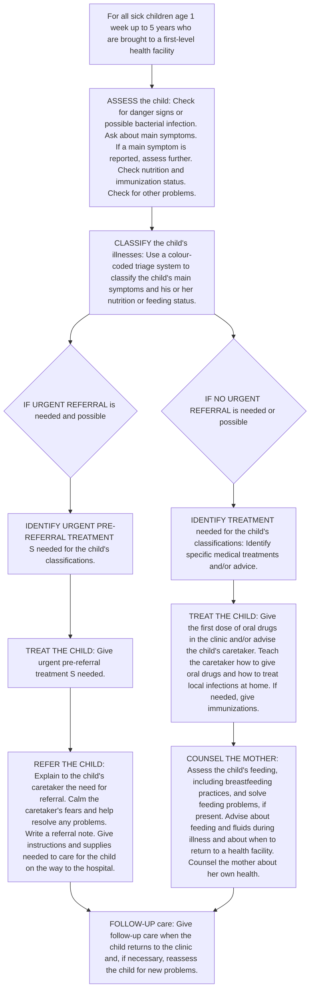
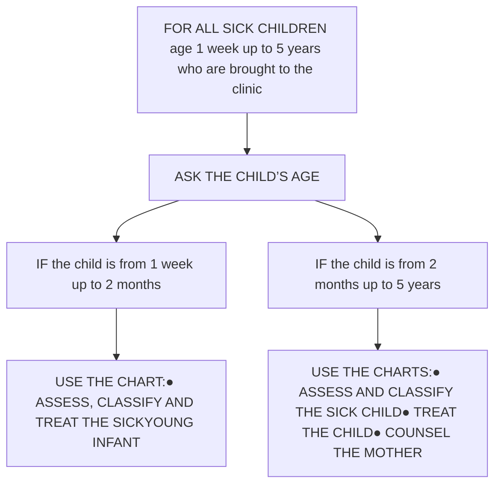
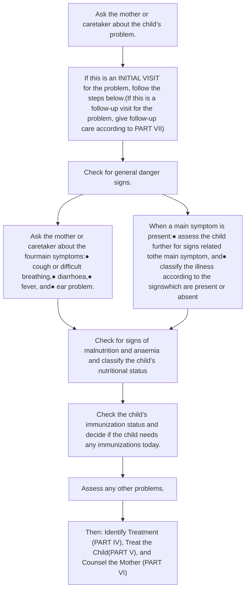
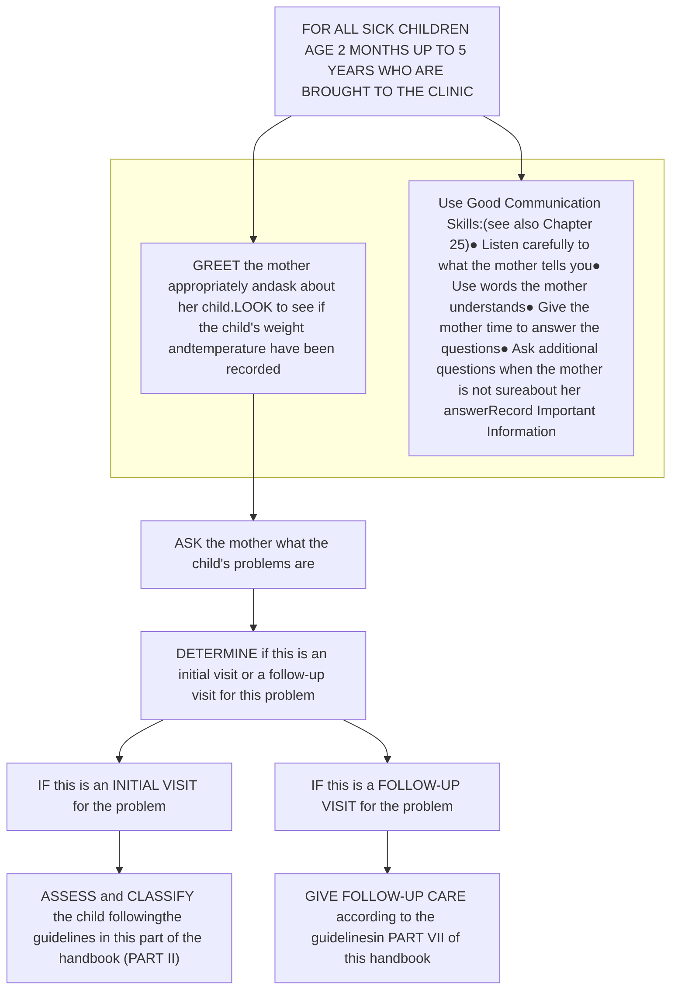
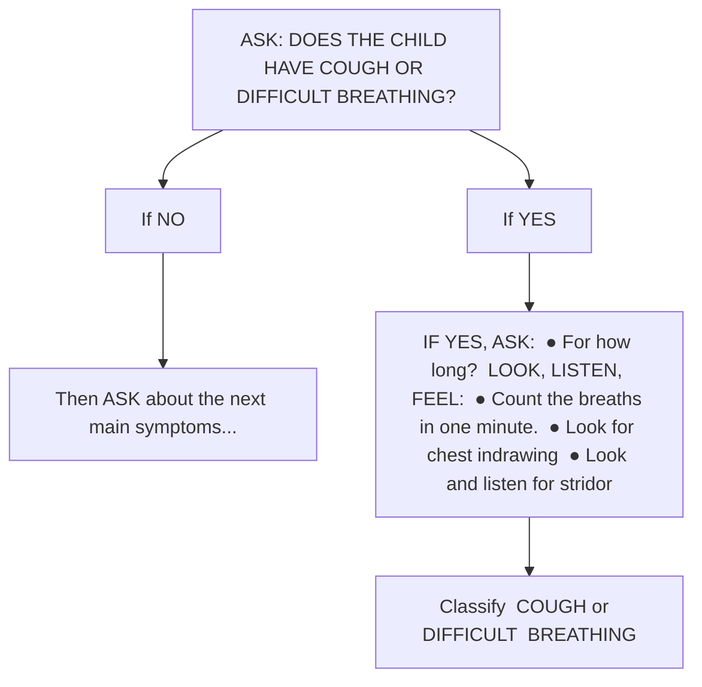
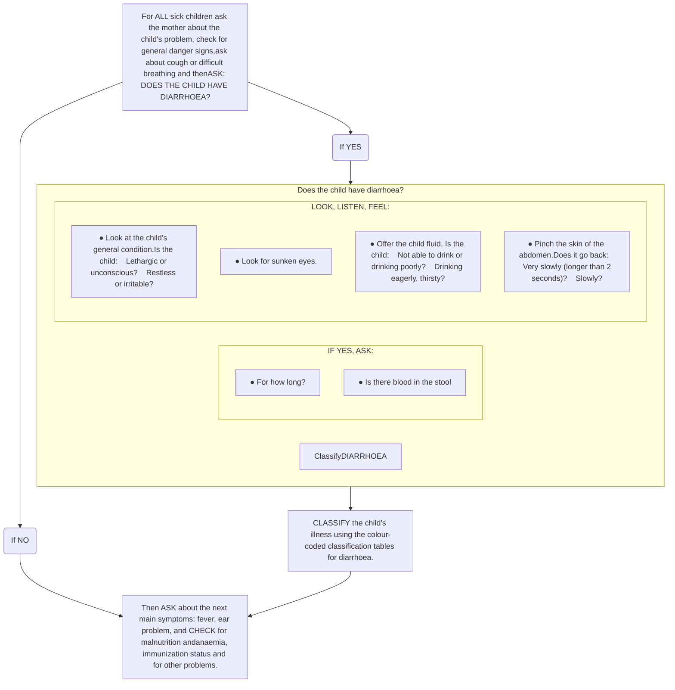
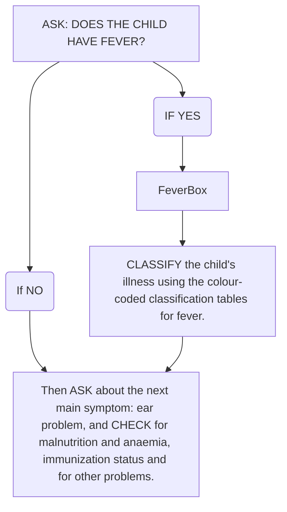
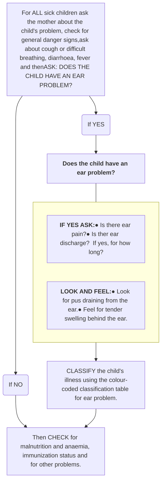
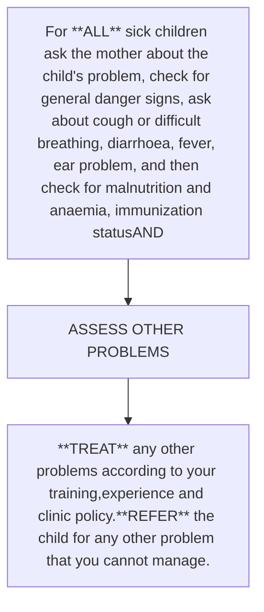

# HANDBOOK
# IMCI
# Integrated Management of Childhood Illness

World Health Organization logo

Department of Child and Adolescent Health
and Development (CAH)

unicef logo

WHO Library Cataloguing-in-Publication Data

Handbook : IMCI integrated management of childhood illness.

1.Disease – in infancy and childhood 2.Disease management 3.Child health services – organization and administration 3.Delivery of health care, Integrated 4.Community health aides – education 7.Manuals I.World Health Organization

ISBN 92 4 154644 1 (NLM classification: WS 200)

**© World Health Organization 2005**

All rights reserved. Publications of the World Health Organization can be obtained from Marketing and Dissemination, World Health Organization, 20 Avenue Appia, 1211 Geneva 27, Switzerland (tel: +41 22 791 2476; fax: +41 22 791 4857; email: bookorders@who.int). Requests for permission to reproduce or translate WHO publications – whether for sale or for noncommercial distribution – should be addressed to Publications, at the above address (fax: +41 22 791 4806; email: permissions@who.int).

The designations employed and the presentation of the material in this publication do not imply the expression of any opinion whatsoever on the part of the World Health Organization concerning the legal status of any country, territory, city or area or of its authorities, or concerning the delimitation of its frontiers or boundaries. Dotted lines on maps represent approximate border lines for which there may not yet be full agreement.

The mention of specific companies or of certain manufacturers’ products does not imply that they are endorsed or recommended by the World Health Organization in preference to others of a similar nature that are not mentioned. Errors and omissions excepted, the names of proprietary products are distinguished by initial capital letters.

The World Health Organization does not warrant that the information contained in this publication is complete and correct and shall not be liable for any damages incurred as a result of its use.

Designed by minimum graphics

iii

# How to adapt the Model IMCI Handbook

**Note: Do not include this section in the adapted IMCI Handbook**

The WHO/UNICEF guidelines for *Integrated Management of Childhood Illness* (IMCI) offer simple and effective methods to prevent and manage the leading causes of serious illness and mortality in young children. The clinical guidelines promote evidence-based assessment and treatment, using a syndromic approach that supports the rational, effective and affordable use of drugs. The guidelines include methods for checking a child’s immunization and nutrition status; teaching parents how to give treatments at home; assessing a child’s feeding and counselling to solve feeding problems; and advising parents about when to return to a health facility. The approach is designed for use in outpatient clinical settings with limited diagnostic tools, limited medications and limited opportunities to practice complicated clinical procedures.

In each country, the IMCI clinical guidelines are adapted:

■ To cover the most serious childhood illnesses typically seen at first-level health facilities,

■ To make the guidelines consistent with national treatment guidelines and other policies, and

■ To make the guidelines feasible to implement through the health system and by families caring for their children at home.

The IMCI charts and related in-service training materials, provided by WHO and UNICEF, are considered to be a “generic” version. This model IMCI handbook is also a generic document. The WHO Department of Child and Adolescent Health and Development (CAH) created this handbook to help teaching institutions incorporate IMCI into academic programmes for doctors, nurses and other health professionals.

Before the handbook can be used, however, it needs to be adapted in two ways:

■ **Technical Adaptation:** All text, charts and illustrations in the model handbook should be carefully reviewed and, if needed, revised to make them consistent with the nationally adapted IMCI guidelines.

■ **Pedagogical Adaptation:** The model handbook should be modified to correspond to the teaching/learning methods used by a faculty. For example, a faculty may choose to revise or format the handbook as a stand-alone document, or to incorporate the contents of the handbook into other materials or textbooks.

The two step process of adaptation will ensure that the content of the handbook is consistent with a country’s national IMCI guidelines, and that its style and format are compatible with a faculty’s approach to teaching.

iv ▼ IMCI HANDBOOK

## Technical Adaptation

When the IMCI strategy was initially introduced in your country, a national task force adapted the generic IMCI guidelines and created in-service training materials. The in-service training materials normally include an IMCI chart booklet, IMCI mother’s card, set of IMCI training modules, photograph booklet, video, and wall charts. The nationally adapted IMCI charts and in-service training modules should be referred to when making technical adaptations to this handbook. In countries where the guidelines have been adapted, the IMCI in-service training materials can be requested from the Ministry of Health. Computer diskettes of the model IMCI handbook are available from WHO CAH.*

Each section of the model IMCI handbook should be adapted in the following ways:

■ **Forward.** It is recommended to include some information and/or graphs about the main causes of childhood morbidity and mortality in a country, and to add some country-specific information about the need for, or appropriateness of, the IMCI approach.

■ **Part I: Integrated Management of Childhood Illness (IMCI).** This section of the handbook (Chapters 1 through 3) does *not* require technical adaptation.

■ **Part II: The Sick Child Age 2 Months Up to 5 Years: Assess and Classify.** The technical guidelines in this section of the handbook (Chapters 4 through 13) should agree with those in the nationally adapted IMCI training module called *Assess and Classify the Sick Child Age 2 Months Up to 5 Years*. Like the module, Part II of the handbook describes the types and combinations of clinical signs used to assess main symptoms of common childhood illnesses, and provides action-oriented classifications for each main symptom. When adapting the IMCI clinical guidelines, it is likely that the national IMCI task force modified the assessment process and the classifications for certain main symptoms. Some changes will therefore be needed in the handbook to make all main symptoms, clinical signs and classifications consistent with those in the national IMCI charts and training modules. The chapter in the handbook on Fever (Chapter 9) may require particular revisions, because common illnesses associated with fever tend to be country specific. In addition to revising the text, pieces of the national IMCI charts should be inserted on the pages indicated in the model handbook. The format of the case recording form used in the examples also should be revised to match the national IMCI recording form.

■ **Part III: The Sick Young Infant Age 1 Week Up to 2 Months: Assess and Classify.** The technical information in this section (Chapters 14 through 15) should agree with Chapter 1, Assess and Classify the Sick Young Infant, in the national IMCI module titled *Management of the Sick Young Infant Age 1 Week Up to 2 Months*. This section will require adaptations very similar to Part II in order to ensure that all main symptoms, clinical signs and classifications are consistent with the national IMCI charts and training modules. The format of the case recording form used in the examples should be revised to match the national recording form for young infants.

■ **Part IV: Identify Treatment.** The technical guidelines in this section (Chapters 16 through 18) should agree with those in the nationally adapted IMCI module called *Identify Treatment*, AND to Chapter 2, Identify Appropriate Treatment, in the module called *Management of the Sick Young Infant Age 1*

* World Health Organization, Department of Child and Adolescent Health and Development (CAH), Avenue Appia 20, CH-1211 Geneva 27, Switzerland. Fax: +41 22 791 4853.

HOW TO ADAPT THE MODEL IMCI HANDBOOK ▼ v

*Week Up to 2 Months*. The names of classifications in this section should match those in the national IMCI charts. If the national IMCI guidelines do not recommend cotrimoxazole for the treatment of both MALARIA and PNEUMONIA, delete the first bullet point under Problems that Require Special Explanation in Chapter 18 of the handbook. It is important to note that the steps for giving urgent pre-referral treatment and referring the child to hospital, found in Chapters 4 and 5 of the *Identify Treatment* module, were moved to Part V (Chapter 20) of the model handbook.

■ **Part V: Treat the Sick Child or the Sick Young Infant.** The technical guidelines in this section (Chapters 19 through 24) should agree with those in the national IMCI module called *Treat the Child*, AND to Chapter 3, Treat the Sick Young Infant and Counsel the Mother, in the module called *Management of the Sick Young Infant Age 1 Week Up to 2 Months*. Chapter 20, Urgent Referral, of the handbook combines selected chapters from three different modules—*Identify Treatment*, *Treat the Child* and *Management of the Sick Young Infant Age 1 Week Up to 2 Months*. In this section of the handbook, some changes may be needed to the names of classifications, the names of drugs, drug doses, and schedules to correspond with those in the national IMCI charts and training modules. It should be noted that Annexes C-1 through C-4 of the *Treat the Child* module were combined and moved to Annex A, Treat Severe Dehydration Quickly, of the handbook. It is also important to note that information from the national training modules on teaching and advising a mother about treatment and feeding was incorporated into Part VI, Communicate and Counsel, of the model handbook.

■ **Part VI: Communicate and Counsel.** The technical information in this section (Chapters 25 through 30) should agree with the national IMCI module called *Counsel the Mother*, AND to selected sections of the *Treat the Child* and *Management of the Sick Young Infant Age 1 Week Up to 2 Months* modules. The feeding recommendations described in Chapter 29 of the handbook may need revision to make them consistent with the recommendations in the national IMCI charts. In addition, common local feeding problems should be taken from the national IMCI charts and inserted into the section in Chapter 29 called Identify Feeding Problems.

■ **Part VII: Give Follow-Up Care.** The technical guidelines in this section (Chapter 31 through 32) should agree with those in the national IMCI module called *Follow-Up*. The names of classifications, number of days to a follow-up visit, and the guidelines for each type of follow-up visit should coincide with those in the national IMCI charts and training modules.

■ **Annexes.** Annex A corresponds to Annexes C-1 through C-4 in the IMCI module called *Treat the Child*. Copies of the national IMCI case recording forms for the *Management of the Sick Young Infant Age 1 Week Up to 2 Months* and the *Management of the Sick Child Age 2 Months Up to 5 Years* should appear in Annex B. An example of a local Mother’s Card may be attached as Annex C. It is also recommended to attach a copy of the Glossary from the IMCI module called *Introduction* as well as a copy of the national IMCI chart booklet.

vi ▼ IMCI HANDBOOK

## Pedagogical Adaptation

Each faculty will need to determine how to incorporate IMCI into the relevant certificate, diploma or degree programme(s). Because this process takes time and consideration, many faculties have chosen to begin IMCI teaching using a draft version of the technically adapted IMCI handbook. The draft handbook serves as an intermediate step, giving a faculty time to gain experience with IMCI teaching in order to effectively modify the handbook to suit their own approach to teaching, and to identify other appropriate materials, already used by the faculty, in which to incorporate elements of the handbook.

Pedagogical adaptation may also involve adding to or reorganizing the contents of the handbook. For example, a faculty might decide to add the scientific basis for the IMCI guidelines. If this is the case, the faculty may refer to the section of the *IMCI Adaptation Guide* called *Technical Basis for Adapting Clinical Guide- lines, Feeding Recommendations, and Local Terms* (also available from WHO CAH). This section of the adaptation guide provides technical justification for the generic IMCI guidelines. To reinforce student learning, some faculties have developed student notes based on the model IMCI handbook, some have adapted exercises from the IMCI in-service training modules, and others have created IMCI problem-solving exercises and case studies.

▼ vii

# Contents

Foreword ix

**PART I: Integrated Management of Childhood Illness (IMCI) 1**
1 The integrated case management process 3
2 Selecting the appropriate case management charts 6
3 Using the case management charts and case Recording Forms 8

**PART II: The sick child age 2 months up to 5 years: Assess and classify 11**
4 Assess and classify the sick child 13
5 When a child is brought to the clinic 14
6 General danger signs 17
7 Cough or difficult breathing 19
8 Diarrhoea 25
9 Fever 32
10 Ear problem 43
11 Malnutrition and anaemia 47
12 Immunization status 53
13 Other problems 56

**PART III: The sick young infant age 1 week up to 2 months: Assess and classify 57**
14 Overview of assess and classify 59
15 Assess and classify the sick young infant 61

**PART IV: Identify treatment 73**
16 Choose treatment priorities 75
17 Identify urgent pre-referral treatment 78
18 Identify treatment for patients who do not need urgent referral 80

**PART V: Treat the sick child or the sick young infant 83**
19 Overview of the types of treatment 85
20 Urgent referral 86
21 Appropriate oral drugs 90
22 Treating local infections 94
23 Extra fluid for diarrhoea and continued feeding 95
24 Immunizations 101

viii ▼ IMCI HANDBOOK

| \*\*PART VI: Communicate and counsel\*\*                            | \*\*103\*\* |
| ------------------------------------------------------------------- | ----------- |
| 25 Use good communication skills                                    | 105         |
| 26 Teach the caretaker to give oral drugs at home                   | 109         |
| 27 Teach the caretaker to treat local Infections at home            | 112         |
| 28 Counsel the mother about breastfeeding problems                  | 116         |
| 29 Counsel the mother about feeding and fluids                      | 119         |
| 30 Counsel the mother about when to return and about her own health | 127         |

| \*\*PART VII: Give follow-up care\*\*       | \*\*129\*\* |
| ------------------------------------------- | ----------- |
| 31 Follow-up care for the sick child        | 131         |
| 32 Follow-up care for the sick young infant | 140         |


ANNEX A: Plan C—Treat severe dehydration quickly      143
ANNEX B: Sample case recording forms      151
ANNEX C: Example mother’s card      155
Glossary      157
IMCI Chart Booklet

▼ ix

# Foreword

Since the 1970s, the estimated annual number of deaths among children less than 5 years old has decreased by almost a third. This reduction, however, has been very uneven. And in some countries rates of childhood mortality are increasing. In 1998, more than 50 countries still had childhood mortality rates of over 100 per 1000 live births.<sup>1</sup> Altogether more than 10 million children die each year in developing countries before they reach their fifth birthday. Seven in ten of these deaths are due to acute respiratory infections (mostly pneumonia), diarrhoea, measles, malaria, or malnutrition—and often to a combination of these conditions (figure 1).

Projections based on the 1996 analysis *The global burden of disease* indicate that these conditions will continue to be major contributors to child deaths in the year 2020 unless significantly greater efforts are made to control them.<sup>2</sup> Every day, millions of parents take children with potentially fatal illnesses to first-level health facilities such as clinics, health centres and outpatient departments of hospitals. In some countries, three in four episodes of childhood illness are caused by one of these five conditions. And most sick children present with signs and symptoms related to more than one. This overlap means that a single diagnosis may not be possible or appropriate, and that treatment may be complicated by the need to combine therapy for several conditions. Surveys of the management of sick children at these facilities reveal that many are not properly assessed and treated and that their parents are poorly advised.<sup>3</sup>

FIGURE 1: DISTRIBUTION OF 11.6 MILLION DEATHS AMONG CHILDREN LESS THAN 5 YEARS OLD IN ALL DEVELOPING COUNTRIES, 1995

| Category                             | Percentage |
| ------------------------------------ | ---------- |
| Malaria\*                            | 5          |
| Measles\*                            | 7          |
| Diarrhoea\*                          | 19         |
| Acute Respiratory Infections (ARI)\* | 19         |
| Perinatal                            | 18         |
| Other                                | 32         |
| Malnutrition\*                       | 54         |


\* Approximately 70% of all childhood deaths are associated with one or more of these 5 conditions.

Based on data taken from *The Global Burden of Disease 1996*, edited by Murray CJL and Lopez AD, and *Epidemiological evidence for a potentiating effect of malnutrition on child mortality*, Pelletier DL, Frongillo EA and Habicht JP, *American Journal of Public Health* 1993; 83:1133–1139.

At this level, in most developing countries, diagnostic supports such as radiology and laboratory services are minimal or non-existent; and drugs and equipment are scarce. Limited supplies and equipment, combined with an irregular flow of patients, leave health care providers at first-level facilities with few opportunities to practise complicated clinical procedures. Instead, they must often rely on history and signs and symptoms to determine a course of management that makes the best use of available resources.

Providing quality care to sick children in these conditions is a serious challenge. In response to this challenge, WHO and UNICEF developed a strategy known as Integrated Management of Childhood Illness (IMCI). Although the major stimulus for IMCI came from the needs of curative care, the strategy combines improved management of childhood illness with aspects of nutrition, immunisation, and other important disease

<sup>1</sup> World Health Organization. *World health report 1999: Making a difference.* Geneva: WHO, 1999.

<sup>2</sup> Murray CJL and Lopez AD. *The global burden of disease: a comprehensive assessment of mortality and disability from diseases injuries, and risk factors in 1990 and projected to 2020.* Geneva, World Health Organization, 1996.

<sup>3</sup> World Health Organization. *Report of the Division of Child Health and Development 1996-1997.* Geneva: WHO, 1998.

x ▼ **IMCI HANDBOOK**

prevention and health promotion elements. The objectives are to reduce deaths and the frequency and severity of illness and disability and to contribute to improved growth and development.

The strategy includes three main components:

■ Improvements in the case-management skills of health staff through the provision of locally adapted guidelines on IMCI and through activities to promote their use

■ Improvements in the health system required for effective management of childhood illness

■ Improvements in family and community practices

The core of the IMCI strategy is integrated case management of the most common childhood problems, with a focus on the most important causes of death. The generic guidelines, however, are not designed for immediate use. A guided process of adaptation ensures that the guidelines, and the learning materials that go with them, reflect the epidemiology within a country and are tailored to fit the needs, resources and capacity of a country’s health system.

The clinical guidelines, which are based on expert clinical opinion and research results, are designed for the management of sick children aged 1 week up to 5 years. They promote evidence-based assessment and management, using a syndromic approach that supports the rational, effective and affordable use of drugs. They include methods for assessing signs that indicate severe disease; assessing a child’s nutrition, immunization, and feeding; teaching parents how to care for a child at home; counselling parents to solve feeding problems; and advising parents about when to return to a health facility. The guidelines also include recommendations for checking the parents’ understanding of the advice given and for showing them how to administer the first dose of treatment.

When assessing a sick child, a combination of individual signs leads to one or more classifications, rather than to a diagnosis. IMCI classifications are action oriented and allow a health care provider to determine if a child should be urgently referred to another health facility, if the child can be treated at the first-level facility (e.g. with oral antibiotic, antimalarial, ORS, etc.), or if the child can be safely managed at home.

When used correctly, the approach described in this handbook ensures the thorough assessment of common serious conditions, nutrition and immunization; promotes rapid and affordable interventions; strengthens the counselling of caretakers and the provision of preventive services; and assists health care providers to support and follow national guidelines.

# Part I
INTEGRATED
MANAGEMENT
OF CHILDHOOD
ILLNESS (IMCI)

▼ 3

CHAPTER 1

# The integrated case management process

Integrated case management relies on case detection using simple clinical signs and empirical treatment. As few clinical signs as possible are used. The signs are based on expert clinical opinion and research results, and strike a careful balance between *sensitivity* and *specificity* (see Box 1). The treatments are developed according to action-oriented classifications rather than exact diagnosis. They cover the most likely diseases represented by each classification.

The IMCI process can be used by doctors, nurses and other health professionals who see sick infants and children aged from 1 week up to five years. It is a case management process for a first-level facility such as a clinic, a health centre or an outpatient department of a hospital.

The IMCI guidelines describe how to care for a child who is brought to a clinic with an illness, or for a scheduled follow-up visit to check the child’s progress. The guidelines give instructions for how to routinely assess a child for general danger signs (or possible bacterial infection in a young infant), common illnesses, malnutrition and anaemia, and to look for other problems. In addition to treatment, the guidelines incorporate basic activities for illness prevention.

This handbook will help you learn to use the IMCI guidelines in order to interview caretakers, accurately recognize clinical signs, choose appropriate treatments, and provide counselling and preventive care. The complete IMCI case management process involves the following elements:

**Box 1: Sensitivity and Specificity<sup>1</sup>**

Sensitivity and specificity measure the diagnostic performance of a clinical sign compared with that of the gold standard, which by definition has a sensitivity of 100% and a specificity of 100%.

**Sensitivity** measures the proportion or percentage of those with the disease who are correctly identified by the sign. In other words, it measures how sensitive the sign is in detecting the disease. (Sensitivity = true positives / [true positives + false negatives])

**Specificity** measures the proportion of those without the disease who are correctly called free of the disease by using the sign. (Specificity = true negatives / [true negatives + false positives])

* **Assess** a child by checking first for danger signs (or possible bacterial infection in a young infant), asking questions about common conditions, examining the child, and checking nutrition and immunization status. Assessment includes checking the child for other health problems.

* **Classify** a child’s illnesses using a colour-coded triage system. Because many children have more than one condition, each illness is classified according to whether it requires:
    

    - urgent pre-referral treatment and referral (red), or
    

    - specific medical treatment and advice (yellow), or
    

    - simple advice on home management (green).

* After classifying all conditions, **identify** specific treatments for the child. If a child requires urgent referral, give essential treatment before the patient is transferred. If a child needs treatment at home, develop an integrated treatment plan for the child and give the first dose of drugs in the clinic. If a child should be immunized, give immunizations.

<sup>1</sup> Riegelman RK and Hirsch RP. *Studying a Study and Testing a Test: How to Read the Health Science Literature*, 3rd ed. Boston, Little, Brown and Company, 1996.

# 4 ▼ IMCI HANDBOOK

■ Provide practical **treatment** instructions, including teaching the caretaker how to give oral drugs, how to feed and give fluids during illness, and how to treat local infections at home. Ask the caretaker to return for follow-up on a specific date, and teach her how to recognize signs that indicate the child should return immediately to the health facility.

■ Assess feeding, including assessment of breastfeeding practices, and **counsel** to solve any feeding problems found. Then counsel the mother about her own health.

■ When a child is brought back to the clinic as requested, **give follow-up care** and, if necessary, reassess the child for new problems.

The IMCI guidelines address most, but not all, of the major reasons a sick child is brought to a clinic. A child returning with chronic problems or less common illnesses may require special care which is not described in this handbook. The guidelines do not describe the management of trauma or other acute emergencies due to accidents or injuries.

Although AIDS is not addressed specifically, the case management guidelines address the most common reasons children with HIV seek care: diarrhoea and respiratory infections. When a child, who is believed to have HIV, presents with any of these common illnesses, he or she can be treated the same as any child presenting with an illness. If a child’s illness does not respond to the standard treatments described in this handbook, or if a child becomes severely malnourished, or returns to the clinic repeatedly, the child is referred to a hospital for special care.

Case management can only be effective to the extent that families bring their sick children to a trained health worker for care in a timely way. If a family waits to bring a child to a clinic until the child is extremely sick, or takes the child to an untrained provider, the child is more likely to die from the illness. Therefore, teaching families when to seek care for a sick child is an important part of the case management process.

The case management process is presented on two different sets of charts: one for children age 2 months up to five years, and one for children age 1 week up to 2 months. You will learn how to choose the appropriate set of charts in **Chapter 2**.

CHAPTER 1. THE INTEGRATED CASE MANAGEMENT PROCESS ▼ 5

# SUMMARY OF THE INTEGRATED CASE MANAGEMENT PROCESS



For all sick children age 1 week up to 5 years who are brought to a first-level health facility

ASSESS the child: Check for danger signs (or possible bacterial infection). Ask about main symptoms. If a main symptom is reported, assess further. Check nutrition and immunization status. Check for other problems.

CLASSIFY the child’s illnesses: Use a colour-coded triage system to classify the child’s main symptoms and his or her nutrition or feeding status.

**IF URGENT REFERRAL** is needed and possible

**IF NO URGENT REFERRAL** is needed or possible

**IDENTIFY URGENT PRE-REFERRAL TREATMENT(S)** needed for the child’s classifications.

**IDENTIFY TREATMENT** needed for the child’s classifications: Identify specific medical treatments and/or advice.

**TREAT THE CHILD:** Give urgent pre-referral treatment(s) needed.

**TREAT THE CHILD:** Give the first dose of oral drugs in the clinic and/or advise the child’s caretaker. Teach the caretaker how to give oral drugs and how to treat local infections at home. If needed, give immunizations.

**REFER THE CHILD:** Explain to the child’s caretaker the need for referral. Calm the caretaker’s fears and help resolve any problems. Write a referral note. Give instructions and supplies needed to care for the child on the way to the hospital.

**COUNSEL THE MOTHER:** Assess the child’s feeding, including breastfeeding practices, and solve feeding problems, if present. Advise about feeding and fluids during illness and about when to return to a health facility. Counsel the mother about her own health.

**FOLLOW-UP** care: Give follow-up care when the child returns to the clinic and, if necessary, reassess the child for new problems.

6 ▼

CHAPTER 2

# Selecting the appropriate case management charts



The IMCI case management process is presented on a series of charts that show the sequence of steps and provide information for performing them. This series of charts has also been transformed into an IMCI chart booklet designed to help you carry out the case management process. The IMCI chart booklet contains three charts for managing sick children age 2 months up to 5 years, and a separate chart for managing sick young infants age 1 week up to 2 months.

Most health facilities have a procedure for registering children and identifying whether they have come because they are sick, or for some other reason, such as for a well-child visit or an immunization, or for care of an injury. When a mother brings a child because the child is sick (due to illness, not trauma) and the child is sent to you for attention, you need to know the age of the child in order to select the appropriate IMCI charts and begin the assessment process.

Depending on the procedure for registering patients at the clinic, the child’s name, age and other information, such as address, may have been recorded already. If not, you may begin by asking the child’s name and age.

Decide which age group the child is in:

— Age 1 week up to 2 months, or

— Age 2 months up to 5 years.

**Up to 5 years** means the child has not yet had his or her fifth birthday. For example, this age group includes a child who is 4 years 11 months but not a child who is 5 years old. A child who is 2 months old would be in the group 2 months up to 5 years, not in the group 1 week up to 2 months.

The case management process for sick children age 2 months up to 5 years is presented on three charts titled:

*   *ASSESS AND CLASSIFY THE SICK CHILD*

*   *TREAT THE CHILD*

*   *COUNSEL THE MOTHER*

CHAPTER 2. SELECTING THE APPROPRIATE CASE MANAGEMENT CHARTS ▼ 7

If the child is **not yet 2 months of age**, the child is considered a young infant. Management of the young infant age 1 week up to 2 months is somewhat different from older infants and children. It is described on a different chart titled:

* *ASSESS, CLASSIFY AND TREAT THE SICK YOUNG INFANT.*

8 ▼

CHAPTER 3

# Using the case management charts and case recording forms

The IMCI case management charts and recording forms guide you through the following steps:

* Assess the sick child or sick young infant

* Classify the illness

* Identify treatment

* Treat the child or young infant

* Counsel the mother

* Give follow-up care

The case management steps are the same for all sick children from age 1 week up to 5 years. However, because signs, classifications, treatments and counselling differ between sick young infants and sick children, it is essential to start the case management process by selecting the appropriate set of IMCI charts (see Chapter 2). The charts, tables and recording forms for the sick child aged 2 months up to 5 years are briefly described below.

## 3.1 Assess and classify

**ASSESS AND CLASSIFY CHART** **CASE RECORDING FORM (FRONT)**

Diagram showing the relationship between the ASSESS AND CLASSIFY chart and the CASE RECORDING FORM (FRONT)

The ASSESS AND CLASSIFY chart describes how to assess the child, classify the child’s illnesses and identify treatments. The ASSESS column on the left side of the chart describes how to take a history and do a physical examination. You will note the main symptoms and signs found during the examination in the ASSESS column of the case recording form.

CHAPTER 3. USING THE CASE MANAGEMENT CHARTS AND CASE RECORDING FORMS ▼ 9

The **CLASSIFY** column on the *ASSESS AND CLASSIFY* chart lists clinical signs of illness and their classifications. Classify means to make a decision about the severity of the illness. For each of the child’s main symptoms, you will select a category, or “classification,” that corresponds to the severity of the child’s illnesses. You will then write your classifications in the CLASSIFY column of the case recording form.

## 3.2 Identify treatment

The **IDENTIFY TREATMENT** column of the *ASSESS AND CLASSIFY* chart helps you to quickly identify treatment for the classifications written on your case recording form. Appropriate treatments are recommended for each classification. When a child has more than one classification, you must look at more than one table to find the appropriate treatments. You will write the treatments identified for each classification on the reverse side of the case recording form.

**ASSESS AND CLASSIFY CHART**

Illustration showing the relationship between the ASSESS AND CLASSIFY chart and the back of the CASE RECORDING FORM. An arrow points from the IDENTIFY TREATMENT column of the chart to the TREAT column of the form.

## 3.3 Treat the child

The IMCI chart titled *TREAT THE CHILD* shows how to do the treatment steps identified on the *ASSESS AND CLASSIFY* chart. **TREAT** means giving treatment in clinic, prescribing drugs or other treatments to be given at home, and also teaching the caretaker how to carry out the treatments.

**TREAT THE CHILD CHART (TOP)**

| TREAT THE CHILD<br/>CARRY OUT THE TREATMENT STEPS IDENTIFIED ON THE ASSESS AND CLASSIFY CHART<br/>TEACH THE MOTHER TO GIVE ORAL DRUGS AT HOME                                                                                                                                                                                                                                                                                                                                                                                                                                                                                                                                                                        | TREAT THE CHILD<br/>CARRY OUT THE TREATMENT STEPS IDENTIFIED ON THE ASSESS AND CLASSIFY CHART                                                     |
| -------------------------------------------------------------------------------------------------------------------------------------------------------------------------------------------------------------------------------------------------------------------------------------------------------------------------------------------------------------------------------------------------------------------------------------------------------------------------------------------------------------------------------------------------------------------------------------------------------------------------------------------------------------------------------------------------------------------- | ------------------------------------------------------------------------------------------------------------------------------------------------- |
| Follow the instructions below for every oral drug to be given at home.<br/>Also follow the instructions listed with each drug's dosage table.<br/>➤ Determine the appropriate drugs and dosage for the child's age or weight.<br/>➤ Tell the mother the reason for giving the drug to the child.<br/>➤ Demonstrate how to measure a dose.<br/>➤ Watch the mother practise measuring a dose by herself.<br/>➤ Ask the mother to give the first dose to her child.<br/>➤ Explain carefully how to give the drug, then label and package the drug.<br/>➤ If more than one drug will be given, collect, count and package each drug.<br/>➤ Explain that all drug tablets or syrups must be used and check understanding. | ➤ Give an Oral Antimalarial<br/><br/>➤ Give Vitamin A<br/><br/>➤ Give Iron<br/><br/>➤ Give Paracetamol for High Fever<br/><br/>➤ Give Mebendazole |
| ➤ Give an Appropriate Oral Antibiotic                                                                                                                                                                                                                                                                                                                                                                                                                                                                                                                                                                                                                                                                                |                                                                                                                                                   |
| TEACH THE MOTHER TO TREAT LOCAL INFECTIONS AT HOME                                                                                                                                                                                                                                                                                                                                                                                                                                                                                                                                                                                                                                                                   |                                                                                                                                                   |
|                                                                                                                                                                                                                                                                                                                                                                                                                                                                                                                                                                                                                                                                                                                      | ➤ Dry the Ear by Wicking                                                                                                                          |


10 ▼ IMCI HANDBOOK

## 3.4 Counsel the mother

Recommendations on feeding, fluids and when to return are given on the chart titled *COUNSEL THE MOTHER*. For many sick children, you will assess feeding and counsel the mother about any feeding problems found. For all sick children who are going home, you will advise the child’s caretaker about feeding, fluids and when to return for further care. You will write the results of any feeding assessment on the bottom of the case recording form. You will record the earliest date to return for “follow-up” on the reverse side of the case recording form. You will also advise the mother about her own health.

**COUNSEL THE MOTHER CHART (TOP)** **CASE RECORDING FORM (FRONT)**

Illustration showing the Counsel the Mother chart and how it relates to the Case Recording Form

## 3.5 Give follow-up care

Several treatments in the *ASSESS AND CLASSIFY* chart include a follow-up visit. At a follow-up visit you can see if the child is improving on the drug or other treatment that was prescribed. The **GIVE FOLLOW-UP CARE** section of the *TREAT THE CHILD* chart describes the steps for conducting each type of follow-up visit. Headings in this section correspond to the child’s previous classification(s).

**TREAT THE CHILD CHART (BOTTOM)**

Illustration of the Give Follow-up Care section of the Treat the Child chart

Part II logo

# THE SICK CHILD
# AGE 2 MONTHS
# UP TO 5 YEARS:
# ASSESS AND
# CLASSIFY

▼ 13

CHAPTER 4

# Assess and classify the sick child

A mother or other caretaker brings a sick child to the clinic for a particular problem or symptom. If you only assess the child for that particular problem or symptom, you might overlook other signs of disease. The child might have pneumonia, diarrhoea, malaria, measles, or malnutrition. These diseases can cause death or disability in young children if they are not treated.

The chart *ASSESS AND CLASSIFY THE SICK CHILD AGE 2 MONTHS UP TO 5 YEARS* describes how to assess and classify sick children so that signs of disease are not overlooked. The chart then helps you to identify the appropriate treatments for each classification. According to the chart, you should ask the mother about the child’s problem and check the child for general danger signs. Then ask about the four main symptoms: cough or difficult breathing, diarrhoea, fever and ear problem.

A child who has one or more of the main symptoms could have a serious illness. When a main symptom is present, ask additional questions to help classify the illness and identify appropriate treatment(s). Check the child for malnutrition and anaemia. Also check the child’s immunization status and assess other problems that the mother has mentioned. The next several chapters will describe these activities.

## SUMMARY OF ASSESS AND CLASSIFY



14 ▼

CHAPTER 5

# When a child is brought to the clinic



The steps on the *ASSESS AND CLASSIFY THE SICK CHILD* chart describe what you should do when a mother brings her child to the clinic because her child is sick. The chart should not be used for a well child brought for immunization or for a child with an injury or burn. When patients arrive at most clinics, clinic staff identify the reason for the child's visit. Clinic staff obtain the child's weight and temperature and record them on a patient chart, another written record, or on a small piece of paper. Then the mother and child see a health worker.

The *ASSESS AND CLASSIFY* chart summarizes how to assess the child, classify the child's illnesses and identify treatments. The **ASSESS** column on the left side of the chart describes how to take a history and do a physical examination. The instructions in this column begin with ASK THE MOTHER WHAT THE CHILD'S PROBLEMS ARE (see Example 1).

CHAPTER 5. WHEN A CHILD IS BROUGHT TO THE CLINIC ▼ 15
<page_number>15</page_number>

# EXAMPLE 1: TOP OF ASSESS AND CLASSIFY CHART FOR A CHILD AGE 2 MONTHS UP TO 5 YEARS

| ASSESS AND CLASSIFY THE SICK CHILDAGE 2 MONTHS UP TO 5 YEARS<br/>ASSESS                                                                                                                                                                                               | ASSESS AND CLASSIFY THE SICK CHILDAGE 2 MONTHS UP TO 5 YEARS<br/>CLASSIFY | ASSESS AND CLASSIFY THE SICK CHILDAGE 2 MONTHS UP TO 5 YEARS<br/>IDENTIFY TREATMENT |
| --------------------------------------------------------------------------------------------------------------------------------------------------------------------------------------------------------------------------------------------------------------------- | ------------------------------------------------------------------------- | ----------------------------------------------------------------------------------- |
| **ASK THE MOTHER WHAT THE CHILD’S PROBLEMS ARE**<br/>● Determine if this is an initial or follow-up visit for this problem.<br/>— If follow-up visit, use the follow-up instructions on *TREAT THE CHILD* chart.<br/>— If initial visit, assess the child as follows: |                                                                           |                                                                                     |


When you see the mother, or the child’s caretaker, with the sick child:

## ▼ GREET THE MOTHER APPROPRIATELY AND ASK ABOUT THE CHILD
## ▼ LOOK TO SEE IF THE CHILD’S WEIGHT AND TEMPERATURE HAVE BEEN RECORDED

Look to see if the child’s weight and temperature have been measured and recorded. If not, weigh the child and measure his or her temperature later when you assess and classify the child’s main symptoms. Do not undress or disturb the child now.

## ▼ ASK THE MOTHER WHAT THE CHILD’S PROBLEMS ARE

An important reason for asking this question is to open good communication with the mother. Using good communication helps to reassure the mother that her child will receive good care. When you treat the child’s illness later in the visit, you will need to teach and advise the mother about caring for her sick child at home. So it is important to have good communication with the mother from the beginning of the visit. To use good communication skills:

— **Listen carefully to what the mother tells you.** This will show her that you are taking her concerns seriously.

— **Use words the mother understands.** If she does not understand the questions you ask her, she cannot give the information you need to assess and classify the child correctly.

— **Give the mother time to answer the questions.** For example, she may need time to decide if the sign you asked about is present.

— **Ask additional questions when the mother is not sure about her answer.** When you ask about a main symptom or related sign, the mother may not be sure if it is present. Ask her additional questions to help her give clearer answers.

## ▼ DETERMINE IF THIS IS AN INITIAL OR FOLLOW-UP VISIT FOR THIS PROBLEM

If this is the child’s first visit for this episode of an illness or problem, then this is an **initial visit**.

If the child was seen a few days before for the same illness, this is a **follow-up visit**. A **follow-up** visit has a different purpose than an initial visit. During a follow-up visit, you find out if the treatment given during the initial visit has helped the child. If the child is not improving or is getting worse after a few days, refer the child to a hospital or change the child’s treatment.

How you find out if this is an initial or follow-up visit depends on how the health facility registers patients and identifies the reason for their visit. Some clinics give mothers follow-up slips that tell them when to return. In other clinics a health worker writes a follow-up note on the multi-visit card or chart. Or, when the patient registers, clinic staff ask the mother questions to find out why she has come.

16 ▼ IMCI HANDBOOK

The procedures for a follow-up visit are described in **PART VII**.

Your interview with a child’s caretaker begins with the questions above. If you use an IMCI case recording form, write the responses and check (✔) the appropriate spaces on the form (see Example 2). There are two types of case recording forms; one for young infants age 1 week up to 2 months, and one for children age 2 months up to 5 years. ***Sample case recording forms*** can be found at the back of the IMCI chart booklet and in Annex B of this handbook.

**EXAMPLE 2: TOP PART OF A CASE RECORDING FORM**

> **MANAGEMENT OF THE SICK CHILD AGE 2 MONTHS UP TO 5 YEARS**
>
> **Name**: <u>Fatima</u> **Age**: <u>18 months</u> **Weight**: <u>11.5</u> kg **Temperature**: <u>37.5</u> °C
> **ASK: What are the child's problems?** <u>cough, trouble breathing</u> **Initial visit?** [x] **Follow-up Visit?** [ ]

**CASE 1:** Fatima is 18 months old. She weighs 11.5 kg. Her temperature is 37.5 °C. The health worker asked, “What are the child’s problems?” The mother said “Fatima has been coughing for 6 days, and she is having trouble breathing.” This is the initial visit for this illness.

▼ 17

CHAPTER 6

# General danger signs

For ALL sick children ask the mother about the child’s problem, then
CHECK FOR GENERAL DANGER SIGNS

## CHECK FOR GENERAL DANGER SIGNS

**ASK:**
* Is the child able to drink or breastfeed?
* Does the child vomit everything?
* Hs the child had convulsions?

**LOOK:**
* See if the child is lethargic or unconscious.

A child with any general danger sign needs URGENT attention; complete the assessment and any pre-referral treatment immediately so referral is not delayed

Make sure that a child with any danger sign is referred after receiving urgent re-referral treatment.

Then ASK about main symptoms: cough and difficult breathing, diarrhoea, fever, ear problems. CHECK for malnutrition and anaemia, immunization status and for other problems.

Moving down the left side of the *ASSESS AND CLASSIFY* chart, you find a box titled CHECK FOR GENERAL DANGER SIGNS. Ask the questions and look for the clinical signs described in this box.

A child with a general danger sign has a serious problem. Most children with a general danger sign need URGENT referral to hospital. They may need lifesaving treatment with injectable antibiotics, oxygen or other treatments that may not be available in a first-level health facility. Complete the rest of the assessment immediately. Urgent pre-referral treatments are described in **Chapters 17 and 20**.

When you check for general danger signs:

### ▼ ASK: IS THE CHILD ABLE TO DRINK OR BREASTFEED?

A child has the sign “not able to drink or breastfeed” if the child is not able to suck or swallow when offered a drink or breastmilk.

When you ask the mother if the child is able to drink, make sure that she understands the question. If she says that the child is not able to drink or breastfeed, ask her to describe what happens when she offers the child something to drink. For example, is the child able to take fluid into his mouth and swallow it? If you are not sure about the mother’s answer, ask her to offer the child a drink of clean water or breastmilk. Look to see if the child is swallowing the water or breastmilk.

A child who is breastfed may have difficulty sucking when his nose is blocked. If the child’s nose is blocked, clear it. If the child can breastfeed after the nose is cleared, the child does not have the danger sign, “not able to drink or breastfeed.”

### ▼ ASK: DOES THE CHILD VOMIT EVERYTHING?

A child who is not able to hold anything down at all has the sign “vomits everything.” What goes down comes back up. A child who vomits everything will not be able to hold

18 ▼ IMCI HANDBOOK

down food, fluids or oral drugs. A child who vomits several times but can hold down some fluids does not have this general danger sign.

When you ask the question, use words the mother understands. Give her time to answer. If the mother is not sure if the child is vomiting everything, help her to make her answer clear. For example, ask the mother how often the child vomits. Also ask if each time the child swallows food or fluids, does the child vomit? If you are not sure of the mother’s answers, ask her to offer the child a drink. See if the child vomits.

**▼ ASK: HAS THE CHILD HAD CONVULSIONS?**

During a convulsion, the child’s arms and legs stiffen because the muscles are contracting. The child may lose consciousness or not be able to respond to spoken directions. Ask the mother if the child has had convulsions during this current illness. Use words the mother understands. For example, the mother may know convulsions as “fits” or “spasms.”

**▼ LOOK TO SEE IF THE CHILD IS LETHARGIC OR UNCONSCIOUS.**

A lethargic child is not awake and alert when she should be. The child is drowsy and does not show interest in what is happening around him. Often the lethargic child does not look at his mother or watch your face when you talk. The child may stare blankly and appear not to notice what is going on around him. An unconscious child cannot be wakened. He does not respond when he is touched, shaken or spoken to.

Ask the mother if the child seems unusually sleepy or if she cannot wake the child. Look to see if the child wakens when the mother talks or shakes the child or when you clap your hands.

*Note: If the child is sleeping and has cough or difficult breathing, count the number of breaths first before you try to wake the child (see Chapter 7).*

On the case recording form, circle any general danger signs that are found, and check (✔) the appropriate answer in the CLASSIFY column (see Example 3).

**EXAMPLE 3: TOP PART OF A RECORDING FORM WITH GENERAL DANGER SIGNS**

| MANAGEMENT OF THE SICK CHILD AGE 2 MONTHS UP TO 5 YEARS<br/>Name: Fatima Age: 18 months Weight: 11.5 kg Temperature: 37.5 °C<br/>ASK: What are the child's problems? cough, trouble breathing Initial visit? ✔ Follow-up Visit?<br/>ASSESS (Circle all signs present) | MANAGEMENT OF THE SICK CHILD AGE 2 MONTHS UP TO 5 YEARS<br/>Name: Fatima Age: 18 months Weight: 11.5 kg Temperature: 37.5 °C<br/>ASK: What are the child's problems? cough, trouble breathing Initial visit? ✔ Follow-up Visit?<br/>CLASSIFY |
| --------------------------------------------------------------------------------------------------------------------------------------------------------------------------------------------------------------------------------------------------------------------- | -------------------------------------------------------------------------------------------------------------------------------------------------------------------------------------------------------------------------------------------- |
| CHECK FOR GENERAL DANGER SIGNS<br/>NOT ABLE TO DRINK OR BREASTFEED<br/>VOMITS EVERYTHING<br/>CONVULSIONS<br/>*LETHARGIC OR UNCONSCIOUS*                                                                                                                               | General danger signs present?<br/>Yes *✔* No<br/>Remember to use danger sign when<br/>selecting classifications                                                                                                                              |


**CASE 1:** Fatima is 18 months old. She weighs 11.5 kg. Her temperature is 37.5 °C. The health worker asked, “What are the child’s problems?” The mother said “Fatima has been coughing for 6 days, and she is having trouble breathing.” This is the initial visit for this illness.

The health worker checked Fatima for general danger signs. The mother said that Fatima is able to drink. She has not been vomiting. She has not had convulsions during this illness. The health worker asked, “Does Fatima seem unusually sleepy?” The mother said, “Yes.” The health worker clapped his hands. He asked the mother to shake the child. Fatima opened her eyes, but did not look around. The health worker talked to Fatima, but she did not watch his face. She stared blankly and appeared not to notice what was going on around her.

**IF THE CHILD HAS A GENERAL DANGER SIGN, COMPLETE THE REST OF THE ASSESSMENT IMMEDIATELY. THIS CHILD HAS A SEVERE PROBLEM. THERE MUST BE NO DELAY IN HIS OR HER TREATMENT.**

▼ 19

CHAPTER 7

# Cough or difficult breathing

> For ALL sick children ask the mother about the child's problem, check for general danger signs and then
> **ASK: DOES THE CHILD HAVE COUGH OR DIFFICULT BREATHING?**



| If the child is:         | Fast breathing is:            |
| ------------------------ | ----------------------------- |
| 2 months up to 12 months | 50 breaths per minute or more |
| 12 months up to 5 years  | 40 breaths per minute or more |


CLASSIFY the child's illness using the colour-coded classification table for cough or difficult breathing.

Then **ASK** about the next main symptoms: diarrhoea, fever, ear problems. **CHECK** for malnutrition and anaemia, immunization status and for other problems

Respiratory infections can occur in any part of the respiratory tract such as the nose, throat, larynx, trachea, air passages or lungs. A child with cough or difficult breathing may have pneumonia or another severe respiratory infection. Pneumonia is an infection of the lungs. Both bacteria and viruses can cause pneumonia. In developing countries, pneumonia is often due to bacteria. The most common are *Streptococcus pneumoniae* and *Hemophilus influenzae*. Children with bacterial pneumonia may die from hypoxia (too little oxygen) or sepsis (generalized infection).

Many children are brought to the clinic with less serious respiratory infections. Most children with cough or difficult breathing have only a mild infection. For example, a child who has a cold may cough because nasal discharge drips down the back of the throat. Or the child may have a viral infection of the bronchi called bronchitis. These children are not seriously ill. They do not need treatment with antibiotics. Their families can manage them at home.

You need to identify the few, very sick children with cough or difficult breathing who need treatment with antibiotics. Fortunately, you can identify almost all cases of pneumonia by checking for these two clinical signs: fast breathing and chest indrawing.

20 ▼ IMCI HANDBOOK

When children develop pneumonia, their lungs become stiff. One of the body’s responses to stiff lungs and hypoxia (too little oxygen) is fast breathing. When the pneumonia becomes more severe, the lungs become even stiffer. Chest indrawing may develop. Chest indrawing is a sign of severe pneumonia.

## 7.1 How to assess a child with cough or difficult breathing

Moving down the left side of the *ASSESS AND CLASSIFY* chart, you find the first **main symptom box**. Each main symptom box contains two parts: an assessment section on the left side and a colour-coded classification table on the right. The assess- ment section lists questions and clinical signs under the headings ask, look, listen, check and feel.

Before entering a main symptom box, ask if the child has the main symptom. For exam- ple, ask, “Does the child have cough or difficult breathing?” If the answer is NO, leave the box and move down the chart to the next main symptom box. If the answer is YES, ask the questions and check the clinical signs in the assessment section of the box. Then follow the classify arrow across the page to the classification table.

For **ALL** sick children:

### ▼ASK: DOES THE CHILD HAVE COUGH OR DIFFICULT BREATHING?

**Difficult breathing** is any unusual pattern of breathing. Mothers describe this in different ways. They may say that their child’s breathing is “fast” or “noisy” or “inter- rupted.”

If the mother answers NO, look to see if *you* think the child has cough or difficult breath- ing. If the child does not have cough or difficult breathing, ask about the next main symptom, diarrhoea. Do not assess the child further for signs related to cough or diffi- cult breathing.

If the mother answers YES, ask the next question.

### ▼ASK: FOR HOW LONG?

A child who has had cough or difficult breathing for more than 30 days has a chronic cough. This may be a sign of tuberculosis, asthma, whooping cough or another problem.

### ▼ COUNT THE BREATHS IN ONE MINUTE

You must count the breaths the child takes in one minute to decide if the child has fast breathing. The child must be quiet and calm when you look and listen to his breathing. If the child is frightened, crying or angry, you will not be able to obtain an accurate count of the child’s breaths.

Tell the mother you are going to count her child’s breathing. Remind her to keep her child calm. If the child is sleeping, do not wake the child. To count the number of breaths in one minute. Use a watch with a second hand or a digital watch. Look for breathing movement anywhere on the child’s chest or abdomen.

Usually you can see breathing movements even on a child who is dressed. If you cannot see this movement easily, ask the mother to lift the child’s shirt. If the child starts to cry, ask the mother to calm the child before you start counting. If you are not sure about the number of breaths you counted (for example, if the child was actively moving and it was difficult to watch the chest, or if the child was upset or crying), repeat the count.

The cut-off for fast breathing depends on the child’s age. Normal breathing rates are higher in children age 2 months up to 12 months than in children age 12 months up to 5 years. For this reason, the cut-off for identifying fast breathing is higher in children 2 months up to 12 months than in children age 12 months up to 5 years.

CHAPTER 7. COUGH OR DIFFICULT BREATHING ▼ 21

| If the child is:<br/>if you count: | The child has fast breathing   |
| ---------------------------------- | ------------------------------ |
| 2 months up to 12 months:          | 50 breaths per minute or more  |
| 12 months up to 5 years:           | 40 breaths per minute or more. |


**Note:** The child who is exactly 12 months old has fast breathing if you count 40 breaths per minute or more.

Before you look for the next two signs—chest indrawing and stridor—watch the child to determine when the child is breathing IN and when the child is breathing OUT.

# ▼ LOOK FOR CHEST INDRAWING

If you did not lift the child’s shirt when you counted the child’s breaths, ask the mother to lift it now.

Look for chest indrawing when the child breathes IN. Look at the lower chest wall (lower ribs). The child has chest indrawing if the lower chest wall goes IN when the child breathes IN. Chest indrawing occurs when the effort the child needs to breathe in is much greater than normal. In normal breathing, the whole chest wall (upper and lower) and the abdomen move OUT when the child breathes IN. When chest indrawing is present, the lower chest wall goes IN when the child breathes IN.

The child breathing in WITHOUT chest indrawing

The child breathing in WITH chest indrawing

The child breathing in WITHOUT chest indrawing

The child breathing in WITH chest indrawing

If you are not sure that chest indrawing is present, look again. If the child’s body is bent at the waist, it is hard to see the lower chest wall move. Ask the mother to change the child’s position so he is lying flat in her lap. If you still do not see the lower chest wall go IN when the child breathes IN, the child does not have chest indrawing. For chest

indrawing to be present, it must be clearly visible and present all the time. If you only see chest indrawing when the child is crying or feeding, the child does not have chest indrawing.

If only the soft tissue between the ribs goes in when the child breathes in (also called intercostal indrawing or intercostal retractions), the child does not have chest indrawing. In this assessment, chest indrawing is lower chest wall indrawing. This is the same as “subcostal indrawing” or “subcostal retractions.” It does not include “intercostal indrawing.”

# ▼ LOOK AND LISTEN FOR STRIDOR

Stridor is a harsh noise made when the child breathes IN. Stridor happens when there is a swelling of the larynx, trachea or epiglottis. These conditions are often called croup. This swelling interferes with air entering the lungs. It can be life-threatening when the swelling causes the child’s airway to be blocked. A child who has stridor when calm has a dangerous condition.

To look and listen for stridor, look to see when the child breathes IN. Then listen for stridor. Put your ear near the child’s mouth because stridor can be difficult to hear. Sometimes you will hear a wet noise if the child’s nose is blocked. Clear the nose, and listen again. A child who is not very ill may have stridor only when he is crying or upset. Be sure to look and listen for stridor when the child is calm.

You may hear a wheezing noise when the child breathes OUT. This is not stridor.

22 ▼ IMCI HANDBOOK

## 7.2 How to classify cough or difficult breathing

*CLASSIFY* means to make a decision about the severity of the illness. For each of the child’s main symptoms, you will select a category, or “classification,” that corresponds to the severity of the disease. Classifications are not exact disease diagnoses. Instead, they are categories that are used to determine appropriate action or treatment.

Each classification table on the *ASSESS AND CLASSIFY* chart lists clinical signs of illness and their classifications. The tables are divided into three columns titled signs, classify as, and treatment. Most classification tables also have three rows. If the chart is printed in colour, each row is coloured *pink*, *yellow* or *green*. The coloured rows signify the severity of the illness.

To use a classification table, start at the top of the **SIGNS** column on the left side of the table. Read down the column and decide if the child has the sign or not. When you reach a sign that the child has, stop. The child will be classified in that row. In this way, you will always assign the child to the more serious classification.

### EXAMPLE 4: CLASSIFICATION TABLE FOR COUGH OR DIFFICULT BREATHING

| SIGNS                                                                              | CLASSIFY AS                             | IDENTIFY TREATMENT<br/>(Urgent pre-referral treatments are in bold print.)                                                                                                                                           |
| ---------------------------------------------------------------------------------- | --------------------------------------- | -------------------------------------------------------------------------------------------------------------------------------------------------------------------------------------------------------------------- |
| ● Any general danger sign or<br/>● Chest indrawing or<br/>● Stridor in calm child. | SEVERE PNEUMONIA OR VERY SEVERE DISEASE | ➤ **Give first dose of an appropriate antibiotic.**<br/>➤ **Refer URGENTLY to hospital.**                                                                                                                            |
| ● Fast breathing                                                                   | PNEUMONIA                               | ➤ Give an appropriate oral antibiotic for 5 days.<br/>➤ Soothe the throat and relieve the cough with a safe remedy.<br/>➤ Advise mother when to return immediately.<br/>➤ Follow-up in 2 days.                       |
| No signs of pneumonia or very severe disease.                                      | NO PNEUMONIA: COUGH OR COLD             | ➤ If coughing more than 30 days, refer for assessment.<br/>➤ Soothe the throat and relieve the cough with a safe remedy.<br/>➤ Advise mother when to return immediately.<br/>➤ Follow-up in 5 days if not improving. |


There are three possible classifications for a child with cough or difficult breathing: SEVERE PNEUMONIA OR VERY SEVERE DISEASE, PNEUMONIA, and NO PNEUMONIA: COUGH OR COLD (see Example 4). To classify cough or difficult breathing:

1. Look at the signs in the *pink* (or top) row. Does the child have a general danger sign? Does the child have chest indrawing or stridor in a calm child? If the child has a general danger sign or any of the other signs listed in the pink row, select the severe classification, SEVERE PNEUMONIA OR VERY SEVERE DISEASE.

2. If the child does not have the severe classification, look at the *yellow* (or second) row. Does the child have fast breathing? If the child has fast breathing, a sign in the *yellow* row, and the child does not have the severe classification, select the classification in the yellow row, PNEUMONIA.

3. If the child does not have any of the signs in the pink or yellow row, look at the *green* (or bottom) row, and select the classification NO PNEUMONIA: COUGH OR COLD.

The classifications for cough or difficult breathing can be described as follows:

CHAPTER 7. COUGH OR DIFFICULT BREATHING ▼ 23

## SEVERE PNEUMONIA OR VERY SEVERE DISEASE

A child with cough or difficult breathing and with any of the following signs—any general danger sign, chest indrawing or stridor in a calm child—is classified as having SEVERE PNEUMONIA OR VERY SEVERE DISEASE.

A child with chest indrawing usually has severe pneumonia. Or the child may have another serious acute lower respiratory infection such as bronchiolitis, pertussis, or a wheezing problem. Chest indrawing develops when the lungs become stiff. The effort the child needs to breathe in is much greater than normal.

A child with chest indrawing has a higher risk of death from pneumonia than the child who has fast breathing and no chest indrawing. If the child is tired, and if the effort the child needs to expand the stiff lungs is too great, the child’s breathing slows down. Therefore, a child with chest indrawing may not have fast breathing. Chest indrawing may be the child’s *only* sign of severe pneumonia.

A child classified as having SEVERE PNEUMONIA OR VERY SEVERE DISEASE is *seriously* ill. He or she needs **urgent referral** to a hospital for treatments such as oxygen, a bronchodilator, or injectable antibiotics. Before the child leaves, give the first dose of an appropriate antibiotic. The antibiotic helps prevent severe pneumonia from becoming worse. It also helps treat other serious bacterial infections such as sepsis or meningitis. In **Parts IV and V** you will read about how to identify and give urgent pre-referral treatments.

## PNEUMONIA

A child with cough or difficult breathing who has fast breathing and no general danger signs, no chest indrawing and no stridor when calm is classified as having PNEUMONIA.

A child with PNEUMONIA needs treatment with an appropriate antibiotic. In **Parts IV, V and VI** you will read about how to identify and give an appropriate antibiotic, and how to teach caretakers to give treatments at home.

## NO PNEUMONIA: COUGH OR COLD

A child with cough or difficult breathing who has no general danger signs, no chest indrawing, no stridor when calm and no fast breathing is classified as having NO PNEUMONIA: COUGH OR COLD.

A child with NO PNEUMONIA: COUGH OR COLD does not need an antibiotic. The antibiotic will not relieve the child’s symptoms. It will not prevent the cold from developing into pneumonia. Instead, give the mother advice about good home care.

A child with a cold normally improves in one to two weeks. However, a child who has a chronic cough (a cough lasting more than 30 days) may have tuberculosis, asthma, whooping cough or another problem. A child with a chronic cough needs to be referred to hospital for further assessment.

As you assess and classify cough or difficult breathing, circle the signs found and write the classification on the case recording form (see Example 5).

24 ▼ IMCI HANDBOOK

# EXAMPLE 5: TOP PART OF RECORDING FORM WITH THE MAIN SYMPTOM COUGH OR DIFFICULT BREATHING

## MANAGEMENT OF THE SICK CHILD AGE 2 MONTHS UP TO 5 YEARS

**Name**: Fatima **Age**: 18 months **Weight**: 11.5 kg **Temperature**: 37.5 °C

**ASK: What are the child's problems?** cough, trouble breathing **Initial visit?** [x] **Follow-up Visit?** [ ]

**ASSESS (Circle all signs present)** **CLASSIFY**

**CHECK FOR GENERAL DANGER SIGNS** General danger signs present?

* NOT ABLE TO DRINK OR BREASTFEED
* VOMITS EVERYTHING
* CONVULSIONS
* <u>LETHARGIC OR UNCONSCIOUS</u>

Yes [x] No [ ]

*Remember to use danger sign when selecting classifications*

**DOES THE CHILD HAVE COUGH OR DIFFICULT BREATHING?** Yes [x] No [ ]

* For how long? 6 Days
* Count the breaths in one minute. <u>41</u> breaths per minute. <u>Fast breathing?</u>
* Look for chest indrawing.
* Look and listen for stridor.

**Severe Pneumonia or Very Severe Disease**

**CASE 1**: Fatima is 18 months old. She weighs 11.5 kg. Her temperature is 37.5 °C. The health worker asked, "What are the child's problems?" The mother said "Fatima has been coughing for 6 days, and she is having trouble breathing." This is the initial visit for this illness.

The health worker checked Fatima for general danger signs. The mother said that Fatima is able to drink. She has not been vomiting. She has not had convulsions during this illness. The health worker asked, "Does Fatima seem unusually sleepy?" The mother said, "Yes." The health worker clapped his hands. He asked the mother to shake the child. Fatima opened her eyes, but did not look around. The health worker talked to Fatima, but she did not watch his face. She stared blankly and appeared not to notice what was going on around her.

The health worker asked the mother to lift Fatima's shirt. He then counted the number of breaths the child took in a minute. He counted 41 breaths per minute. The health worker did not see any chest indrawing. He did not hear stridor.

▼ 25

## CHAPTER 8

Diarrhoea



Diarrhoea occurs when stools contain more water than normal. Diarrhoea is also called **loose** or **watery** stools. It is common in children, especially those between 6 months and 2 years of age. It is more common in babies under 6 months who are drinking cow's milk or infant formulas. Frequent passing of normal stools is not diarrhoea. The number of stools normally passed in a day varies with the diet and age of the child. In many regions diarrhoea is defined as three or more loose or watery stools in a 24-hour period.

Mothers usually know when their children have diarrhoea. They may say that the child's stools are loose or watery. Mothers may use a local word for diarrhoea. Babies who are exclusively breastfed often have stools that are soft; this is not diarrhoea. The mother of a breastfed baby can recognize diarrhoea because the consistency or frequency of the stools is different than normal.

26 ▼ IMCI HANDBOOK

## What are the types of diarrhoea?

Most diarrhoeas which cause dehydration are *loose* or *watery*. Cholera is one example of loose or watery diarrhoea. Only a small proportion of all loose or watery diarrhoeas are due to cholera.

If an episode of diarrhoea lasts less than 14 days, it is *acute* diarrhoea. Acute watery diarrhoea causes dehydration and contributes to malnutrition. The death of a child with acute diarrhoea is usually due to dehydration.

If the diarrhoea lasts 14 days or more, it is *persistent* diarrhoea. Up to 20% of episodes of diarrhoea become persistent. Persistent diarrhoea often causes nutritional problems that contribute to deaths in children who have diarrhoea.

Diarrhoea with blood in the stool, with or without mucus, is called *dysentery*. The most common cause of dysentery is *Shigella* bacteria. Amoebic dysentery is not common in young children. A child may have both watery diarrhoea and dysentery.

## 8.1 How to assess a child with diarrhoea

Ask about diarrhoea in **ALL** children:

**▼ ASK: DOES THE CHILD HAVE DIARRHOEA?**

Use words for diarrhoea the mother understands. If the mother answers NO, ask about the next main symptom, fever. You do not need to assess the child further for signs related to diarrhoea.

If the mother answers YES, or if the mother said earlier that diarrhoea was the reason coming to the clinic, record her answer. Then assess the child for signs of dehydration, persistent diarrhoea and dysentery.

**▼ ASK: FOR HOW LONG?**

Diarrhoea which lasts *14 days or more* is persistent diarrhoea. Give the mother time to answer the question. She may need time to recall the exact number of days.

**▼ ASK: IS THERE BLOOD IN THE STOOL?**

Ask the mother if she has seen blood in the stools at any time during this episode of diarrhoea.

Next, check for signs of **dehydration**. When a child becomes dehydrated, he is at first restless and irritable. If dehydration continues, the child becomes lethargic or unconscious. As the child’s body loses fluids, the eyes may look sunken. When pinched, the skin will go back slowly or very slowly.

**▼ LOOK AT THE CHILD’S GENERAL CONDITION**

When you checked for general danger signs, you checked to see if the child was lethargic or unconscious. If the child is **lethargic or unconscious**, he has a general danger sign. Remember to use this general danger sign when you classify the child’s diarrhoea.

A child has the sign **restless and irritable** if the child is restless and irritable all the time or every time he is touched or handled. If an infant or child is calm when breastfeeding but again restless and irritable when he stops breastfeeding, he has the sign “restless and irritable”. Many children are upset just because they are in the clinic. Usually these children can be consoled and calmed. They do not have the sign “restless and irritable”.

CHAPTER 8. DIARRHOEA ▼ 27

**▼ LOOK FOR SUNKEN EYES**

The eyes of a child who is dehydrated may look sunken. Decide if you think the eyes are sunken. Then ask the mother if she thinks her child’s eyes look unusual. Her opinion helps you confirm that the child’s eyes are sunken.

*Note: In a severely malnourished child who is visibly wasted (that is, who has marasmus), the eyes may always look sunken, even if the child is not dehydrated. Even though the sign sunken eyes is less reliable in a visibly wasted child, you should still use the sign to classify the child’s dehydration.*

**▼ OFFER THE CHILD FLUID**

Ask the mother to offer the child some water in a cup or spoon. Watch the child drink.

A child is **not able to drink** if he is not able to take fluid in his mouth and swallow it. For example, a child may not be able to drink because he is lethargic or unconscious. Or the child may not be able to suck or swallow.

A child is **drinking poorly** if the child is weak and cannot drink without help. He may be able to swallow only if fluid is put in his mouth.

A child has the sign **drinking eagerly, thirsty** if it is clear that the child wants to drink. Look to see if the child reaches out for the cup or spoon when you offer him water. When the water is taken away, see if the child is unhappy because he wants to drink more.

If the child takes a drink only with encouragement and does not want to drink more, he does not have the sign “drinking eagerly, thirsty.”

**▼ PINCH THE SKIN OF THE ABDOMEN**

Ask the mother to place the child on the examining table so that the child is flat on his back with his arms at his sides (not over his head) and his legs straight. Or, ask the mother to hold the child so he is lying flat in her lap.

Locate the area on the child’s abdomen halfway between the umbilicus and the side of the abdomen. To do the skin pinch, use your thumb and first finger. Do not use your fingertips because this will cause pain. Place your hand so that when you pinch the skin, the fold of skin will be in a line up and down the child’s body and not across the child’s body. Firmly pick up all of the layers of skin and the tissue under them. Pinch the skin for one second and then release it. When you release the skin, look to see if the skin pinch goes back:

— very slowly (longer than 2 seconds)

— slowly (skin stays up even for a brief instant)

— immediately

Illustration of a healthcare worker performing a skin pinch on a child's abdomen

If the skin stays up for even a brief time after you release it, decide that the skin pinch goes back slowly.

*Note: In a child with marasmus (severe malnutrition), the skin may go back slowly even if the child is not dehydrated. In an overweight child, or a child with oedema, the skin may go back immediately even if the child is dehydrated. Even though skin pinch is less reliable in these children, still use it to classify the child’s dehydration.*

## 8.2 How to classify diarrhoea

Some main symptom boxes in the *ASSESS AND CLASSIFY* chart contain more than one classification table. For example, if a child has the main symptom of diarrhoea, the

28 ▼ IMCI HANDBOOK

child can be classified for dehydration, for persistent diarrhoea and for dysentery. When classifying diarrhoea:

* all children with diarrhoea are classified for dehydration

* if the child has had diarrhoea for 14 days or more, classify the child for persistent diarrhoea

* if the child has blood in the stool, classify the child for dysentery.

## 8.2.1 Classify Dehydration

There are three possible classifications for dehydration in a child with diarrhoea: SEVERE DEHYDRATION, SOME DEHYDRATION and NO DEHYDRATION (see Example 6). You will read about how to identify treatments and to treat children with these classifications in **Parts IV, V and VI**.

### EXAMPLE 6: CLASSIFICATION TABLE FOR DEHYDRATION

| SIGNS                                                                                                                                                          | CLASSIFY AS        | IDENTIFY TREATMENT<br/>(Urgent pre-referral treatments are in bold print.)                                                                                                                                                                                                                                                                                                                                   |
| -------------------------------------------------------------------------------------------------------------------------------------------------------------- | ------------------ | ------------------------------------------------------------------------------------------------------------------------------------------------------------------------------------------------------------------------------------------------------------------------------------------------------------------------------------------------------------------------------------------------------------ |
| Two of the following signs:<br/>● Lethargic or unconscious<br/>● Sunken eyes<br/>● Not able to drink or drinking poorly<br/>● Skin pinch goes back very slowly | SEVERE DEHYDRATION | ➤ If child has no other severe classification:<br/>— Give fluid for severe dehydration (Plan C).<br/>OR<br/>If child also has another severe classification:<br/>— **Refer URGENTLY to hospital with mother giving frequent sips of ORS on the way.**<br/>Advise the mother to continue breastfeeding<br/>➤ **If child is 2 years or older and there is cholera in your area, give antibiotic for cholera.** |
| Two of the following signs:<br/>● Restless, irritable<br/>● Sunken eyes<br/>● Drinks eagerly, thirsty<br/>● Skin pinch goes back slowly                        | SOME DEHYDRATION   | ➤ Give fluid and food for some dehydration (Plan B).<br/>➤ If child also has a severe classification:<br/>— **Refer URGENTLY to hospital with mother giving frequent sips of ORS on the way.**<br/>Advise the mother to continue breastfeeding<br/>➤ Advise mother when to return immediately.<br/>➤ Follow-up in 5 days if not improving.                                                                   |
| Not enough signs to classify as some or severe dehydration.                                                                                                    | NO DEHYDRATION     | ➤ Give fluid and food to treat diarrhoea at home (Plan A).<br/>➤ Advise mother when to return immediately.<br/>➤ Follow-up in 5 days if not improving.                                                                                                                                                                                                                                                       |


### SEVERE DEHYDRATION

If the child has *two or more* of the following signs—lethargic or unconscious, not able to drink or drinking poorly, sunken eyes, skin pinch goes back very slowly—classify as SEVERE DEHYDRATION.

Any child with dehydration needs extra fluids. A child classified with SEVERE DEHYDRATION needs fluids quickly. Treat with IV (intravenous) fluids. The box “Plan C: Treat Severe Dehydration Quickly” on the *TREAT* chart describes how to give fluids to severely dehydrated children.

CHAPTER 8. DIARRHOEA ▼ 29

**SOME DEHYDRATION**

If the child does not have signs of SEVERE DEHYDRATION, look at the next row. Does the child have signs of SOME DEHYDRATION? If the child has *two or more* of the following signs—restless, irritable; drinks eagerly, thirsty; sunken eyes; skin pinch goes back slowly—classify as SOME DEHYDRATION.

**If a child has one sign in the pink (top) row and one sign in the yellow (middle) row, classify the child in the yellow row (SOME DEHYDRATION).**

A child who has SOME DEHYDRATION needs fluid and foods. Treat the child with ORS solution. In addition to fluid, the child with SOME DEHYDRATION needs food. Breastfed children should continue breastfeeding. Other children should receive their usual milk or some nutritious food after 4 hours of treatment with ORS. The treatment is described in the box “Plan B: Treat Some Dehydration with ORS”.

**NO DEHYDRATION**

A child who does not have two or more signs in the pink or yellow row is classified as having NO DEHYDRATION.

This child needs extra fluid and foods to *prevent dehydration*. The three rules of home treatment are: 1) Give extra fluid, 2) Continue feeding, and 3) Return immediately if the child develops danger signs. The treatment box called “Plan A, Treat Diarrhoea At Home” describes what fluids to teach the mother to give and how much she should give. A child with NO DEHYDRATION also needs food.

## 8.2.2 Classify Persistent Diarrhoea

After you classify dehydration, classify the child for persistent diarrhoea if the child has had diarrhoea for 14 days or more. There are two possible classifications for persistent diarrhoea: SEVERE PERSISTENT DIARRHOEA and PERSISTENT DIARRHOEA (see Example 7). You will read about how to identify treatments and to treat children with these classifications in **Parts IV, V and VI.**

### EXAMPLE 7: CLASSIFICATION TABLE FOR PERSISTENT DIARRHOEA

| SIGNS                 | CLASSIFY AS                 | IDENTIFY TREATMENT<br/>(Urgent pre-referral treatments are in bold print.)                                               |
| --------------------- | --------------------------- | ------------------------------------------------------------------------------------------------------------------------ |
| ● Dehydration present | SEVERE PERSISTENT DIARRHOEA | ➤ **Treat dehydration before referral unless the child has another severe classification.**<br/>➤ **Refer to hospital.** |
| ● No dehydration      | PERSISTENT DIARRHOEA        | ➤ Advise the mother on feeding a child who has PERSISTENT DIARRHOEA.<br/>➤ Follow-up in 5 days.                          |


**SEVERE PERSISTENT DIARRHOEA**

If a child has had diarrhoea for 14 days or more *and* also has some or severe dehydration, classify the child’s illness as SEVERE PERSISTENT DIARRHOEA. Children who are classified with SEVERE PERSISTENT DIARRHOEA should be referred to hospital. These children need special attention to help prevent loss of fluid. They may need a change in diet. They may also need laboratory tests to identify the cause of the diarrhoea.

Treat the child’s dehydration before referral unless the child has another severe classification. Treating dehydration in children with another severe disease can be difficult. These children should be treated in a hospital.

30 ▼ IMCI HANDBOOK

**PERSISTENT DIARRHOEA**

A child who has had diarrhoea for 14 days or more *and* who has no signs of dehydration is classified as having PERSISTENT DIARRHOEA. Special feeding is the most important treatment for persistent diarrhoea. Feeding recommendations for persistent diarrhoea are described in **Chapter 29**.

## 8.2.3 Classify Dysentery

There is only one classification for dysentery: DYSENTERY (see Example 8). You will read about how to identify treatments and to treat children with DYSENTERY in **Parts IV, V and VI**.

**EXAMPLE 8: CLASSIFICATION TABLE FOR DYSENTERY**

| SIGNS                | CLASSIFY AS | IDENTIFY TREATMENT(Urgent pre-referral treatments are in bold print.)                                          |
| -------------------- | ----------- | -------------------------------------------------------------------------------------------------------------- |
| ● Blood in the stool | DYSENTERY   | ➤ *Treat for 5 days with an oral antibiotic recommended for Shigella in your area.*<br/>➤ Follow-up in 2 days. |


**DYSENTERY**

Classify a child with diarrhoea and blood in the stool as having DYSENTERY. A child with dysentery should be treated for dehydration. You should also give an antibiotic recommended for *Shigella* in your area.

You can assume that *Shigella* caused the dysentery because:

— *Shigella* causes about 60% of dysentery cases seen in clinics.

— *Shigella* causes nearly all cases of life-threatening dysentery.

— Finding the actual cause of the dysentery requires a stool culture for which it can take at least 2 days to obtain the laboratory results.

As you assess and classify diarrhoea, circle the signs found and write the classification(s) on the case recording form (see Example 9).

CHAPTER 8. DIARRHOEA ▼ 31

# EXAMPLE 9: TOP PART OF THE RECORDING FORM WITH THE MAIN SYMPTOM DIARRHOEA

**MANAGEMENT OF THE SICK CHILD AGE 2 MONTHS UP TO 5 YEARS**

**Name:** Fatima **Age:** 18 months **Weight:** 11.5 kg **Temperature:** 37.5 °C
**ASK: What are the child's problems?** cough, trouble breathing **Initial visit?** [x] **Follow-up Visit?**     

| ASSESS (Circle all signs present)                                                                                                                                                                                                                                                                                                                                                                                                                                                                                  | CLASSIFY                                                                                                         |
| ------------------------------------------------------------------------------------------------------------------------------------------------------------------------------------------------------------------------------------------------------------------------------------------------------------------------------------------------------------------------------------------------------------------------------------------------------------------------------------------------------------------ | ---------------------------------------------------------------------------------------------------------------- |
| CHECK FOR GENERAL DANGER SIGNS<br/>NOT ABLE TO DRINK OR BREASTFEED<br/>VOMITS EVERYTHING<br/>CONVULSIONS<br/>*LETHARGIC OR UNCONSCIOUS*                                                                                                                                                                                                                                                                                                                                                                            | General danger signs present?<br/>Yes \[x] No<br/>**Remember to use danger sign when selecting classifications** |
| DOES THE CHILD HAVE COUGH OR DIFFICULT BREATHING? Yes \[x] No<br/>\\\* For how long? 6 Days<br/>\\\* Count the breaths in one minute.<br/>*41* breaths per minute. *Fast breathing?*<br/>\\\* Look for chest indrawing.<br/>\\\* Look and listen for stridor.                                                                                                                                                                                                                                                      | **Severe Pneumonia or Very Severe Disease**                                                                      |
| DOES THE CHILD HAVE DIARRHOEA? Yes \[x] No<br/>\\\* For how long? 3 Days<br/>\\\* Is there blood in the stools?<br/>\\\* Look at the child's general condition. Is the child:<br/>*Lethargic or unconscious?*<br/>Restless or irritable?<br/>\\\* *Look for sunken eyes.*<br/>\\\* Offer the child fluid. Is the child:<br/>*Not able to drink or drinking poorly?*<br/>Drinking eagerly, thirsty?<br/>\\\* Pinch the skin of the abdomen. Does it go back:<br/>Very slowly (longer than 2 seconds)?<br/>*Slowly?* | **Severe Dehydration**                                                                                           |


**CASE 1:** Fatima is 18 months old. She weighs 11.5 kg. Her temperature is 37.5 °C. The health worker asked, "What are the child's problems?" The mother said "Fatima has been coughing for 6 days, and she is having trouble breathing." This is the initial visit for this illness.

The health worker checked Fatima for general danger signs. The mother said that Fatima is able to drink. She has not been vomiting. She has not had convulsions during this illness. The health worker asked, "Does Fatima seem unusually sleepy?" The mother said, "Yes." The health worker clapped his hands. He asked the mother to shake the child. Fatima opened her eyes, but did not look around. The health worker talked to Fatima, but she did not watch his face. She stared blankly and appeared not to notice what was going on around her.

The health worker asked the mother to lift Fatima's shirt. He then counted the number of breaths the child took in a minute. He counted 41 breaths per minute. The health worker did not see any chest indrawing. He did not hear stridor.

The health worker asked, "Does the child have diarrhoea?" The mother said, "Yes, for 3 days." There was no blood in the stool. Fatima's eyes looked sunken. The health worker asked, "Do you notice anything different about Fatima's eyes?" The mother said, "Yes." He gave the mother some clean water in a cup and asked her to offer it to Fatima. When offered the cup, Fatima would not drink. When pinched, the skin of Fatima's abdomen went back slowly.

32 ▼

CHAPTER 9
# Fever

> For ALL sick children ask the mother about the child's problem, check for general danger signs, ask about cough or difficult breathing, diarrhoea and then
> **ASK: DOES THE CHILD HAVE FEVER?**



### Does the child have fever?
(by history or feels hot or temperature 37.5 °C\*\* or above)

**IF YES:**
Decide the Malaria Risk: high or low

| THEN ASK:                                                         | LOOK AND FEEL:                                         |
| ----------------------------------------------------------------- | ------------------------------------------------------ |
| \* For how long?                                                  | \* Look or feel for stiff neck.                        |
| \* If more than 7 days, has fever been present every day?         | \* Look for runny nose.                                |
| \* Has the child had measles within the last 3 months?            | \*\*Look for signs of MEASLES\*\*                      |
|                                                                   | \* Generalized rash and                                |
|                                                                   | \* One of these: cough, runny nose, or red eyes.       |
| \*\*If the child has measles now or within the last 3 months:\*\* | \* Look for mouth ulcers. Are they deep and extensive? |
|                                                                   | \* Look for pus draining from the eye.                 |
|                                                                   | \* Look for clouding of the cornea.                    |


> CLASSIFY the child's illness using the colour-coded classification tables for fever.

> Then ASK about the next main symptom: ear problem, and CHECK for malnutrition and anaemia, immunization status and for other problems.

A child with fever may have malaria, measles or another severe disease. Or, a child with fever may have a simple cough or cold or other viral infection.

## Malaria

Malaria is caused by parasites in the blood called "plasmodia." They are transmitted through the bite of anopheline mosquitoes. Four species of plasmodia can cause malaria, but the most dangerous one is *Plasmodium falciparum*.

CHAPTER 9. FEVER ▼ 33

Fever is the main symptom of malaria. It can be present all the time or go away and return at regular intervals. Other signs of falciparum malaria are shivering, sweating and vomiting. A child with malaria may have chronic anaemia (with no fever) as the only sign of illness.

Signs of malaria can overlap with signs of other illnesses. For example, a child may have malaria and cough with fast breathing, a sign of pneumonia. This child needs treatment for both falciparum malaria and pneumonia. Children with malaria may also have diarrhoea. They need an antimalarial and treatment for the diarrhoea.

In areas with very high malaria transmission, malaria is a major cause of death in children. A case of uncomplicated malaria can develop into severe malaria as soon as 24 hours after the fever first appears. Severe malaria is malaria with complications such as cerebral malaria or severe anaemia. The child can die if he does not receive urgent treatment.

## Measles

Fever and a generalized rash are the main signs of measles. Measles is highly infectious. Maternal antibody protects young infants against measles for about 6 months. Then the protection gradually disappears. Most cases occur in children between 6 months and 2 years of age. Overcrowding and poor housing increase the risk of measles occurring early.

Measles is caused by a virus. It infects the skin and the layer of cells that line the lung, gut, eye, mouth and throat. The measles virus damages the immune system for many weeks after the onset of measles. This leaves the child at risk for other infections.

Complications of measles occur in about 30% of all cases. The most important are:

* — diarrhoea (including dysentery and persistent diarrhoea)

* — pneumonia

* — stridor

* — mouth ulcers

* — ear infection and

* — severe eye infection (which may lead to corneal ulceration and blindness).

Encephalitis (a brain infection) occurs in about one in one thousand cases. A child with encephalitis may have a general danger sign such as convulsions or lethargic or unconscious.

Measles contributes to malnutrition because it causes diarrhoea, high fever and mouth ulcers. These problems interfere with feeding. Malnourished children are more likely to have severe complications due to measles. This is especially true for children who are deficient in vitamin A. One in ten severely malnourished children with measles may die. For this reason, it is very important to help the mother to continue to feed her child during measles.

## 9.1 How to assess a child with fever

The assessment box for fever has two parts. The top part of the box (above the broken line) describes how to assess the child for signs of malaria, measles, meningitis and other causes of fever. The bottom part of the box describes how to assess the child for signs of measels complications, if the child has measles now or within the last 3 months.

Ask about (or measure) fever in ALL sick children.

## ▼ASK: DOES THE CHILD HAVE FEVER?

Check to see if the child has a history of fever, feels hot or has a temperature of 37.5°C or above.

34 ▼ IMCI HANDBOOK

The child has a history of fever if the child has had any fever with this illness. Use words for “fever” that the mother understands. Make sure the mother understands what fever is. For example, ask the mother if the child’s body has felt hot.

Feel the child’s stomach or axilla (underarm) and determine if the child feels hot. Look to see if the child’s temperature was measured today and recorded on the child’s chart. If the child has a temperature of 37.5°C or above, the child has fever. If the child’s temperature has not been measured, and you have a thermometer, measure the child’s temperature.

If the child has NO fever (by history, feel, or measured temperature of 37.5°C or above), ask about the next main symptom, ear problem. Do not assess the child for signs related to fever.

If the child HAS fever (by history, feel, or measured temperature of 37.5°C or above), assess the child for additional signs related to fever. History of fever is enough to assess the child for fever. Assess the child’s fever even if the child does not have a temperature of 37.5°C or above or does not feel hot now.

## ▼ DECIDE THE MALARIA RISK

To classify and treat children with fever, you must know the malaria risk in your area.

■ There is a *high malaria risk* in areas where more than 5% of the fever cases in children are due to malaria.

■ There is a *low malaria risk* in areas where 5% or less of the fever cases in children are due to malaria.

■ There is *no malaria risk* in areas where no transmission of malaria occurs.

Malaria risk can vary by season. The breeding conditions for mosquitoes are limited or absent during the dry season. As a result, during the dry season, the risk of malaria is usually low. Areas where malaria occurs, but only rarely, are also identified as low malaria risk.

For example, in the Gambia during the rainy season, conditions are favourable for mosquitoes to breed. The malaria risk during rainy season is *high*. Many children develop malaria. They present with fever, anaemia, and signs of cerebral malaria. During the dry season, there are almost no cases of malaria. Therefore, during dry season the malaria risk is *low*.

There are parts of Africa where malaria commonly occurs during all or most of the year. In these areas, the malaria risk is *high* all year.

Find out the risk of malaria for your area. If the risk changes according to season, be sure you know when the malaria risk is high and when the risk is low. If you do not have information telling you that the malaria risk is low in your area, always assume that children under 5 who have fever are at high risk for malaria.

If a child lives in a low or no malaria risk area, you may need to ask an additional question—Has the child travelled outside this area within the last 2 weeks? If yes, has the child been to a high or low malaria risk area? If the child has travelled to a high or low malaria risk area, you should assess the child as though he lived in the area to which he travelled.

Decide if the malaria risk is high, low or no. Circle the malaria risk on the recording form. You will use this information later when classifying the child’s fever.

## ▼ ASK: FOR HOW LONG? IF MORE THAN 7 DAYS, HAS FEVER BEEN PRESENT EVERY DAY?

Ask the mother how long the child has had fever. If the fever has been present for more than 7 days, ask if the fever has been present every day.

CHAPTER 9. FEVER ▼ 35

Most fevers due to viral illnesses go away within a few days. A fever which has been present every day for more than 7 days can mean that the child has a more severe disease such as typhoid fever.

**▼ ASK: HAS THE CHILD HAD MEASLES WITHIN THE LAST 3 MONTHS?**

Measles damages the child’s immune system and leaves the child at risk for other infections for many weeks. A child with fever and a history of measles within the last 3 months may have an infection, such as an eye infection, due to complications of measles. In areas with a high measles prevalence, mothers are often able to recognize the disease.

**▼ LOOK OR FEEL FOR STIFF NECK**

A child with fever and stiff neck may have meningitis. A child with meningitis needs urgent treatment with injectable antibiotics and referral to hospital.

While you talk with the mother during the assessment, look to see if the child moves and bends his neck easily as he looks around. If the child is moving and bending his neck, he does not have a stiff neck.

If you did not see any movement, or if you are not sure, draw the child’s attention to his umbilicus or toes. For example, you can shine a flashlight on his toes or umbilicus or tickle his toes to encourage the child to look down. Look to see if the child can bend his neck when he looks down at his umbilicus or toes.

If you still have not seen the child bend his neck himself, ask the mother to help you lie the child on his back. Lean over the child, gently support his back and shoulders with one hand. With the other hand, hold his head. Then carefully bend the head forward toward his chest. If the neck bends easily, the child does not have stiff neck. If the neck feels stiff and there is resistance to bending, the child has a stiff neck. Often a child with a stiff neck will cry when you try to bend the neck.

Illustration of a health worker observing a child sitting on its mother's lap to see if the child moves its neck naturally.

Illustration of a health worker drawing a child's attention to its toes to check for neck movement.

Illustration of a health worker gently bending a child's head forward while the child lies on its back to check for neck stiffness.

**▼ LOOK FOR RUNNY NOSE**

A runny nose in a child with fever may mean that the child has a common cold. If the child has a runny nose, ask the mother if the child has had a runny nose only with this illness. If she is not sure, ask questions to find out if it is an acute or chronic runny nose. When malaria risk is low or no, a child with fever and a runny nose does not need an antimalarial. This child’s fever is probably due to a common cold.

36 ▼ IMCI HANDBOOK

## ▼ LOOK FOR SIGNS SUGGESTING MEASLES

Assess a child with fever to see if there are signs suggesting measles. Look for a general-ized rash *and* for one of the following signs: cough, runny nose, or red eyes.

## Generalized rash

In measles, a red rash begins behind the ears and on the neck. It spreads to the face. During the next day, the rash spreads to the rest of the body, arms and legs. After 4 to 5 days, the rash starts to fade and the skin may peel. Some children with severe infection may have more rash spread over more of the body. The rash becomes more discolored (dark brown or blackish), and there is more peeling of the skin.

A measles rash does not have vesicles (blisters) or pustules. The rash does not itch. Do not confuse measles with other common childhood rashes such as chicken pox, scabies or heat rash. (The chicken pox rash is a generalized rash with vesicles. Scabies occurs on the hands, feet, ankles, elbows, buttocks and axilla. It also itches. Heat rash can be a generalized rash with small bumps and vesicles which itch. A child with heat rash is not sick.) You can recognize measles more easily during times when other cases of measles are occurring in your community.

## Cough, runny nose, or red eyes

To classify a child as having measles, the child with fever must have a generalized rash AND one of the following signs: cough, runny nose, or red eyes. The child has “red eyes” if there is redness in the white part of the eye. In a healthy eye, the white part of the eye is clearly white and not discoloured.

**IF THE CHILD HAS MEASLES NOW OR WITHIN THE LAST 3 MONTHS:**

Look to see if the child has mouth or eye complications. Other complications of measles such as stridor in a calm child, pneumonia, and diarrhoea are assessed earlier. Malnutrition and ear infection are assessed later.

## ▼ LOOK FOR MOUTH ULCERS. ARE THEY DEEP AND EXTENSIVE?

Look inside the child’s mouth for mouth ulcers. Ulcers are painful open sores on the inside of the mouth and lips or the tongue. They may be red or have white coating on them. In severe cases, they are deep and extensive. When present, mouth ulcers make it difficult for the child with measles to drink or eat.

Mouth ulcers are different than the small spots called Koplik spots. Koplik spots occur in the mouth inside the cheek during early stages of the measles infection. Koplik spots are small, irregular, bright red spots with a white spot in the center. They do not interfere with drinking or eating. They do not need treatment.

## ▼ LOOK FOR PUS DRAINING FROM THE EYE

Pus draining from the eye is a sign of conjunctivitis. Conjunctivitis is an infection of the conjunctiva, the inside surface of the eyelid and the white part of the eye. If you do not see pus draining from the eye, look for pus on the conjunctiva or on the eyelids.

Often the pus forms a crust when the child is sleeping and seals the eye shut. It can be gently opened with clean hands. Wash your hands after examining the eye of any child with pus draining from the eye.

## ▼ LOOK FOR CLOUDING OF THE CORNEA

The *conjunctiva* lines the eyelids and covers the white part of the eye. The *iris* is the coloured part of the eye. The normal *cornea* (the clear window of the eye) is bright and transparent. Through it, you can see the iris and the round *pupil* at its middle. A normal cornea is clear. You can see the colour of the iris clearly. The pupil is black.

CHAPTER 9. FEVER ▼ 37

When clouding of the cornea is present, there is a hazy area in the cornea. Look carefully at the cornea for clouding. The cornea may appear clouded or hazy, such as how a glass of water looks when you add a small amount of milk. The clouding may occur in one or both eyes.

Corneal clouding is a dangerous condition. The corneal clouding may be due to vitamin A deficiency which has been made worse by measles. If the corneal clouding is not treated, the cornea can ulcerate and cause blindness. A child with clouding of the cornea needs urgent treatment with vitamin A.

Diagram of the eye showing the iris, pupil, and cornea. The text states: The conjunctiva lines the eyelids and covers the white part of the eye. The cornea is the transparent layer that covers the pupil and the iris.

A child with corneal clouding may keep his eyes tightly shut when exposed to light. The light may cause irritation and pain to the child’s eyes. To check the child’s eye, wait for the child to open his eye. Or, gently pull down the lower eyelid to look for clouding.

If there is clouding of the cornea, ask the mother how long the clouding has been present. If the mother is certain that clouding has been there for some time, ask if the clouding has already been assessed and treated at the hospital. If it has, you do not need to refer this child again for corneal clouding.

## 9.2 How to classify fever

If the child has fever and no signs of measles, classify the child for fever only. If the child has signs of both fever and measles, classify the child for fever *and* for measles.

The ASSESS & CLASSIFY chart has more than one table to classify fever. One is used to classify fever when the risk of malaria is high. The others are used to classify fever when the risk of malaria is low or no. To classify fever, you must know if the malaria risk is high, low or no. You should also know if the child has travelled outside the area in the last 2 weeks. Then select the appropriate classification table.

### 9.2.1 High malaria risk

There are two possible classifications for fever in an area with high malaria risk: VERY SEVERE FEBRILE DISEASE, and MALARIA (see Example 10). You will read about

**EXAMPLE 10: CLASSIFICATION TABLE FOR HIGH MALARIA RISK**

| SIGNS                                                                      | CLASSIFY AS                 | IDENTIFY TREATMENT(Urgent pre-referral treatments are in bold print.)                                                                                                                                                                                                                                                                                                                                      |
| -------------------------------------------------------------------------- | --------------------------- | ---------------------------------------------------------------------------------------------------------------------------------------------------------------------------------------------------------------------------------------------------------------------------------------------------------------------------------------------------------------------------------------------------------- |
| \* Any general danger sign<br/>\* Stiff neck                               | VERY SEVERE FEBRILE DISEASE | ➤ **Give quinine for severe malaria (first dose).**<br/>➤ **Give first dose of an appropriate antibiotic.**<br/>➤ **Treat the child to prevent low blood sugar.**<br/>➤ **Give one dose of paracetamol in clinic for high fever (38.5° C or above).**<br/>➤ **Refer URGENTLY to hospital.**                                                                                                                |
| \* Fever<br/>(by history or feels hot or temperature 37.5° C\*\* or above) | MALARIA                     | ➤ If NO cough with fast breathing, treat with oral antimalarial.<br/>OR<br/>If cough with fast breathing, treat with cotrimoxazole for 5 days<br/>➤ Give one dose of paracetamol in clinic for high fever (38.5° C or above).<br/>➤ Advise mother when to return immediately.<br/>➤ Follow-up in 2 days if fever persists.<br/>➤ If fever is present every day for more than 7 days, REFER for assessment. |


\*<sup>**</sup> These temperatures are based on axillary temperature

38 ▼ IMCI HANDBOOK

how to identify treatments and to treat children with these classifications in Parts IV, V and VI.

### VERY SEVERE FEBRILE DISEASE

If a child with fever has any general danger sign or a stiff neck, classify the child as having VERY SEVERE FEBRILE DISEASE.

A child with fever and any general danger sign or stiff neck may have meningitis, severe malaria (including cerebral malaria) or sepsis. It is not possible to distinguish between these severe diseases without laboratory tests. A child classified as having VERY SEVERE FEBRILE DISEASE needs urgent treatment and referral. Before referring urgently, you will give several treatments for the possible severe diseases.

### MALARIA

If a general danger sign or stiff neck is *not* present, look at the yellow row.

Because the child has a fever (by history, feels hot, or temperature 37.5°C or above) in a *high malaria risk area*, classify the child as having MALARIA. When the risk of malaria is high, the chance is also high that the child’s fever is due to malaria.

Most viral infections last less than a week. A fever that persists every day for more than 7 days may be a sign of typhoid fever or other severe disease. If the child’s fever has persisted every day for more than 7 days, refer the child for additional assessment.

Treat a child classified as having MALARIA with an oral antimalarial. If the child also has cough and fast breathing, the child may have malaria or pneumonia, or both. It is not possible without laboratory tests to find out if the child has malaria or pneumonia. Cotrimoxazole is effective as both an antibiotic and an antimalarial.

### 9.2.2 Low malaria risk

There are three possible classifications for fever in an area with *low malaria risk*: VERY SEVERE FEBRILE DISEASE, MALARIA, and FEVER—MALARIA UNLIKELY (see Example 11). In some low malaria risk areas, there may be families who have travelled to areas where the risk of malaria is high. If the mother or caretaker tells you that the child has travelled to an area where you know there is a high malaria risk, use the High Malaria Risk classification table. You will read about how to identify treatments and to treat children with these classifications in Parts IV, V and VI.

### VERY SEVERE FEBRILE DISEASE

If a child with fever has any general danger sign or a stiff neck, classify the child as having VERY SEVERE FEBRILE DISEASE (see section 9.2.1 above).

### MALARIA

When the risk of malaria is *low*, a child with fever and NO runny nose, NO measles and NO other cause of fever, is classified as having MALARIA.

The chance that a child’s fever is due to malaria is low. The chance of malaria is even lower if the child has signs of another infection that can cause fever. For example, the child’s fever may be due to a common cold (suggested by the runny nose), measles, or another obvious cause such as cellulitis, an abscess or ear infection. However, when signs of another infection are *not* present, classify and treat the illness as MALARIA.

Treat a child classified as having MALARIA with an oral antimalarial. If the child also has cough and fast breathing, the child may have malaria or pneumonia, or both.

If the fever has been present every day for more than 7 days, refer for assessment.

CHAPTER 9. FEVER ▼ 39

# EXAMPLE 11: CLASSIFICATION TABLE FOR LOW MALARIA RISK AND NO TRAVEL TO A HIGH RISK AREA

| SIGNS                                                                                               | CLASSIFY AS                     | IDENTIFY TREATMENT(Urgent pre-referral treatments are in bold print.)                                                                                                                                                                                                                                                                                                                                      |
| --------------------------------------------------------------------------------------------------- | ------------------------------- | ---------------------------------------------------------------------------------------------------------------------------------------------------------------------------------------------------------------------------------------------------------------------------------------------------------------------------------------------------------------------------------------------------------- |
| \* Any general danger sign<br/>\* Stiff neck                                                        | VERY SEVERE<br/>FEBRILE DISEASE | ➤ **Give quinine for severe malaria (first dose).**<br/>➤ **Give first dose of an appropriate antibiotic.**<br/>➤ **Treat the child to prevent low blood sugar.**<br/>➤ Give one dose of paracetamol in clinic for high fever (38.5° C or above).<br/>➤ **Refer URGENTLY to hospital.**                                                                                                                    |
| \* NO runny nose and<br/>NO measles and<br/>NO other cause of<br/>fever.                            | MALARIA                         | ➤ If NO cough with fast breathing, treat with oral antimalarial.<br/>OR<br/>If cough with fast breathing, treat with cotrimoxazole for 5 days<br/>➤ Give one dose of paracetamol in clinic for high fever (38.5° C or above).<br/>➤ Advise mother when to return immediately.<br/>➤ Follow-up in 2 days if fever persists.<br/>➤ If fever is present every day for more than 7 days, REFER for assessment. |
| \* Runny nose PRESENT<br/>OR<br/>\* Measles PRESENT<br/>OR<br/>\* Other cause of fever<br/>PRESENT. | FEVER—<br/>MALARIA<br/>UNLIKELY | ➤ Give one dose of paracetamol in clinic for high fever (38.5° C or above).<br/>➤ Advise mother when to return immediately.<br/>➤ Follow-up in 2 days if fever persists.<br/>➤ If fever is present every day for more than 7 days, REFER for assessment.                                                                                                                                                   |


**FEVER—MALARIA UNLIKELY**

If the child does not have signs of VERY SEVERE FEBRILE DISEASE or of MALARIA, look at the last row. When the *malaria risk is low* and the child has signs of runny nose, measles or other causes of fever, classify the child as having FEVER—MALARIA UNLIKELY. The chance that this child's fever is due to malaria is very low. It is safe to not treat the child with an antimalarial during this visit. If the child's fever is high, give paracetamol.

If the fever has been present every day for more than 7 days, refer for assessment.

## 9.2.3 No malaria risk

There are two possible classifications for fever in an area with *no malaria risk*: VERY SEVERE FEBRILE DISEASE, and FEVER—MALARIA UNLIKELY (see Example 12). There may be families who have travelled to areas where there is low or high malaria risk. If the mother or caretaker tells you that the child has travelled to an area where you know the malaria risk is low or high, use the classification table for the area to which the child travelled. You will read about how to identify treatments and to treat children with these classifications in **Parts IV, V and VI**.

**VERY SEVERE FEBRILE DISEASE**

If a child with fever has any general danger sign or a stiff neck, classify the child as having VERY SEVERE FEBRILE DISEASE (see section 9.2.1 above).

40 ▼ IMCI HANDBOOK

# EXAMPLE 12: CLASSIFICATION TABLE FOR NO MALARIA RISK AND NO TRAVEL TO A MALARIA RISK AREA

| SIGNS                                                 | CLASSIFY AS                     | IDENTIFY TREATMENT<br/>(Urgent pre-referral treatments are in bold print.)                                                                                                                                                                               |
| ----------------------------------------------------- | ------------------------------- | -------------------------------------------------------------------------------------------------------------------------------------------------------------------------------------------------------------------------------------------------------- |
| ● Any general danger sign<br/>● Stiff neck            | **VERY SEVERE FEBRILE DISEASE** | ➤ **Give first dose of an appropriate antibiotic.**<br/>➤ **Treat the child to prevent low blood sugar.**<br/>➤ Give one dose of paracetamol in clinic for high fever (38.5° C or above).<br/>➤ **Refer URGENTLY to hospital.**                          |
| ● NO general danger sign<br/>AND<br/>● NO Stiff neck. | FEVER—<br/>MALARIA UNLIKELY     | ➤ Give one dose of paracetamol in clinic for high fever (38.5° C or above).<br/>➤ Advise mother when to return immediately.<br/>➤ Follow-up in 2 days if fever persists.<br/>➤ If fever is present every day for more than 7 days, REFER for assessment. |


**FEVER—MALARIA UNLIKELY**

In areas with *no malaria risk*, if the child has not travelled to a low or high malaria risk area in the last 2 weeks, and if the child has no signs of VERY SEVERE FEBRILE DISEASE, look at the last row. Classify the child who has NO general danger signs *and* NO stiff neck as having FEVER—MALARIA UNLIKELY. Check for other possible causes of fever. If the child’s fever is high, give paracetamol. If the fever has been present every day for more than 7 days, refer for assessment.

## 9.3 How to classify measles

A child who has the main symptom “fever” and measles now (or within the last 3 months) is classified both for fever *and* for measles. First you must classify the child’s fever. Next you classify measles. If the child has no signs suggesting measles, or has not had measles within the last three months, do not classify measles.

Children with measles may have other serious complications of measles. These include stridor in a calm child, severe pneumonia, severe dehydration, or severe malnutrition. You assess and classify these signs in other parts of the assessment. Their treatments are appropriate for the child with measles.

Some complications are due to bacterial infections. Others are due to the measles virus, which causes damage to the respiratory and intestinal tracts. Vitamin A deficiency contributes to some of the complications such as corneal ulcer. Any vitamin A deficiency is made worse by the measles infection. Measles complications can lead to severe disease and death.

There are three possible classifications for measles: SEVERE COMPLICATED MEASLES, MEASLES WITH EYE OR MOUTH COMPLICATIONS and MEASLES (see Example 13). You will read about how to identify treatments and to treat children with these classifications in Parts IV, V and VI.

CHAPTER 9. FEVER ▼ 41

**EXAMPLE 13: CLASSIFICATION TABLE FOR MEASLES (IF MEASLES NOW OR WITHIN THE LAST 3 MONTHS)**

| SIGNS                                                                                                  | CLASSIFY AS                                           | IDENTIFY TREATMENT(Urgent pre-referral treatments are in bold print.)                                                                                                                                                  |
| ------------------------------------------------------------------------------------------------------ | ----------------------------------------------------- | ---------------------------------------------------------------------------------------------------------------------------------------------------------------------------------------------------------------------- |
| ● Any general danger sign<br/>or<br/>● Clouding of cornea or<br/>● Deep or extensive<br/>mouth ulcers. | SEVERE<br/>COMPLICATED<br/>MEASLES\*\*\*              | ➤ **Give vitamin A.**<br/>➤ **Give first dose of an appropriate antibiotic.**<br/>➤ **If clouding of the cornea or pus draining from the eye, apply tetracycline eye ointment.**<br/>➤ **Refer URGENTLY to hospital.** |
| ● Pus draining from the<br/>eye or<br/>● Mouth ulcers                                                  | MEASLES WITH<br/>EYE OR MOUTH<br/>COMPLICATIONS\*\*\* | ➤ Give vitamin A.<br/>➤ If pus draining from the eye, treat eye infection with tetracycline eye ointment.<br/>➤ If mouth ulcers, treat with gentian violet.<br/>➤ Follow-up in 2 days.                                 |
| ● Measles now or within<br/>the last 3 months.                                                         | MEASLES                                               | ➤ Give vitamin A.                                                                                                                                                                                                      |


\*\*\* Other important complications of measles—pneumonia, stridor, diarrhoea, ear infection, and malnutrition—are classified in other tables.

### SEVERE COMPLICATED MEASLES

If the child has any general danger sign, clouding of cornea, or deep or extensive mouth ulcers, classify the child as having SEVERE COMPLICATED MEASLES. This child needs urgent treatment and referral to hospital.

If there is clouding of the cornea, or pus draining from the eye, apply tetracycline ointment. If it is not treated, corneal clouding can result in blindness. Ask the mother if the clouding has been present for some time. Find out if it was assessed and treated at the hospital. If it was, you do not need to refer the child again for this eye sign.

### MEASLES WITH EYE OR MOUTH COMPLICATIONS

If the child has pus draining from the eye, or mouth ulcers which are not deep or extensive, classify the child as having MEASLES WITH EYE OR MOUTH COMPLICATIONS. A child with this classification does not need referral.

Identifying and treating measles complications early in the infection can prevent many deaths. Treat the child with vitamin A. It will help correct any vitamin A deficiency and decrease the severity of the complications. Teach the mother to treat the child’s eye infection or mouth ulcers at home. Treating mouth ulcers helps the child to more quickly resume normal feeding.

### MEASLES

A child with measles now or within the last 3 months and with none of the complications listed in the pink (top) or yellow (middle) rows is classified as having MEASLES. Give the child vitamin A to help prevent measles complications. All children with measles should receive vitamin A.

As you assess and classify fever, circle the signs found and write the classification(s) on the case recording form (see Example 14).

42 ▼ IMCI HANDBOOK

# EXAMPLE 14: CASE RECORDING FORM WITH THE MAIN SYMPTOM FEVER

**MANAGEMENT OF THE SICK CHILD AGE 2 MONTHS UP TO 5 YEARS**

**Name**: Fatima **Age**: 18 months **Weight**: 11.5 kg **Temperature**: 37.5 °C

**ASK: What are the child's problems?** cough, trouble breathing **Initial visit?** [x] **Follow-up Visit?** [ ]

**ASSESS (Circle all signs present)** | **CLASSIFY**
---|---

**CHECK FOR GENERAL DANGER SIGNS**NOT ABLE TO DRINK OR BREASTFEEDVOMITS EVERYTHINGCONVULSIONS<u>LETHARGIC OR UNCONSCIOUS</u> | General danger signs present?Yes [x] No [ ]**Remember to use danger sign when selecting classifications**

**DOES THE CHILD HAVE COUGH OR DIFFICULT BREATHING?** Yes [x] No [ ] |  **Severe Pneumonia or Very Severe Disease**

* For how long? 6 Days* Count the breaths in one minute. 41 breaths per minute. <u>Fast breathing?</u>* Look for chest indrawing.* Look and listen for stridor. | 

**DOES THE CHILD HAVE DIARRHOEA?** Yes [x] No [ ] |  **Severe Dehydration**

* For how long? 3 Days* Is there blood in the stools?* Look at the child's general condition. Is the child:  <u>Lethargic or unconscious?</u>  ~~Restless or irritable?~~* <u>Look for sunken eyes.</u>* Offer the child fluid. Is the child:  <u>Not able to drink or drinking poorly?</u>  ~~Drinking eagerly, thirsty?~~* Pinch the skin of the abdomen. Does it go back:  ~~Very slowly (longer than 2 seconds)?~~  <u>Slowly?</u> | 

**DOES THE CHILD HAVE FEVER?** (by history/feels hot/temperature 37.5°C or above) Yes [x] No [ ] |  **Very Severe Febrile Disease**

Decide Malaria Risk: High <u>Low</u>* For how long? 2 Days* If more than 7 days, has fever been present every day?* Has child had measles within the last three months?* Look or feel for stiff neck.* Look for <u>runny nose.</u>Look for signs of MEASLES:* Generalized rash and* One of these: cough, runny nose, or red eyes.If the child has measles now or within the last 3 months:* Look for mouth ulcers. If Yes, are they deep and extensive?* Look for pus draining from the eye.* Look for clouding of the cornea. | 

**CASE 1:** Fatima is 18 months old. She weighs 11.5 kg. Her temperature is 37.5 °C. The health worker asked, “What are the child’s problems?” The mother said “Fatima has been coughing for 6 days, and she is having trouble breathing.” This is the initial visit for this illness.

The health worker checked Fatima for general danger signs. The mother said that Fatima is able to drink. She has not been vomiting. She has not had convulsions during this illness. The health worker asked, “Does Fatima seem unusually sleepy?” The mother said, “Yes.” The health worker clapped his hands. He asked the mother to shake the child. Fatima opened her eyes, but did not look around. The health worker talked to Fatima, but she did not watch his face. She stared blankly and appeared not to notice what was going on around her.

The health worker asked the mother to lift Fatima’s shirt. He then counted the number of breaths the child took in a minute. He counted 41 breaths per minute. The health worker did not see any chest indrawing. He did not hear stridor.

The health worker asked, “Does the child have diarrhoea?” The mother said, “Yes, for 3 days.” There was no blood in the stool. Fatima’s eyes looked sunken. The health worker asked, “Do you notice anything different about Fatima’s eyes?” The mother said, “Yes.” He gave the mother some clean water in a cup and asked her to offer it to Fatima. When offered the cup, Fatima would not drink. When pinched, the skin of Fatima’s abdomen went back slowly.

Because Fatima’s temperature is 37.5 °C and she feels hot, the health worker assessed Fatima further for signs related to fever. The mother said Fatima’s fever began 2 days ago. It is the dry season, and the risk of malaria is low. The mother said that Fatima did not travel away from home in the last two weeks. Fatima has not had measles within the last 3 months, and there are no signs suggesting measles. She does not have stiff neck. The health worker noticed that Fatima has a runny nose.

▼ 43

CHAPTER 10

# Ear problem



A child with an ear problem may have an ear infection.

When a child has an ear infection, pus collects behind the ear drum and causes pain and often fever. If the infection is not treated, the ear drum may burst. The pus discharges, and the child feels less pain. The fever and other symptoms may stop, but the child suffers from poor hearing because the ear drum has a hole in it. Usually the ear drum heals by itself. At other times the discharge continues, the ear drum does not heal and the child becomes deaf in that ear.

Sometimes the infection can spread from the ear to the bone behind the ear (the mastoid) causing mastoiditis. Infection can also spread from the ear to the brain causing meningitis. These are severe diseases. They need urgent attention and referral.

Ear infections rarely cause death. However, they cause many days of illness in children. Ear infections are the main cause of deafness in developing countries, and deafness causes learning problems in school. The ASSESS & CLASSIFY chart helps you identify ear problems due to ear infection.

## 10.1 How to assess a child with an ear problem

Ask about ear problem in ALL sick children.

44 ▼ IMCI HANDBOOK

**▼ ASK: DOES THE CHILD HAVE AN EAR PROBLEM?**

If the mother answers NO, record her answer. Do not assess the child for ear problem. Go to the next box and check for malnutrition and anaemia.

If the mother answers YES, ask the next question.

**▼ ASK: DOES THE CHILD HAVE EAR PAIN?**

Ear pain can mean that the child has an ear infection. If the mother is not sure that the child has ear pain, ask if the child has been irritable and rubbing his ear.

**▼ ASK: IS THERE EAR DISCHARGE? IF YES, FOR HOW LONG?**

Ear discharge is also a sign of infection. When asking about ear discharge, use words the mother understands. If the child has had ear discharge, ask for how long. Give her time to answer the question. She may need to remember when the discharge started.

You will classify and treat the ear problem depending on how long the ear discharge has been present.

* Ear discharge reported for *2 weeks or more* (with pus seen draining from the ear) is treated as a chronic ear infection.

* Ear discharge reported for *less than 2 weeks* (with pus seen draining from the ear) is treated as an acute ear infection.

You do not need more accurate information about how long the discharge has been present.

**▼ LOOK FOR PUS DRAINING FROM THE EAR**

Pus draining from the ear is a sign of infection, even if the child no longer has any pain. Look inside the child’s ear to see if pus is draining from the ear.

**▼ FEEL FOR TENDER SWELLING BEHIND THE EAR**

Feel behind both ears. Compare them and decide if there is tender swelling of the mas- toid bone. In infants, the swelling may be above the ear. Both tenderness *and* swelling must be present to classify mastoiditis, a deep infection in the mastoid bone. Do not confuse this swelling of the bone with swollen lymph nodes.

**10.2 How to classify ear problem**

There are four classifications for ear problem: MASTOIDITIS, ACUTE EAR INFEC- TION, CHRONIC EAR INFECTION, NO EAR INFECTION (see Example 15). You will read about how to identify treatments and to treat children with these classifications in Parts IV, V and VI.

**MASTOIDITIS**

If a child has tender swelling behind the ear, classify the child as having MASTOIDI- TIS. Refer the child urgently to hospital. This child needs treatment with injectable antibiotics. He may also need surgery. Before the child leaves for hospital, give the first dose of an appropriate antibiotic.

**ACUTE EAR INFECTION**

If you see pus draining from the ear and discharge is reported present for less than two weeks, or if there is ear pain, classify the child’s illness as ACUTE EAR INFECTION. Give a child with an ACUTE EAR INFECTION an appropriate antibiotic. Antibiotics

CHAPTER 10. EAR PROBLEM ▼ 45

# EXAMPLE 15: CLASSIFICATION TABLE FOR EAR PROBLEM

| SIGNS                                                                                                   | CLASSIFY AS           | IDENTIFY TREATMENT<br/>(Urgent pre-referral treatments are in bold print.)                                                                   |
| ------------------------------------------------------------------------------------------------------- | --------------------- | -------------------------------------------------------------------------------------------------------------------------------------------- |
| ● Tender swelling behind the ear.                                                                       | MASTOIDITIS           | ➤ **Give first dose of an appropriate antibiotic.**<br/>➤ **Give first dose of paracetamol for pain.**<br/>➤ **Refer URGENTLY to hospital.** |
| ● Pus is seen draining from the ear and discharge is reported for less than 14 days, or<br/>● Ear pain. | ACUTE EAR INFECTION   | ➤ Give an oral antibiotic for 5 days.<br/>➤ Give paracetamol for pain.<br/>➤ Dry the ear by wicking.<br/>➤ Follow-up in 5 days.              |
| ● Pus is seen draining from the ear and discharge is reported for 14 days or more.                      | CHRONIC EAR INFECTION | ➤ Dry the ear by wicking.<br/>➤ Follow-up in 5 days.                                                                                         |
| ● No ear pain and No pus seen draining from the ear.                                                    | NO EAR INFECTION      | No additional treatment.                                                                                                                     |


for treating pneumonia are effective against the bacteria that cause most ear infections. Give paracetamol to relieve the ear pain (or high fever). If pus is draining from the ear, dry the ear by wicking.

## CHRONIC EAR INFECTION

If you see pus draining from the ear and discharge has been present for two weeks or more, classify the child’s illness as CHRONIC EAR INFECTION.

Most bacteria that cause CHRONIC EAR INFECTION are different from those that cause acute ear infections. For this reason, oral antibiotics are not usually effective against chronic infections. Do not give repeated courses of antibiotics for a draining ear.

## NO EAR INFECTION

If there is no ear pain and no pus is seen draining from the ear, the child’s illness is classified as NO EAR INFECTION. The child needs no additional treatment.

As you assess and classify ear problem, circle the signs found and write the classification on the case recording form (see Example 16).

# EXAMPLE 16: EAR PROBLEM SECTION OF THE CASE RECORDING FORM

* **MANAGEMENT OF THE SICK CHILD AGE 2 MONTHS UP TO 5 YEARS**
* **Name**: Mbira
* **Age**: 3 years
* **Weight**: 13 kg
* **Temperature**: 37.5 °C
* **ASK: What are the child's problems?**: Fever and ear pain
* **Initial visit?**: [x]
* **Follow-up Visit?**: [ ]
* **ASSESS (Circle all signs present)**
* **CLASSIFY**

* **DOES THE CHILD HAVE AN EAR PROBLEM?**: Yes [x] No [ ]
    * **Is there ear pain?**: [x]
    * **Is there ear discharge?**: [ ]
        * **If Yes, for how long?**:      Days
    * **Look for pus draining from the ear.**: [ ]
    * **Feel for tender swelling behind the ear.**: [ ]
* **CLASSIFY**: Acute Ear Infection

46 ▼ IMCI HANDBOOK

**CASE 2:** Mbira is 3 years old. She weighs 13 kg. Her temperature is 37.5 °C. Her mother came to the clinic because Mbira has felt hot for 2 days. She was crying last night and complained that her ear was hurting. The health worker checked and found no general danger signs. Mbira does not have cough or difficult breathing. She does not have diarrhoea. Her malaria risk is high. Her fever was classified as MALARIA.

Next the health worker asked about Mbira’s ear problem. The mother said she is sure Mbira has ear pain. The child cried most of the night because her ear hurt. There has not been ear discharge. The health worker did not see any pus draining from the child’s ear. She felt behind the child’s ears and found no tender swelling.

▼ 47

CHAPTER 11

# Malnutrition and anaemia

> For ALL sick children ask the mother about the child’s problem, check for general danger signs, ask about cough or difficult breathing, diarrhoea, fever, ear problem and then **CHECK FOR MALNUTRITION AND ANAEMIA.**

### THEN CHECK FOR MALNUTRITION AND ANAEMIA

**LOOK AND FEEL:**
* Look for visible severe wasting.
* Look for palmar pallor. Is it:
  - Severe palmar pallor?
  - Some palmar pallor?
* Look for oedema of both feet.
* Determine weight for age.

**Classify NUTRITIONAL STATUS**

> **CLASSIFY** the child’s illness using the colour-coded classification table for malnutrition and anaemia.

> Then **CHECK** immunization status and for other problems.

A mother may bring her child to clinic because the child has an acute illness. The child may not have specific complaints that point to malnutrition or anaemia. A sick child can be malnourished, but you or the child’s family may not notice the problem. A child with malnutrition has a higher risk of many types of disease and death. Even children with mild and moderate malnutrition have an increased risk of death.

Identifying children with malnutrition and treating them can help prevent many severe diseases and death. Some malnutrition cases can be treated at home. Severe cases need referral to hospital for special feeding, blood transfusion, or specific treatment of a disease contributing to malnutrition (such as tuberculosis).

## Causes of malnutrition

There are several causes of malnutrition. They may vary from country to country. One type of malnutrition is ***protein-energy malnutrition***. Protein-energy malnutrition develops when the child is not getting enough energy or protein from his food to meet his nutritional needs. A child who has had frequent illnesses can also develop protein-energy malnutrition. The child’s appetite decreases, and the food that the child eats is not used efficiently. When the child has protein-energy malnutrition:

* The child may become severely wasted, a sign of marasmus.

* The child may develop oedema, a sign of kwashiorkor.

48 ▼ IMCI HANDBOOK

■ The child may not grow well and become stunted (too short).

A child whose *diet lacks recommended amounts of essential vitamins and minerals* can develop malnutrition. The child may not be eating enough of the recommended amounts of specific vitamins (such as vitamin A) or minerals (such as iron).

— Not eating foods that contain vitamin A can result in vitamin A deficiency. A child with vitamin A deficiency is at risk of death from measles and diarrhoea. The child is also at risk of blindness.

— Not eating foods rich in iron can lead to iron deficiency and anaemia. **Anaemia** is a reduced number of red cells or a reduced amount of haemoglobin in each red cell. A child can also develop anaemia as a result of:

✔ Infections

✔ Parasites such as hookworm or whipworm that can cause blood loss from the gut and lead to anaemia.

✔ Malaria, which can destroy red cells rapidly. Children can develop anaemia if they have repeated episodes of malaria or if malaria was inadequately treated. The anaemia may develop slowly. Often, anaemia in these children is due to both malnutrition *and* malaria.

# 11.1 How to check a child for malnutrition and anemia

Check **ALL** sick children for malnutrition and anaemia.

## ▼ LOOK FOR VISIBLE SEVERE WASTING

Illustration of a child with visible severe wasting, front view

Illustration of a child with visible severe wasting, side view

A child with visible severe wasting has marasmus, a form of severe malnutrition. A child has this sign if he is very thin, has no fat, and looks like skin and bones. Some children are thin but do not have visible severe wasting. This assessment step helps you identify children with visible severe wasting who need urgent treatment and referral to a hospital.

To look for visible severe wasting, remove the child’s clothes. Look for severe wasting of the muscles of the shoulders, arms, buttocks and legs. Look to see if the outline of the child’s ribs is easily seen. Look at the child’s hips. They may look small when you compare them with the chest and abdomen. Look at the child from the side to see if the fat of the buttocks is missing. When wasting is extreme, there are many folds of skins on the buttocks and thigh. It looks as if the child is wearing baggy pants.

The face of a child with visible severe wasting may still look normal. The child’s abdomen may be large or distended.

## ▼ LOOK FOR PALMAR PALLOR

Pallor is unusual paleness of the skin. It is a sign of anaemia. To see if the child has palmar pallor, look at the skin of the child’s palm. Hold the child’s palm open by grasping it gently from the side. **Do not stretch the fingers backwards.** This may cause pallor by blocking the blood supply.

CHAPTER 11. MALNUTRITION AND ANAEMIA ▼ 49

Compare the colour of the child’s palm with your own palm and with the palms of other children. If the skin of the child’s palm is pale, the child has some palmar pallor. If the skin of the palm is very pale or so pale that it looks white, the child has severe palmar pallor.

## ▼ LOOK AND FEEL FOR OEDEMA OF BOTH FEET

A child with oedema of both feet may have kwashiorkor, another form of severe malnu- trition. Other common signs of kwashiorkor include thin, sparse and pale hair that easily falls out; dry, scaly skin especially on the arms and legs; and a puffy or “moon” face.
Oedema is when an unusually large amount of fluid gathers in the child’s tissues. The tissues become filled with the fluid and look swollen or puffed up. Look and feel to determine if the child has oedema of both feet. Use your thumb to press gently for a few seconds on the top side of each foot. The child has oedema if a dent remains in the child’s foot when you lift your thumb.

## ▼ DETERMINE WEIGHT FOR AGE

Weight for age compares the child’s weight with the weight of other children who are the same age. You will identify children whose weight for age is below the bottom curve of a weight for age chart. These are children who are very low weight for age. Children on or above the bottom curve of the chart can still be malnourished. But children who are below the bottom curve are very low weight and need special attention to how they are fed.

Look at the weight for age chart in the IMCI chart booklet. To determine weight for age:

1. Calculate the child’s age in months.

2. Weigh the child if he has not already been weighed today. Use a scale that you know gives accurate weights. The child should wear light clothing when he is weighed. Ask the mother to help remove any coat, sweater, or shoes.

Weight for age chart showing a child at 27 months and 8.0 kg, which is below the bottom curve.

* 1 This line shows the child’s weight: 8.0 kg
* 2 This line shows the child’s age: 27 months
* 3 This is the point where the lines for age and weight meet. Because the point is below the bottom curve, the child is very low weight for age.

50 ▼ IMCI HANDBOOK

3. Use the weight for age chart to determine weight for age.

— Look at the left-hand axis to locate the line that shows the child’s weight.

— Look at the bottom axis of the chart to locate the line that shows the child’s age in months.

— Find the point on the chart where the line for the child’s weight meets the line for the child’s age.

4. Decide if the point is *above, on, or below* the bottom curve.

— If the point is *below the bottom curve*, the child is very low weight for age.

— If the point is *above or on the bottom curve*, the child is *not* very low weight for age.

## 11.2 How to classify nutritional status

There are three classifications for a child’s nutritional status: SEVERE MALNUTRITION OR SEVERE ANAEMIA, ANAEMIA OR VERY LOW WEIGHT and NO ANAEMIA AND NOT VERY LOW WEIGHT (see Example 17). You will read about how to identify treatments and to treat children with these classifications in **Parts IV, V and VI.**

### EXAMPLE 17: CLASSIFICATION TABLE FOR MALNUTRITION AND ANAEMIA

| SIGNS                                                                                | CLASSIFY AS                                   | IDENTIFY TREATMENT(Urgent pre-referral treatments are in bold print.)                                                                                                                                                                                                                                                                                                                                                                                                                                                 |
| ------------------------------------------------------------------------------------ | --------------------------------------------- | --------------------------------------------------------------------------------------------------------------------------------------------------------------------------------------------------------------------------------------------------------------------------------------------------------------------------------------------------------------------------------------------------------------------------------------------------------------------------------------------------------------------- |
| ● Visible severe wasting or<br/>● Severe palmar pallor or<br/>● Oedema of both feet. | SEVERE<br/>MALNUTRITION OR<br/>SEVERE ANAEMIA | ➤ **Give Vitamin A.**<br/>➤ **Refer URGENTLY to hospital.**                                                                                                                                                                                                                                                                                                                                                                                                                                                           |
| ● Some palmar pallor or<br/>● Very low weight for age.                               | ANAEMIA<br/>OR VERY<br/>LOW WEIGHT            | ➤ Assess the child’s feeding and counsel the mother on feeding according to the FOOD box on the *COUNSEL THE MOTHER* chart.<br/>— If feeding problem, follow-up in 5 days.<br/>➤ If pallor:<br/>— Give iron.<br/>— **Give oral antimalarial if high malaria risk.**<br/>— Give mebendazole if child is 2 years or older and has not had a dose in the previous 6 months.<br/>➤ Advise mother when to return immediately.<br/>➤ If pallor, follow-up in 14 days.<br/>If very low weight for age, follow-up in 30 days. |
| ● Not very low weight for age and no other signs or malnutrition.                    | NO ANAEMIA<br/>AND NOT VERY<br/>LOW WEIGHT    | ➤ If child is less than 2 years old, assess the child’s feeding and counsel the mother on feeding according to the FOOD box on the *COUNSEL THE MOTHER* chart.<br/>— If feeding problem, follow-up in 5 days.<br/>➤ Advise mother when to return immediately.                                                                                                                                                                                                                                                         |


You need to assess the feeding of children who:

* are classified as having ANAEMIA OR VERY LOW WEIGHT, or

* are less than 2 years old.

You will learn more about how to assess feeding and counsel a mother about feeding and fluids in **Chapter 29 Counsel the Mother about Feeding and Fluids.**

### SEVERE MALNUTRITION OR SEVERE ANAEMIA

If the child has visible severe wasting, severe palmar pallor or oedema of both feet, classify the child as having SEVERE MALNUTRITION OR SEVERE ANAEMIA.

CHAPTER 11. MALNUTRITION AND ANAEMIA ▼ 51

Children with oedema of both feet may have other diseases such as nephrotic syndrome. It is not necessary to distinguish these other conditions from kwashiorkor since they also require referral.

Children classified as having SEVERE MALNUTRITION OR SEVERE ANAEMIA are at risk of death from pneumonia, diarrhoea, measles, and other severe diseases. These children need urgent referral to hospital where their treatment can be carefully monitored. They may need special feeding, antibiotics or blood transfusions. Before the child leaves for hospital, give the child a dose of vitamin A.

**ANAEMIA OR VERY LOW WEIGHT**

If the child is very low weight for age or has some palmar pallor, classify the child as having ANAEMIA OR VERY LOW WEIGHT. A child classified as having ANAEMIA OR VERY LOW WEIGHT has a higher risk of severe disease. When you record this classification, you can just write ANAEMIA if the child has only palmar pallor or VERY LOW WEIGHT if the child is only very low weight for age.

Assess the child’s feeding and counsel the mother about feeding her child according to the instructions and recommendations in the FOOD box on the *COUNSEL THE MOTHER* chart and in **Chapter 29**.

A child with some palmar pallor may have anaemia. Treat the child with iron. The anaemia may be due to malaria, Hookworm or Whipworm. When there is a high risk of malaria, give an antimalarial to a child with signs of anaemia. Hookworm and whipworm infections contribute to anaemia because the loss of blood from the gut results in iron deficiency. Give the child mebendazole only if there is hookworm or whipworm in the area. Only give mebendazole if the child with anaemia is 2 years of age or older and has not had a dose of mebendazole in the last 6 months.

**NO ANAEMIA AND NOT VERY LOW WEIGHT**

If the child is not very low weight for age and there are no other signs of malnutrition, classify the child as having NO ANAEMIA AND NOT VERY LOW WEIGHT. Children less than 2 years of age have a higher risk of feeding problems and malnutrition than older children do. If the child is less than 2 years of age, assess the child’s feeding. Counsel the mother about feeding her child according to the recommendations in the FOOD box on the *COUNSEL THE MOTHER* chart and **Chapter 29**.

As you assess and classify malnutrition and anaemia, circle the signs found and write the classification(s) on the case recording form (see Example 18).

52 ▼ IMCI HANDBOOK

# EXAMPLE 18: MALNUTRITION AND ANAEMIA SECTION OF THE CASE RECORDING FORM

**MANAGEMENT OF THE SICK CHILD AGE 2 MONTHS UP TO 5 YEARS**

**Name**: Alulu **Age**: 9 months **Weight**: 7 kg **Temperature**: 36.8 °C

**ASK: What are the child's problems?** Diarrhoea **Initial visit?** [x] **Follow-up Visit?**     

**ASSESS (Circle all signs present)** **CLASSIFY**

> 

> **THEN CHECK FOR MALNUTRITION AND ANAEMIA**
>
> 

> * Look for visible severe wasting.
> * Look for palmar pallor.
>   Severe palmar pallor? <mark>Some palmar pallor?</mark> **Anaemia**
> * Look for oedema of both feet.
> * Determine weight for age.
>   Very Low      Not Very Low [x]

**CASE 3**: Alulu is 9 months old. He weighs 7 kg. His temperature is 36.8 °C. He is at the clinic today because his mother and father are concerned about his diarrhoea. He does not have any general danger signs. He does not have cough or difficult breathing. He has had diarrhoea for 5 days, and is classified as diarrhoea with SOME DEHYDRATION. He does not have fever. He does not have an ear problem.

Next, the health worker checked for signs of malnutrition and anaemia. The child does not have visible severe wasting. There is some palmar pallor. He does not have oedema of both feet. The health worker uses the Weight for Age chart to determine Alulu’s weight (7 kg.) for his age (9 months).

▼ 53

CHAPTER 12

# Immunization status

For ALL sick children ask the mother about the child’s problem, check for general danger signs, ask about cough or difficult breathing, diarrhoea, fever, ear problem, and then check for malnutrition and anaemia and **CHECK IMMUNIZATION STATUS**.

## THEN CHECK THE CHILD’S IMMUNIZATION STATUS

| IMMUNIZATION SCHEDULE: | AGE<br/>Birth<br/>6 weeks<br/>10 weeks<br/>14 weeks<br/>9 months | VACCINE<br/>BCG<br/>DPT-1<br/>DPT-2<br/>DPT-3<br/>Measles | OPV-0<br/>OPV-1<br/>OPV-2<br/>OPV-3 |
| ---------------------- | ---------------------------------------------------------------- | --------------------------------------------------------- | ----------------------------------- |


DECIDE if the child needs an immunization today, or if the mother should be told to come back with the child at a later date for an immunization.

Note: Remember there are no contraindications to immunization of a sick child if the child is well enough to go home.

Then **CHECK** for other problems.

Check the immunization status of ALL sick children.

## ▼ USE THE RECOMMENDED IMMUNIZATION SCHEDULE

Use your country’s recommended immunization schedule when you check the child’s immunization status. Look at the recommended immunization schedule on the *ASSESS & CLASSIFY* chart. Refer to it as you read how to check a child’s immunization status.

Give the recommended vaccine only when the child is the appropriate age for each dose. If the child receives an immunization when he or she is too young, the child’s body will not be able to fight the disease very well. Also, if the child does not receive an immunization as soon as he is old enough, his risk of getting the disease increases.

In exceptional situation where measles morbidity and mortality before nine months of age represent a significant problem (more than 15% of cases and deaths), an extra dose of measles vaccine is given at 6 months of age. This is in addition to the scheduled dose given as soon as possible after 9 months of age. This schedule is also recommended for groups at high risk of measles death, such as infants in refugee camps, infants admitted to hospitals, infants affected by disasters and during outbreaks.

54 ▼ IMCI HANDBOOK

All children should receive all the recommended immunizations before their first birth- day. If the child does not come for an immunization at the recommended age, give the necessary immunizations any time after the child reaches that age. For each vaccine, give the remaining doses at least 4 weeks apart. You do not need to repeat the whole schedule.

### ▼ OBSERVE CONTRAINDICATIONS TO IMMUNIZATION

In the past some health workers thought minor illness was a contraindication to immu- nization (a reason to not immunize the child). They sent sick children away and told the mothers to bring them back when the children were well. This is a bad practice because it delays immunization. The mother may have travelled a long distance to bring her sick child to the clinic and cannot easily bring the child back for immunization at another time. The child is left at risk of getting measles, polio, diphtheria, pertussis, tetanus or tuberculosis. It is very important to immunize sick and malnourished children against these diseases.

There are only three situations at present that are contraindications to immunization:

■ Do not give BCG to a child known to have AIDS.

■ Do not give DPT 2 or DPT 3 to a child who has had convulsions or shock within 3 days of the most recent dose.

■ Do not give DPT to a child with recurrent convulsions or another active neurological disease of the central nervous system.

In all other situations, here is a good rule to follow: *There are no contraindications to immunization of a sick child if the child is well enough to go home.*

If a child is going to be referred, do not immunize the child before referral. The hospital staff at the referral site should make the decision about immunizing the child when the child is admitted. This will avoid delaying referral.

Children with diarrhoea who are due for OPV should receive a dose of OPV (oral polio vaccine) during this visit. However, do not count the dose. The child should return when the next dose of OPV is due for an extra dose of OPV.

Advise the mother to be sure that the other children in the family are immunized. Give the mother tetanus toxoid, if required.

### CONTRAINDICATIONS TO IMMUNIZATION

|     |                                                                                                                                                                                                                                                                         |
| --- | ----------------------------------------------------------------------------------------------------------------------------------------------------------------------------------------------------------------------------------------------------------------------- |
| DPT | ■ Do not give DPT2 or DPT 3 to a child who had convulsions, shock or any other adverse reaction after the most recent dose. Instead, give DT. ■ Do not give to a child with recurrent convulsions or another active neurological disease of the central nervous system. |
| OPV | ■ If the child has diarrhoea, give a dose of OPV, but do not count the dose. Ask the mother to return in 4 weeks for the missing dose of OPV.                                                                                                                           |


### 12.1 How to decide if a child needs immunization today

The child may receive immunization today and/or the child’s caretaker may be asked to return with the child on a particular date for an immunization, or the child may be referred with a note that indicates an immunization is needed. Decide if the child *needs* immunization.

CHAPTER 12. IMMUNIZATION STATUS ▼ 55

### ▼ LOOK AT THE CHILD’S AGE ON THE CLINICAL RECORD

If you do not already know the child’s age, ask about the child’s age.

### ▼ ASK THE MOTHER IF THE CHILD HAS AN IMMUNIZATION CARD

If the mother answers YES, ask her if she brought the card to the clinic today.

If she brought the card with her, ask to see the card:

■ Compare the child’s immunization record with the recommended immunization schedule. Decide whether the child has had all the immunizations recommended for the child’s age.

■ On the Recording Form, check all immunizations the child has already received. Write the date of the immunization the child received most recently. Circle any immunizations the child needs today.

■ If the child is not being referred, explain to the mother that the child needs to receive an immunization (or immunizations) today.

If the mother says that she does NOT have an immunization card with her:

■ Ask the mother to tell you what immunizations the child has received.

■ Use your judgement to decide if the mother has given a reliable report. If you have any doubt, immunize the child. Give the child OPV, DPT and measles vaccine according to the child’s age.

■ Give an immunization card to the mother and ask her to please bring it with her each time she brings the child to the clinic.

As you check the child’s immunization status, use the case recording form to check the immunizations already given and circle the immunizations needed today. If the child should return for an immunization, write the date that the child should return in the classification column (see Example 19).

### EXAMPLE 19: IMMUNIZATION STATUS SECTION OF THE CASE RECORDING FORM

> **MANAGEMENT OF THE SICK CHILD AGE 2 MONTHS UP TO 5 YEARS**
>
> **Name:** Salim **Age:** 4 months **Weight:** 5.5 kg **Temperature:** 36 °C
> **ASK: What are the child's problems?** Diarrhoea **Initial visit?** [x] **Follow-up Visit?** [ ]
> **ASSESS (Circle all signs present)** **CLASSIFY**
>
> ---
>
> **CHECK THE CHILD'S IMMUNIZATION STATUS** Circle immunizations needed today.
>
> | | | | | | | **Return for next immunization on:** |
> | :--- | :--- | :--- | :--- | :--- | :--- | :--- |
> | ✔BCG | ✔DPT1 | ✔DPT2 | (DPT3) | | *Child has diarrhoea.* | |
> | ✔OPV 0 | ✔OPV 1 | ✔OPV 2 | (OPV 3) | Measles | *Give OPV 3, but do not record it.* | **OPV-3 (12 May)**(Date) |

**CASE 4:** Salim is 4 months old. He has no general danger signs. He is classified as diarrhoea with NO DHYDRATION. His immunization record shows that he has received BCG, OPV0, OPV1, OPV2, DPT1, and DPT2.

56 ▼

CHAPTER 13

# Other problems



The *ASSESS & CLASSIFY* chart reminds you to assess any other problems that the child may have. Since the chart does not address all of the problems that a sick child may have, you will now assess other problems the mother told you about. For example, she may have said the child has a skin infection, itching or swollen neck glands. Or you may have observed another problem during the assessment. Identify and treat any other problems according to your training, experience and clinic policy. Refer the child for any other problem you cannot manage in clinic.

The last box on the *ASSESS & CLASSIFY* chart has an important warning. It says:

> 

> **MAKE SURE CHILD WITH ANY GENERAL DANGER SIGN IS REFERRED** after first dose of an appropriate antibiotic and other urgent treatments.
>
> 

> **Exception:** Rehydration of the child according to Plan C may resolve danger signs so that referral is no longer needed.

It is possible, though uncommon, that a child may have a general danger sign, but may not have a severe classification for any of the main symptoms. This note reminds you that a child with any general danger sign needs urgent treatment and referral.

# Part III

THE SICK
YOUNG INFANT
AGE 1 WEEK
UP TO 2 MONTHS:
ASSESS AND
CLASSIFY

▼ 59

CHAPTER 14

# Overview of assess and classify

In this section you will learn to assess a sick young infant age 1 week up to 2 months and to classify the infant’s illnesses. The process is very similar to the one you learned for the sick child age 2 months up to 5 years. All the steps are described on the chart titled *ASSESS, CLASSIFY AND TREAT THE SICK YOUNG INFANT*.

Ask the mother what the young infant’s problems are. Determine if this is an initial or follow-up visit for these problems. If this is a follow-up visit, you should manage the infant according to the special instructions for a follow-up visit. These special instructions are found in the follow-up boxes at the bottom of the *YOUNG INFANT* chart, and are further described in Chapter 30.

## SUMMARY OF ASSESS AND CLASSIFY

> 

> Ask the mother or caretaker about the young infant’s problem.
>
> 

> If this is an INITIAL VISIT for the problem, follow the steps below.
> (If this is a follow-up visit for the problem, give follow-up care according to PART VII)
>
> 

> Check for **POSSIBLE BACTERIAL INFECTION** and classify the illness.
>
> 

> Ask the mother or caretaker about **DIARRHOEA**:
> If diarrhoea is present:
> * assess the infant further for signs related to diarrhoea, and
> * classify the illness according to the signs which are present or absent.
>
> 

> Check for **FEEDING PROBLEM OR LOW WEIGHT** and classify the infant’s nutritional status.
>
> 

> Check the infant’s immunization status and decide if the infant needs any immunizations today.
>
> 

> Assess any other problems.
>
> 

> **Then: Identify Treatment (PART IV), Treat the Infant (PART V), and Counsel the Mother (PART VI)**

60 ▼ IMCI HANDBOOK

Young infants have special characteristics that must be considered when classifying their illnesses. They can become sick and die very quickly from serious bacterial infections. They frequently have only general signs such as few movements, fever, or low body temperature. Mild chest indrawing is normal in young infants because their chest wall is soft. For these reasons, you will assess, classify and treat the young infant somewhat differently than an older infant or young child. The *ASSESS, CLASSIFY AND TREAT THE SICK YOUNG INFANT* chart lists the special signs to assess, the classifications, and the treatments for young infants.

The chart is *not* used for a sick newborn, that is a young infant who is less than 1 week of age. In the first week of life, newborn infants are often sick from conditions related to labour and delivery, or have conditions which require special management. Newborns may be suffering from asphyxia, sepsis from premature ruptured membranes or other intrauterine infection, or birth trauma. Or they may have trouble breathing due to im- mature lungs. Jaundice also requires special management in the first week of life. For all these reasons, management of a sick newborn is somewhat different from caring for a young infant age 1 week up to 2 months.

Some of what you already learned in managing sick children age 2 months up to 5 years will be useful for young infants. The next chapter will focus on new information and skills that you need to manage young infants. There is a special recording form for young infants (see **Annex B**). It is similar in format to the form for older infants and young children. It lists signs to assess in a young infant.

▼ 61

CHAPTER 15

# Assess and classify the sick young infant

This chapter describes the steps to assess and classify a sick young infant during an initial visit. The steps are:

* Check for signs of possible bacterial infection. Then classify the young infant based on the clinical signs found.

* Ask about diarrhoea. If the infant has diarrhoea, assess for related signs. Classify the young infant for dehydration. Also classify for persistent diarrhoea and dysentery if present.

* Check for feeding problem or low weight. This may include assessing breastfeeding. Then classify feeding.

* Check the young infant’s immunization status.

* Assess any other problems.

If you find a reason that a young infant needs urgent referral, you should continue the assessment. However, skip the breastfeeding assessment because it can take some time.

## 15.1 How to check a young infant for possible bacterial infection

For ALL sick young infants check for signs of POSSIBLE BACTERIAL INFECTION

### CHECK FOR POSSIBLE BACTERIAL INFECTION

| ASK:                              | LOOK, LISTEN, FEEL:                                                                                                                                                                                                                                                                                                                                                                                                                                                                                                                                                                                                                    |                                       |
| --------------------------------- | -------------------------------------------------------------------------------------------------------------------------------------------------------------------------------------------------------------------------------------------------------------------------------------------------------------------------------------------------------------------------------------------------------------------------------------------------------------------------------------------------------------------------------------------------------------------------------------------------------------------------------------- | ------------------------------------- |
| ● Has the infant had convulsions? | ● Count the breaths in one minute. Repeat the count if elevated.<br/>● Look for severe chest indrawing.<br/>● Look for nasal flaring.<br/>● Look and listen for grunting.<br/>● Look and feel for bulging fontanelle.<br/>● Look for pus draining from the ear.<br/>● Look at the umbilicus. Is it red or draining pus? Does the redness extend to the skin?<br/>● Measure temperature (or feel for fever or low body temperature).<br/>● Look for skin pustules. Are there many or severe pustules?<br/>● See if the young infant is lethargic or unconscious.<br/>● Look at the young infant’s movements. Are they less than normal? | YOUNG<br/>INFANT<br/>MUST BE<br/>CALM |


CLASSIFY the infant’s illness using the colour-coded classification table for possible bacterial infection.

Then ASK about diarrhoea. CHECK for feeding problem or low weight, immunization status and for other problems.

62 ▼ IMCI HANDBOOK

This assessment step is done for *every* sick young infant. In this step you are looking for signs of bacterial infection, especially a serious infection. A young infant can become sick and die very quickly from serious bacterial infections such as pneumonia, sepsis and meningitis.

It is important to assess the signs in the order on the chart, and to keep the young infant calm. The young infant must be calm and may be asleep while you assess the first four signs, that is, count breathing and look for chest indrawing, nasal flaring and grunting.

To assess the next few signs, you will pick up the infant and then undress him, look at the skin all over his body and measure his temperature. By this time he will probably be awake. Then you can see if he is lethargic or unconscious and observe his movements.

Check for possible bacterial infection in **ALL** young infants.

### ▼ ASK: HAS THE INFANT HAD CONVULSIONS?

Ask the mother this question.

### ▼ LOOK: COUNT THE BREATHS IN ONE MINUTE. REPEAT THE COUNT IF ELEVATED

Count the breathing rate as you would in an older infant or young child. Young infants usually breathe faster than older infants and young children. The breathing rate of a healthy young infant is commonly more than 50 breaths per minute. Therefore, 60 breaths per minute or more is the cutoff used to identify fast breathing in a young infant.

If the first count is 60 breaths or more, repeat the count. This is important because the breathing rate of a young infant is often irregular. The young infant will occasionally stop breathing for a few seconds, followed by a period of faster breathing. If the second count is also 60 breaths or more, the young infant has fast breathing.

### ▼ LOOK FOR SEVERE CHEST INDRAWING

Look for chest indrawing as you would look for chest indrawing in an older infant or young child. However, mild chest indrawing is normal in a young infant because the chest wall is soft. Severe chest indrawing is very deep and easy to see. Severe chest indrawing is a sign of pneumonia and is serious in a young infant.

### ▼ LOOK FOR NASAL FLARING

Nasal flaring is widening of the nostrils when the young infant breathes in.

Illustration of an infant with normal nostrils

Illustration of an infant with nasal flaring

Normal position of nostrils

Nostrils flare when infant breathes in

CHAPTER 15. ASSESS AND CLASSIFY THE SICK YOUNG INFANT ▼ 63

### ▼ LOOK AND LISTEN FOR GRUNTING

Grunting is the soft, short sounds a young infant makes when breathing out. Grunting occurs when an infant is having trouble breathing.

### ▼ LOOK AND FEEL FOR BULGING FONTANELLE

The fontanelle is the soft spot on the top of the young infant’s head, where the bones of the head have not formed completely. Hold the young infant in an upright position. The infant must not be crying. Then look at and feel the fontanelle. If the fontanelle is bulg- ing rather than flat, this may mean the young infant has meningitis.

### ▼ LOOK FOR PUS DRAINING FROM THE EAR

Pus draining from the ear is a sign of infection. Look inside the infant’s ear to see if pus is draining from the ear.

### ▼ LOOK AT THE UMBILICUS—IS IT RED OR DRAINING PUS? DOES THE REDNESS EXTEND TO THE SKIN?

There may be some redness of the end of the umbilicus or the umbilicus may be drain- ing pus. (The cord usually drops from the umbilicus by one week of age.) How far down the umbilicus the redness extends determines the severity of the infection. If the redness extends to the skin of the abdominal wall, it is a serious infection.

### ▼ FEEL: MEASURE TEMPERATURE (OR FEEL FOR FEVER OR LOW BODY TEMPERATURE)

Fever (axillary temperature more than 37.5 °C or rectal temperature more than 38 °C) is uncommon in the first two months of life. If a young infant has fever, this may mean the infant has a serious bacterial infection. In addition, fever may be the only sign of a serious bacterial infection. Young infants can also respond to infection by dropping their body temperature to below 35.5 °C (36 °C rectal temperature). Low body temperature is called hypothermia. If you do not have a thermometer, feel the infant’s stomach or axilla (underarm) and determine if it feels hot or unusually cool.

### ▼ LOOK FOR SKIN PUSTULES. ARE THERE MANY OR SEVERE PUSTULES?

Examine the skin on the entire body. Skin pustules are red spots or blisters that contain pus. If you see pustules, is it just a few pustules or are there many? A severe pustule is large or has redness extending beyond the pustule. Many or severe pustules indicate a serious infection.

### ▼ LOOK: SEE IF THE YOUNG INFANT IS LETHARGIC OR UNCONSCIOUS

Young infants often sleep most of the time, and this is not a sign of illness. Even when awake, a healthy young infant will usually not watch his mother and a health worker while they talk, as an older infant or young child would.

A lethargic young infant is not awake and alert when he should be. He may be drowsy and may not stay awake after a disturbance. If a young infant does not wake up during the assessment, ask the mother to wake him. Look to see if the child wakens when the mother talks or gently shakes the child or when you clap your hands. See if he stays awake.

An unconscious young infant cannot be wakened at all. He does not respond when he is touched or spoken to.

### ▼ LOOK AT THE YOUNG INFANT’S MOVEMENTS. ARE THEY LESS THAN NORMAL?

A young infant who is awake will normally move his arms or legs or turn his head several times in a minute if you watch him closely. Observe the infant’s movements while you do the assessment.

64 ▼ IMCI HANDBOOK

# 15.2 How to classify possible bacterial infection

Classify all sick young infants for bacterial infection. Compare the infant's signs to signs listed on the colour-coded table and choose the appropriate classification. There are two possible classifications for bacterial infection: POSSIBLE SERIOUS BACTERIAL INFECTION and LOCAL BACTERIAL INFECTION (see Example 19). In **Parts IV, V and VI** you will read about how to identify treatments and to treat young infants with these classifications.

## EXAMPLE 19: CLASSIFICATION TABLE FOR POSSIBLE BACTERIAL INFECTION

| SIGNS                                                                                                                                                                                                                                                                                                                                                                                                                                                                                    | CLASSIFY AS                          | IDENTIFY TREATMENT<br/>(Urgent pre-referral treatments are in bold print.) |
| ---------------------------------------------------------------------------------------------------------------------------------------------------------------------------------------------------------------------------------------------------------------------------------------------------------------------------------------------------------------------------------------------------------------------------------------------------------------------------------------- | ------------------------------------ | -------------------------------------------------------------------------- |
| ● Convulsions or<br/>● Fast breathing (60 breaths per minute or more) or<br/>● Severe chest indrawing or<br/>● Nasal flaring or<br/>● Grunting or<br/>● Bulging fontanelle or<br/>● Pus draining from ear or<br/>● Umbilical redness extending to the skin or<br/>● Fever (37.5 °C***&#x20;or above or feels hot) or low body temperature (less than 35.5 °C* or feels cold) or<br/>● Many or severe skin pustules or<br/>● Lethargic or unconscious or<br/>● Less than normal movement. | POSSIBLE SERIOUS BACTERIAL INFECTION | ➤ **Give first dose of intramuscular antibiotics.**                        |
|                                                                                                                                                                                                                                                                                                                                                                                                                                                                                          |                                      |                                                                            |
|                                                                                                                                                                                                                                                                                                                                                                                                                                                                                          |                                      | ➤ **Treat to prevent low blood sugar.**                                    |
|                                                                                                                                                                                                                                                                                                                                                                                                                                                                                          |                                      |                                                                            |
|                                                                                                                                                                                                                                                                                                                                                                                                                                                                                          |                                      | ➤ **Advise mother how to keep the infant warm on the way to hospital.**    |
|                                                                                                                                                                                                                                                                                                                                                                                                                                                                                          |                                      |                                                                            |
|                                                                                                                                                                                                                                                                                                                                                                                                                                                                                          |                                      | ➤ **Refer URGENTLY to hospital**                                           |
|                                                                                                                                                                                                                                                                                                                                                                                                                                                                                          |                                      |                                                                            |
|                                                                                                                                                                                                                                                                                                                                                                                                                                                                                          |                                      |                                                                            |
|                                                                                                                                                                                                                                                                                                                                                                                                                                                                                          |                                      |                                                                            |
|                                                                                                                                                                                                                                                                                                                                                                                                                                                                                          |                                      |                                                                            |
|                                                                                                                                                                                                                                                                                                                                                                                                                                                                                          |                                      |                                                                            |
|                                                                                                                                                                                                                                                                                                                                                                                                                                                                                          |                                      |                                                                            |
| ● Red umbilicus or draining pus or<br/>● Skin pustules.                                                                                                                                                                                                                                                                                                                                                                                                                                  | LOCAL BACTERIAL INFECTION            | ➤ Give an appropriate oral antibiotic.                                     |
|                                                                                                                                                                                                                                                                                                                                                                                                                                                                                          |                                      | ➤ Teach the mother to treat local infections at home.                      |
|                                                                                                                                                                                                                                                                                                                                                                                                                                                                                          |                                      | ➤ Advise mother to give home care for the young infant.                    |
|                                                                                                                                                                                                                                                                                                                                                                                                                                                                                          |                                      | ➤ Follow-up in 2 days.                                                     |


\* These thresholds are based on axillary temperature. The thresholds for rectal temperature readings are approximately 0.5 °C higher.

### POSSIBLE SERIOUS BACTERIAL INFECTION

A young infant with signs in this classification may have a serious disease and be at high risk of dying. The infant may have pneumonia, sepsis or meningitis. It is difficult to distinguish between these infections in a young infant. Fortunately, it is not necessary to make this distinction.

A young infant with any sign of POSSIBLE SERIOUS BACTERIAL INFECTION needs urgent referral to hospital. Before referral, give a first dose of intramuscular antibiotics and treat to prevent low blood sugar. Malaria is unusual in infants of this age, so give no treatment for possible severe malaria. Advise the mother to keep her sick young infant warm. Young infants have difficulty maintaining their body temperature. Low temperature alone can kill young infants.

### LOCAL BACTERIAL INFECTION

Young infants with this classification have an infected umbilicus or a skin infection.

Treatment includes giving an appropriate oral antibiotic at home for 5 days. You will learn more about how to treat the infant and counsel the mother in later chapters.

CHAPTER 15. ASSESS AND CLASSIFY THE SICK YOUNG INFANT ▼ 65

# 15.3 How to assess and classify a young infant for diarrhoea

> For ALL sick young infants check for signs of possible bacterial infection and then
> **ASK: DOES THE YOUNG INFANT HAVE DIARRHOEA?**

> **IF YES: ASSES AND CLASSIFY** the young infant’s diarrhoea using the DIARRHOEA box in the *YOUNG INFANT* chart. The process is very similar to the one used for the sick child (see Chapter 8).

> Then **CHECK** for feeding problem or low weight, immunization status and other problems.

If the mother says that the young infant has diarrhoea, assess and classify for diarrhoea. The normally frequent or loose stools of a breastfed baby are not diarrhoea. The mother of a breastfed baby can recognize diarrhoea because the consistency or frequency of the stools is different than normal. The assessment is similar to the assessment of diarrhoea for an older infant or young child, but **fewer signs are checked**. Thirst is not assessed. This is because it is not possible to distinguish thirst from hunger in a young infant.

Diarrhoea in a young infant is **classified in the same way** as in an older infant or young child. Compare the infant’s signs to the signs listed and choose one classification for dehydration. Choose an additional classification if the infant has diarrhoea for 14 days or more, or has blood in the stool.

**Note:** *there is only one possible classification for persistent diarrhoea in a young infant. This is because any young infant who has persistent diarrhoea has suffered with diarrhoea a large part of his life and should be referred.*

# 15.4 How to check a young infant for feeding problem or low weight

Adequate feeding is essential for growth and development. Poor feeding during infancy can have lifelong effects. Growth is assessed by determining weight for age. It is important to assess a young infant’s feeding and weight so that feeding can be improved if necessary.

The best way to feed a young infant is to breastfeed exclusively. Exclusive breastfeeding means that the infant takes only breastmilk, and no additional food, water or other fluids. (Medicines and vitamins are exceptions.)

Exclusive breastfeeding gives a young infant the best nutrition and protection from disease possible. If mothers understand that *exclusive* breastfeeding gives the best chances of good growth and development, they may be more willing to breastfeed. They may be motivated to breastfeed to give their infants a good start in spite of social or personal reasons that make exclusive breastfeeding difficult or undesirable.

The assessment has two parts. In the first part, you ask the mother questions. You determine if she is having difficulty feeding the infant, what the young infant is fed and how often. You also determine weight for age.

In the second part, if the infant has any problems with breastfeeding or is low weight for age, you assess how the infant breastfeeds.

66 ▼ IMCI HANDBOOK

For ALL sick young infants check for signs of possible bacterial infection, ask about diarrhoea and then CHECK FOR FEEDING PROBLEM OR LOW WEIGHT.

# THEN CHECK FOR FEEDING PROBLEM OR LOW WEIGHT

| THEN CHECK FOR FEEDING PROBLEM OR LOW WEIGHT<br/>ASK:                                                                                                                                                                               | THEN CHECK FOR FEEDING PROBLEM OR LOW WEIGHT<br/>LOOK, LISTEN, FEEL:                                                                                                                                                                                                               |
| ----------------------------------------------------------------------------------------------------------------------------------------------------------------------------------------------------------------------------------- | ---------------------------------------------------------------------------------------------------------------------------------------------------------------------------------------------------------------------------------------------------------------------------------- |
| ● Is there any difficulty feeding?<br/>● Is the infant breastfed? If yes, how many times in 24 hours?<br/>● Does the infant usually receive any other foods or drinks? If yes, how often?<br/>● What do you use to feed the infant? | ● Determine weight for age.                                                                                                                                                                                                                                                        |
| IF AN INFANT:                                                                                                                                                                                                                       | Has any difficulty feeding,<br/>Is breastfeeding less than 8 times in 24 hours,<br/>Is taking any other foods or drinks, or<br/>Is low weight for age,<br/>AND<br/>Has no indications to refer urgently to hospital:                                                               |
| ASSESS BREASTFEEDING:<br/>● Has the infant breastfed in the previous hour?                                                                                                                                                          | If the infant has not fed in the previous hour, ask the mother to put her infant to the breast. Observe the breastfeed for 4 minutes.<br/><br/>(If the infant was fed during the last hour, ask the mother if she can wait and tell you when the infant is willing to feed again.) |
| EMPTY                                                                                                                                                                                                                               | ● Is the infant able to attach?<br/>no attachment at all \[tab] not well attached \[tab] good attachment                                                                                                                                                                           |
| EMPTY                                                                                                                                                                                                                               | TO CHECK ATTACHMENT, LOOK FOR:<br/>— Chin touching breast<br/>— Mouth wide open<br/>— Lower lip turned outward<br/>— More areola visible above then below the mouth<br/><br/>(All these signs should be present if the attachment is good.)                                        |
| EMPTY                                                                                                                                                                                                                               | ● Is the infant suckling effectively (that is, slow deep sucks, sometimes pausing)?<br/>no suckling at all \[tab] not suckling effectively \[tab] suckling effectively                                                                                                             |
| EMPTY                                                                                                                                                                                                                               | Clear a blocked nose if it interferes with breastfeeding.                                                                                                                                                                                                                          |
| EMPTY                                                                                                                                                                                                                               | ● Look for ulcers or white patches in the mouth (thrush).                                                                                                                                                                                                                          |


CLASSIFY the infant’s nutritional status using the colour-coded classification table for feeding problem or low weight.

Then CHECK immunization status and for other problems.

## 15.4.1 How to ask about feeding and determine weight for age

### ▼ ASK: IS THERE ANY DIFFICULTY FEEDING?

Any difficulty mentioned by the mother is important. This mother may need counselling or specific help with a difficulty.<sup>1</sup> If a mother says that the infant is not able to feed,

<sup>1</sup> Breastfeeding difficulties mentioned by a mother may include: her infant feeds too frequently, or not frequently enough; she does not have enough milk; her nipples are sore; she has flat or inverted nipples; or the infant does not want to take the breast.

CHAPTER 15. ASSESS AND CLASSIFY THE SICK YOUNG INFANT ▼ 67

assess breastfeeding or watch her try to feed the infant with a cup to see what she means by this. An infant who is **not able to feed** may have a serious infection or other life-threatening problem and should be referred urgently to hospital.

**▼ ASK: IS THE INFANT BREASTFED? IF YES, HOW MANY TIMES IN 24 HOURS?**

The recommendation is that the young infant be breastfed as often and for as long as the infant wants, day and night. This should be 8 or more times in 24 hours.

**▼ ASK: DOES THE INFANT USUALLY RECEIVE ANY OTHER FOODS OR DRINKS? IF YES, HOW OFTEN?**

A young infant should be exclusively breastfed. Find out if the young infant is receiving **any** other foods or drinks such as other milk, juice, tea, thin porridge, dilute cereal, or even water. Ask how often he receives it and the amount. You need to know if the infant is mostly breastfed, or mostly fed on other foods.

**▼ ASK: WHAT DO YOU USE TO FEED THE INFANT?**

If an infant takes other foods or drinks, find out if the mother uses a feeding bottle or cup.

**▼ LOOK: DETERMINE WEIGHT FOR AGE**

Use a weight for age chart to determine if the young infant is low weight for age. Notice that ***for a young infant you should use the Low Weight for Age line***, instead of the Very Low Weight for Age line, which is used for older infants and children. ***Remember that the age of a young infant is usually stated in weeks, but the Weight for Age chart is labeled in months.*** Some young infants who are low weight for age were born with low birthweight. Some did not gain weight well after birth.

Weight for age chart showing an example for a 6-week-old infant weighing 3 kg, which falls below the low weight for age line.

68 ▼ IMCI HANDBOOK

## 15.4.2 How to assess breastfeeding

First decide whether to assess the infant’s breastfeeding:

* If the infant is exclusively breastfed without difficulty and is not low weight for age, there is no need to assess breastfeeding.

* If the infant is not breastfed at all, do not assess breastfeeding.

* If the infant has a serious problem requiring urgent referral to a hospital, do not assess breastfeeding.

In these situations, classify the feeding based on the information that you have already.

If the mother’s answers or the infant’s weight indicates a difficulty, observe a breastfeed as described below. Low weight for age is often due to low birthweight. Low birthweight infants are particularly likely to have a problem with breastfeeding. Assessing breastfeeding requires careful observation.

### ▼ ASK: HAS THE INFANT BREASTFED IN THE PREVIOUS HOUR?

If yes, ask the mother to wait and tell you when the infant is willing to feed again. In the meantime, complete the assessment by assessing the infant’s immunization status. You may also decide to begin any treatment that the infant needs, such as giving an antibiotic for LOCAL BACTERIAL INFECTION or ORS solution for SOME DEHYDRATION.

If the infant has not fed in the previous hour, he may be willing to breastfeed. Ask the mother to put her infant to the breast. Observe a whole breastfeed if possible, or observe for at least 4 minutes. Sit quietly and watch the infant breastfeed.

### ▼ LOOK: IS THE INFANT ABLE TO ATTACH?

The four signs of good attachment are (If all of these four signs are present, the infant has **good attachment**):

— chin touching breast (or very close)

— mouth wide open

— lower lip turned outward

— more areola visible above than below the mouth

If attachment is not good, you may see (If you see any of these signs of poor attachment, the infant is **not well attached**):

— chin not touching breast

— mouth not wide open, lips pushed forward

— lower lip turned in, or

— more areola (or equal amount) visible below infant’s mouth than above it

If a very sick infant cannot take the nipple into his mouth and keep it there to suck, he

A baby well attached to his mother’s breast

A baby poorly attached to his mother’s breast

A baby well attached to his mother’s breast

A baby poorly attached to his mother’s breast

CHAPTER 15. ASSESS AND CLASSIFY THE SICK YOUNG INFANT ▼ 69

has *no attachment at all*. He is not able to breastfeed at all. If an infant is not well attached, the results may be pain and damage to the nipples. Or the infant may not remove breastmilk effectively, which may cause engorgement of the breast. The infant may be unsatisfied after breastfeeds and want to feed very often or for a very long time. The infant may get too little milk and not gain weight, or the breastmilk may dry up. All these problems may improve if attachment can be improved.

### ▼ LOOK: IS THE INFANT SUCKLING EFFECTIVELY? (THAT IS, SLOW DEEP SUCKS, SOMETIMES PAUSING)

The infant is *suckling effectively* if he suckles with slow deep sucks and sometimes pauses. You may see or hear the infant swallowing. If you can observe how the breastfeed finishes, look for signs that the infant is satisfied. If satisfied, the infant releases the breast spontaneously (that is, the mother does not cause the infant to stop breastfeeding in any way). The infant appears relaxed, sleepy, and loses interest in the breast.

An infant is *not suckling effectively* if he is taking only rapid, shallow sucks. You may also see indrawing of the cheeks. You do not see or hear swallowing. The infant is not satisfied at the end of the feed, and may be restless. He may cry or try to suckle again, or continue to breastfeed for a long time.

An infant who is *not suckling at all* is not able to suck breastmilk into his mouth and swallow. Therefore he is not able to breastfeed at all. If a blocked nose seems to interfere with breastfeeding, clear the infant’s nose. Then check whether the infant can suckle more effectively.

### ▼ LOOK FOR ULCERS OR WHITE PATCHES IN THE MOUTH (THRUSH)

Look inside the mouth at the tongue and inside of the cheek. Thrush looks like milk curds on the inside of the cheek, or a thick white coating of the tongue. Try to wipe the white off. The white patches of thrush will remain.

### 15.5 How to classify feeding problem or low weight

Compare the young infant’s signs to the signs listed in each row of the colour-coded classification table and choose the appropriate classification. There are three possible classifications for feeding problem or low weight: NOT ABLE TO FEED—POSSIBLE SERIOUS BACTERIAL INFECTION, FEEDING PROBLEM OR LOW WEIGHT, and NO FEEDING PROBLEM (see Example 20).

In Parts IV, V and VI you will read about how to identify treatments and to treat young infants with these classifications.

### NOT ABLE TO FEED—POSSIBLE SERIOUS BACTERIAL INFECTION

The young infant who is not able to feed has a life-threatening problem. This could be due to a bacterial infection or another sort of problem.<sup>1</sup> The infant requires immediate attention. Treatment is the same as for the classification POSSIBLE SERIOUS BACTERIAL INFECTION at the top of the chart. Refer the young infant urgently to hospital.

### FEEDING PROBLEM OR LOW WEIGHT

This classification includes infants who are low weight for age or infants who have some sign that their feeding needs improvement. They are likely to have more than one of these signs. Advise the mother of any young infant in this classification to breastfeed as often and for as long as the infant wants, day and night. Short breastfeeds are an impor-

<sup>1</sup> An infant with neonatal tetanus who has stopped being able to feed and has stiffness would be referred based on this classification.

70 ▼ IMCI HANDBOOK

# EXAMPLE 20: CLASSIFICATION TABLE FOR FEEDING PROBLEM OR LOW WEIGHT

| SIGNS                                                                                                                                                                                                                                | CLASSIFY AS                                           | IDENTIFY TREATMENT(Urgent pre-referral treatments are in bold print.)                                                                                                                                                                                                                                                                                                                                                                                                                                                                                                                                                                                                                                                                                                                                                                                 |
| ------------------------------------------------------------------------------------------------------------------------------------------------------------------------------------------------------------------------------------ | ----------------------------------------------------- | ----------------------------------------------------------------------------------------------------------------------------------------------------------------------------------------------------------------------------------------------------------------------------------------------------------------------------------------------------------------------------------------------------------------------------------------------------------------------------------------------------------------------------------------------------------------------------------------------------------------------------------------------------------------------------------------------------------------------------------------------------------------------------------------------------------------------------------------------------- |
| ● Not able to feed or<br/>● No attachment at all or<br/>● Not suckling at all.                                                                                                                                                       | NOT ABLE TO FEED—POSSIBLE SERIOUS BACTERIAL INFECTION | ➤ **Give first dose of intramuscular antibiotics.**<br/>➤ **Treat to prevent low blood sugar.**<br/>➤ **Advise the mother how to keep the young infant warm on the way to hospital.**<br/>➤ **Refer URGENTLY to hospital.**                                                                                                                                                                                                                                                                                                                                                                                                                                                                                                                                                                                                                           |
| ● Not well attached to breast or<br/>● Not suckling effectively or<br/>● Less than 8 breastfeeds in 24 hours or<br/>● Receives other foods or drinks or<br/>● Low weight for age or<br/>● Thrush (ulcers or white patches in mouth). | FEEDING PROBLEM OR LOW WEIGHT                         | ➤ Advise the mother to breastfeed as often and for as long as the infant wants, day and night.<br/>● If not well attached or not suckling effectively, teach correct positioning and attachment.<br/>● If breastfeeding less than 8 times in 24 hours, advise to increase frequency of feeding.<br/>➤ If receiving other foods or drinks, counsel mother about breastfeeding more, reducing other foods or drinks, and using a cup.<br/>● If not breastfeeding at all:<br/>— Refer for breastfeeding counselling and possible relactation.<br/>— Advise about correctly prepared breastmilk substitutes and using a cup.<br/>➤ If thrush, teach the mother to treat thrush at home.<br/>➤ Advise mother to give home care for the young infant.<br/>➤ Follow-up any feeding problem or thrush in 2 days.<br/>Follow-up low weight for age in 14 days. |
| ● Not low weight for age and no other signs of inadequate feeding.                                                                                                                                                                   | NO FEEDING PROBLEM                                    | ➤ Advise mother to give home care for the young infant.<br/>➤ Praise the mother for feeding the infant well.                                                                                                                                                                                                                                                                                                                                                                                                                                                                                                                                                                                                                                                                                                                                          |


tant reason why an infant may not get enough breastmilk. The infant should breastfeed until he is finished. Teach each mother about any specific help her infant needs, such as better positioning and attachment for breastfeeding, or treating thrush.

## NO FEEDING PROBLEM

A young infant in this classification is exclusively and frequently breastfed. "Not low" weight for age means that the infant's weight for age is not below the line for "Low Weight for Age". It is not necessarily normal or good weight for age, but the infant is not in the high-risk category.

## 15.6 How to check the young infant's immunization status

Check immunization status just as you would for an older infant or young child (see Chapter 12). Remember that you should not give OPV 0 to an infant who is more than 14 days old. Therefore, if an infant has not received OPV 0 by the time he is 15 days old, you should wait to give OPV until he or she is 6 weeks old. Then give OPV 1.

## 15.7 How to assess other problems

Assess any other problems mentioned by the mother or observed by you. Refer to other guidelines on treatment of those problems. If you think the infant has a serious problem, or if you do not know how to help the infant, refer the infant to hospital.

CHAPTER 15. ASSESS AND CLASSIFY THE SICK YOUNG INFANT ▼ 71

## 15.8 The young infant case recording form

As you assess and classify the sick young infant, circle the signs found and write the classification(s) on the young infant case recording form (see Example 21). You will find sample case recording forms in Annex B.

**EXAMPLE 21: TOP THREE SECTIONS OF THE YOUNG INFANT CASE RECORDING FORM**

> 

> # MANAGEMENT OF THE SICK YOUNG INFANT AGE 1 WEEK UP TO 2 MONTHS
>
> 

> **Name**: <u>Jomli</u> **Age**: <u>6 weeks</u> **Weight**: <u>4.5</u> kg **Temperature**: <u>37°C</u>
> 

> **ASK: What are the infant's problems?** <u>diarrhoea and rash</u> **Initial visit?** [x] **Follow-up Visit?** [ ]
>
> 

> **ASSESS (Circle all signs present)** **CLASSIFY**
>
> 

> | CHECK FOR POSSIBLE BACTERIAL INFECTION | |
> | :--- | :--- |
> | * Has the infant had convulsions? | * Count the breaths in one minute. <u>55</u> breaths per minuteRepeat if elevated \_\_\_\_\_\_\_ Fast breathing?* Look for severe chest indrawing.* Look for nasal flaring.* Look and listen for grunting.* Look and feel for bulging fontanelle.* Look for pus draining from the ear.* Look at umbilicus. Is it red or draining pus?Does the redness extend to the skin?* Fever (temperature 37.5°C or feels hot) or low body temperature (below 35.5°C or feels cool).* <mark>Look for skin pustules. Are there many or severe pustules?</mark>* See if young infant is lethargic or unconscious.* Look at young infant's movements. Less than normal? | ***Local Bacterial Infection*** |
>
> 

> | DOES THE YOUNG INFANT HAVE DIARRHOEA? | Yes [x] No [ ] |
> | :--- | :--- |
> | * For how long? <u>3</u> Days* Is there blood in the stools? | * Look at the young infant's general condition. Is the infant:<u>Lethargic or unconscious?</u><u>Restless or irritable?</u>* Look for sunken eyes.* Pinch the skin of the abdomen. Does it go back:Very slowly (longer than 2 seconds)?<u>Slowly?</u> | ***Some Dehydration*** |
>
> 

> | THEN CHECK FOR FEEDING PROBLEM OR LOW WEIGHT | |
> | :--- | :--- |
> | * Is there any difficulty feeding? Yes [ ] No [x]* Is the infant breastfed? Yes [x] No [ ]If Yes, how many times in 24 hours? <u>5</u> times* Does the infant usually receive any other foods or drinks? Yes [x] No [ ]If Yes, how often? <u>One bottle of cow’s milk in afternoon, sometimes water also</u>* What do you use to feed the child? <u>feeding bottle</u> | * Determine weight for age. Low [ ] Not Low [x] | ***Feeding Problem or Low Weight*** |
>
> 

> If the infant has any difficulty feeding, is feeding less than 8 times in 24 hours, is taking any other food or drinks, or is low weight for age AND has no indications to refer urgently to hospital:
>
> 

> | ASSESS BREASTFEEDING: | |
> | :--- | :--- |
> | * Has the infant breastfed in the previous hour? | If infant has not fed in the previous hour, ask the mother to put her infant to the breast. Observe the breastfeed for 4 minutes.* Is the infant able to attach? To check attachment, look for:— Chin touching breast Yes [x] No [ ]— Mouth wide open Yes [x] No [ ]— Lower lip turned outward Yes [x] No [ ]— More areola above than below the mouth Yes [x] No [ ]no attachment at all not well attached <mark>good attachment</mark>* Is the infant suckling effectively (that is, slow deep sucks, sometimes pausing)?not suckling at all not suckling effectively <mark>suckling effectively</mark>* Look for ulcers or white patches in the mouth (thrush). | |

**CASE 5**: Jomli is a 6-week-old infant. His weight is 4.5 kg. His axillary temperature is 37 °C. He is brought to the clinic because he has diarrhoea and a rash. It is his first visit for this illness. The health worker checks the young infant for signs of possible bacterial infection. His mother says that Jomli has not had convulsions. The health worker counts 55 breaths per minute. He finds no chest indrawing or nasal flaring. Jomli has no grunting. The fontanelle does not

72 ▼ IMCI HANDBOOK

bulge. There is no pus in his ears. The umbilicus is normal. The body temperature is normal. There are some skin pustules. Jomli is not lethargic or unconscious, and his movements are normal.

When the health worker asks the mother about Jomli’s diarrhoea, the mother replies that it began 3 days ago, and there is no blood in the stool. Jomli is crying. He stopped once when his mother put him to the breast. He began crying again when she stopped breastfeeding. His eyes look normal, not sunken. When the skin of his abdomen is pinched, it goes back slowly.

Jomli’s mother says that she has no difficulty feeding him. He breastfeeds about 5 times in 24 hours. She gives him other foods and drinks. The health worker uses the Weight for Age chart and determines that Jomli’s weight (4.5 kg) is not low for his age (6 weeks).

Since Jomli is feeding less than 8 times in 24 hours and is taking other food or drinks, the health worker decides to assess breastfeeding. Jomli’s mother agrees to try to breastfeed now. The health worker observes that Jomli’s chin is touching the breast. His mouth is open wide, and his lower lip is turned outward. More areola is visible above than below the mouth. His sucks are deep and slow. When Jomli stops breastfeeding, the health worker looks in his mouth. He sees no ulcers or white patches in his mouth.

# Part IV
# IDENTIFY TREATMENT

▼ 75

CHAPTER 16

# Choose treatment priorities

```mermaid
graph TD
    Start[ASSESS ALL sick children and sick young infants. CLASSIFY their illnesses according tothe appropriate classification tables, and thenDETERMINE IF URGENT REFERRAL IS NEEDED.]
    
    Start --> YesNode(IF YES)
    Start --> NoNode(IF NO)
    
    subgraph UrgentReferral [ ]
        direction TB
        U1[IDENTIFY urgent pre-referraltreatment(s) needed]
        U2[GIVE pre-referraltreatment(s) identified.]
        U3[REFER the child or young infant.]
        U1 --> U2 --> U3
    end
    
    subgraph NonUrgent [ ]
        direction TB
        N1[IDENTIFY treatment(s) for patientswho do not need urgent referral.]
        N2[TREAT the sick child or the sickyoung infant.]
        N3[TEACH the child's caretaker how togive treatments at home.]
        N4[COUNSEL the mother or caretakerabout feeding, fluids, and when to return.]
        N1 --> N2 --> N3 --> N4
    end
    
    YesNode --> UrgentReferral
    NoNode --> NonUrgent
    
    UrgentReferral --> FollowUp
    NonUrgent --> FollowUp
    
    FollowUp[GIVE FOLLOW-UP CARE when the infant or child returns to the clinic and, if necessary,reassess for new problems see Part VII.]
```

In the previous sections you learned to assess a sick child age 2 months up to 5 years, and a sick young infant age 1 week up to 2 months, and to classify their illness or illnesses. The next step is to identify the necessary treatments. In some instances, the very sick infant or child will need URGENT referral to a hospital for additional care. If so, you need to start urgent treatments before the child's departure

While reading this section you should refer to the **IDENTIFY TREATMENT** column of the *ASSESS & CLASSIFY* charts. If an infant or child has only one classification, it is easy to see what to do for the child. However, many sick infants and children have more than one classification. For example, a child may have both PNEUMONIA and an ACUTE EAR INFECTION.

When a child has more than one classification, you must look at more than one classification table on the *ASSESS & CLASSIFY* charts to see the treatments listed. The coloured rows help you to quickly identify treatment.

76 ▼ IMCI HANDBOOK

➤ A classification in a *pink* row needs urgent attention and referral or admission for inpatient care. This is a severe classification.

➤ A classification in a *yellow* row means that the child needs an appropriate oral drug or other treatment. The treatment includes teaching the child’s caretaker how to give oral drugs or to treat local infections at home. You also must advise her about caring for the child at home and when she should return.

➤ A classification in a *green* row means the child does not need specific medical treatment such as antibiotics. Teach the child’s caretaker how to care for the child at home. For example, you might advise her on feeding her sick child or giving fluid for diarrhoea. Then teach her signs indicating that the child should return immediately to the health facility.

Some of the treatments may be the same. For example, both pneumonia and ear infection require an antibiotic. You must notice which treatments are the same and can be used for both problems, and which treatments are different.

For some classifications, the treatment column says to “Refer URGENTLY to hospital.” Hospital means a health facility with inpatient beds, supplies and expertise to treat a very sick infant or child. If a health facility has inpatient beds, referral may mean admission to the inpatient department of that facility.

If an infant or child must be referred urgently, you must decide which treatments to do before referral. Some treatments (such as wicking an ear) are not necessary before referral. This section will help you to identify urgent pre-referral treatments.

If there is no hospital in the area, you may make some decisions differently than described in this section. You should only refer a child if you expect the child will actually receive better care. In some cases, giving your very best care is better than sending a child on a long trip to a hospital that may not have the supplies or expertise to care for the child.

If referral is not possible, or if the parents refuse to take the child, you should help the family care for the child. The child may stay near the clinic to be seen several times a day. Or a health worker may visit the home to help give drugs on schedule and to help give fluids and food.

## 16.1 How to determine if the sick young infant needs urgent referral

If the young infant age 1 week up to 2 months has POSSIBLE SERIOUS BACTERIAL INFECTION, he needs urgent referral.

If the young infant has SEVERE DEHYDRATION (and does not have POSSIBLE SERIOUS BACTERIAL INFECTION), the infant needs rehydration with IV fluids according to Plan C. If you can give IV therapy, you can treat the infant in the clinic. Otherwise urgently refer the infant for IV therapy.

If a young infant has both SEVERE DEHYDRATION and POSSIBLE SEVERE BACTERIAL INFECTION, refer the infant urgently to hospital. The mother should give frequent sips of ORS on the way and continue breastfeeding.

If a young infant is NOT ABLE TO FEED—POSSIBLE SERIOUS BACTERIAL INFECTION, refer the infant urgently to hospital.

## 16.2 How to determine if the sick child needs urgent referral

All *severe classifications* on the *ASSESS & CLASSIFY* chart are coloured pink and include:

CHAPTER 16. CHOOSE TREATMENT PRIORITIES ▼ 77

SEVERE PNEUMONIA OR VERY SEVERE DISEASE

SEVERE DEHYDRATION

SEVERE PERSISTENT DIARRHOEA

VERY SEVERE FEBRILE DISEASE

SEVERE COMPLICATED MEASLES

MASTOIDITIS

SEVERE MALNUTRITION OR SEVERE ANAEMIA

In the treatment column for these severe classifications there is an instruction **“Refer URGENTLY to hospital”**. This instruction means to refer the child immediately after giving any necessary pre-referral treatments. Do not give treatments that would unnecessarily delay referral.

*Exception:* For SEVERE PERSISTENT DIARRHOEA, the instruction is simply to “Refer to hospital.” This means that referral is needed, but not as urgently. There is time to identify treatments and give all of the treatments before referral.

*There is one more possible exception:* You may keep and treat a child whose *only* severe classification is **SEVERE DEHYDRATION** if the clinic has the ability to treat the child. This child may have a general danger sign related to dehydration. For example, he may be lethargic, unconscious, or not able to drink because he is severely dehydrated. If the child has another severe classification in addition to SEVERE DEHYDRATION, the child should be urgently referred. Special skills and knowledge are required to rehydrate this child, as too much fluid given too quickly could endanger this child’s life.

Most children who have a **GENERAL DANGER SIGN** also have a severe classification. They will be referred for their severe classification (or possibly treated if they have SEVERE DEHYDRATION only). In rare instances, children may have a general danger sign or signs without a severe classification. These children should be referred urgently.

The *ASSESS & CLASSIFY* chart does not include all problems that children may have. You should decide: Does the child have any **other severe problem** that cannot be treated at this clinic? For example, the child may have a severe problem that is not covered on the chart, such as severe abdominal pain. If you cannot treat a severe problem, you will need to refer the child.

78 ▼

# CHAPTER 17

# Identify urgent pre-referral treatment

Most classifications in the *pink* (or top) row of the of the classification tables in the *ASSESS & CLASSIFY* charts include “Refer URGENTLY to hospital” in the treat- ment column. When a young infant or a child needs urgent referral, you must quickly identify and begin the most urgent treatments for that child. Urgent treatments are in bold print on the classification tables. You will give just the first dose of the drugs before referral.

Appropriate treatments are recommended for each classification. For example, a child with the classification VERY SEVERE FEBRILE DISEASE could have meningitis, severe malaria or septicaemia. The treatments listed for VERY SEVERE FEBRILE DISEASE are appropriate because they have been chosen to cover the most likely diseases included in this classification.

Below are the urgent pre-referral treatments for *young infants age 1 week up to 2 months*:

■ Give first dose of intramuscular or oral antibiotics

■ Advise the mother how to keep the infant warm on the way to the hospital (If the mother is familiar with wrapping her infant next to her body, this is a good way to keep him or her warm on the way to the hospital. Keeping a sick young infant warm is very important).

■ Treat to prevent low blood sugar.

■ Refer urgently to hospital with mother giving frequent sips of ORS on the way. Advise mother to continue breastfeeding.

The following are urgent pre-referral treatments for *sick children age 2 months up to 5 years*:

■ Give an appropriate antibiotic

■ Give quinine for severe malaria

■ Give vitamin A

■ Treat the child to prevent low blood sugar

■ Give an oral antimalarial

■ Give paracetamol for high fever (38.5°C or above) or pain from mastoiditis

■ Apply tetracycline eye ointment (if clouding of the cornea or pus draining from eye)

■ Provide ORS solution so that the mother can give frequent sips on the way to the hospital

**Note:** The first four treatments above are urgent because they can prevent serious consequences such as progression of bacterial meningitis or cerebral malaria, corneal rupture due to lack of vitamin A, or brain damage from low blood sugar. The other listed treatments are also important to prevent worsening of the illness.

Do not delay referral to give non-urgent treatments. For example, do not wick the ear, or give oral iron treatment, or teach a mother how to treat a local infection before refer- ral. If immunizations are needed, do not give them before referral. Let hospital person- nel determine when to give immunizations. This will avoid delaying referral.

CHAPTER 17. IDENTIFY URGENT PRE-REFERRAL TREATMENT ▼ 79

Write the **urgent pre-referral** treatments identified for each classification on the reverse side of the case recording form (see Example 22).

**EXAMPLE 22: TOP (REVERSE SIDE) OF A FOLDED CASE RECORDING FORM**

| YEARS kg Temperature: 37.5 °C Follow-up Visit? \[x]<br/>CLASSIFY                                             | YEARS kg Temperature: 37.5 °C Follow-up Visit? \[x]<br/>TREAT                         |
| ------------------------------------------------------------------------------------------------------------ | ------------------------------------------------------------------------------------- |
| General danger signs present?<br/>Yes \[x] No<br/>Remember to use danger sign when selecting classifications | Remember to refer any child who has a danger sign and no other severe classification. |
| *Severe Pneumonia*<br/>*or Very Severe Disease*                                                              | *First dose antibiotic for pneumonia*<br/>*Refer Urgently to hospital*                |


You will learn the steps for referral, including how to give urgent pre-referral treatments, in **Chapter 20**.

80

CHAPTER 18

# Identify treatment for patients who do not need urgent referral

For each classification listed on the front of the case recording form, you will write the treatments needed on the back of the form. For patients who do *not* need URGENT referral, you should record the treatments, advice to give the mother, and when to return for a follow-up visit.

If a child has multiple classifications, identify treatment for all problems present. Some treatments are listed for more than one classification. For example, vitamin A is listed for both MEASLES and SEVERE MALNUTRITION OR SEVERE ANAEMIA. If a patient has both of these problems, you need only list vitamin A once on the case recording form.

However, if an antibiotic is needed for more than one problem, you should identify it each time, for example:

 antibiotic for pneumonia
 antibiotic for Shigella

When the same antibiotic is appropriate for two different problems, you can give that single antibiotic. However, *two problems may require two different antibiotics*. You will learn how to choose the correct antibiotics in **Chapter 21**.

## 18.1 Problems that require special explanation

Most instructions in the “Identify Treatment” column of the *ASSESS & CLASSIFY* charts are easily understood. However, there are some instructions that require special explanation:

■ MALARIA: Children will usually be given the first-line antimalarial recommended by national policy. However, if the child has cough and fast breathing (PNEUMO- NIA) or another problem for which the antibiotic cotrimoxazole will be given (such as ACUTE EAR INFECTION), cotrimoxazole will serve as treatment for the malaria as well.

■ ANAEMIA OR VERY LOW WEIGHT: A child with palmar pallor should begin iron treatment for anaemia. If there is high risk of malaria, a child with pallor should also be given an oral antimalarial, even if the child does not have a fever. If the child is 2 years of age or older and has not had a dose of mebendazole in the past 6 months, the child should also be given a dose of mebendazole for possible hookworm or whip- worm infection.

## 18.2 Non-urgent referral

If an infant or child does *not* need URGENT referral, check to see if the child needs non-urgent referral for further assessment. For example, for a cough which has lasted more than 30 days, or for fever which has lasted 7 days or more, you would record, “Refer for assessment.” Although the mother should take the child for assessment promptly, these referrals are not as urgent. Any other necessary treatments may be done before referral.

CHAPTER 18. IDENTIFY TREATMENT FOR PATIENTS WHO DO NOT NEED URGENT REFERRAL ▼ 81

## 18.3 When to return immediately

Notice that the case recording form already lists the item, “Advise mother when to return immediately.” You do not need to list this again. You will need to teach each mother the signs that mean she should return immediately for more care for her child. You will learn these signs in **Chapter 30**.

## 18.4 Counsel the mother about feeding

You will learn to complete the feeding sections of the case recording form in **Part VI**. When a feeding assessment is needed, it may be done at any convenient time during the visit, after the child’s immediate needs are taken care of.

## 18.5 Follow-up

Be sure to include items that begin with the words “Follow-up.” These mean to tell the mother to return in a certain number of days. The follow-up visit is very important. It is used to see if the treatment is working, and to give other treatment needed. You may abbreviate follow-up as “F/up.”

If several different times are specified for follow-up, you will look for the earliest definite time. (A definite time is one that is not followed by the word “if”). For example:

■ “Follow-up in 2 days” gives a definite time for follow-up.

■ “Follow-up in 2 days if fever persists” is not definite. The child only needs to come back if the fever persists.

Record the earliest definite time for follow-up in the appropriate space on the back of the case recording form. This is the follow-up visit to tell the mother or caretaker about. (Also tell her about any *earlier* follow-up that may be needed if a condition such as fever persists). Later, when the mother returns for follow-up, you can tell her about any additional visits needed.

Follow-up visits are especially important for a young infant. If you find at the follow-up visit that the infant is worse, you will refer the infant to hospital. A young infant who receives antibiotics for local bacterial infection or dysentery should return for follow-up in 2 days. A young infant who has a feeding problem or thrush should return in 2 days. An infant with low weight for age should return for follow-up in 14 days.

Write the treatments identified for each classification on the reverse side of the case recording form (see Example 23).

82 ▼ **IMCI HANDBOOK**

# EXAMPLE 23: REVERSE SIDE OF A FOLDED CASE RECORDING FORM

| YEARS \_\_\_ kg \&nbsp;\&nbsp;\&nbsp;\&nbsp; Temperature: 37.5 °C Follow-up Visit? \[x]<br/>CLASSIFY                    | YEARS \_\_\_ kg \&nbsp;\&nbsp;\&nbsp;\&nbsp; Temperature: 37.5 °C Follow-up Visit? \[x]<br/>TREAT                                  | YEARS \_\_\_ kg \&nbsp;\&nbsp;\&nbsp;\&nbsp; Temperature: 37.5 °C Follow-up Visit? \[x]<br/>TREAT |
| ----------------------------------------------------------------------------------------------------------------------- | ---------------------------------------------------------------------------------------------------------------------------------- | ------------------------------------------------------------------------------------------------- |
| General danger signs present?<br/>Yes \[x] No \_\_\_<br/>**Remember to use danger sign when selecting classifications** |                                                                                                                                    | Remember to refer any child who has a danger sign and no other severe classification.             |
| *Pneumonia*                                                                                                             | *Antibiotic for pneumonia, 5 days*                                                                                                 |                                                                                                   |
|                                                                                                                         | *Soothe throat, relieve cough with safe remedy*                                                                                    |                                                                                                   |
|                                                                                                                         | *F/up: 2 days*                                                                                                                     |                                                                                                   |
|                                                                                                                         |                                                                                                                                    |                                                                                                   |
|                                                                                                                         |                                                                                                                                    |                                                                                                   |
|                                                                                                                         |                                                                                                                                    |                                                                                                   |
|                                                                                                                         |                                                                                                                                    |                                                                                                   |
|                                                                                                                         |                                                                                                                                    |                                                                                                   |
|                                                                                                                         |                                                                                                                                    |                                                                                                   |
|                                                                                                                         |                                                                                                                                    |                                                                                                   |
|                                                                                                                         |                                                                                                                                    |                                                                                                   |
|                                                                                                                         |                                                                                                                                    |                                                                                                   |
|                                                                                                                         |                                                                                                                                    |                                                                                                   |
|                                                                                                                         |                                                                                                                                    |                                                                                                   |
|                                                                                                                         |                                                                                                                                    |                                                                                                   |
| *Acute Ear Infection*                                                                                                   | *Antibiotic for ear infection, 5 days*                                                                                             |                                                                                                   |
|                                                                                                                         | *Paracetamol for ear pain*                                                                                                         |                                                                                                   |
|                                                                                                                         | *Dry ear by wicking*                                                                                                               |                                                                                                   |
|                                                                                                                         | *F/up: 5 days*                                                                                                                     |                                                                                                   |
| *No Anaemia, Not Very Low Weight*                                                                                       |                                                                                                                                    |                                                                                                   |
|                                                                                                                         | *Because child is less than 2 years old, assess feeding/ counsel mother on feeding. If feeding problem, f/up 5 days.*              |                                                                                                   |
| Return for next immunization on:<br/><br/><br/>(Date)                                                                   | Return for follow-up in: *2 days*<br/>Advise mother when to return immediately.<br/>Give any immunizations needed today: *Measles* |                                                                                                   |
| FEEDING PROBLEMS                                                                                                        | Feeding advice:                                                                                                                    |                                                                                                   |
|                                                                                                                         | Instructions for completing this section are given in Chapter 29                                                                   |                                                                                                   |


Fold indicator arrow

In **Parts V and VI** you will learn how to give identified treatments and to counsel the child’s mother or caretaker

# Part V
TREAT THE
SICK CHILD
OR THE
SICK YOUNG
INFANT

▼ 85

CHAPTER 19

# Overview of the types of treatment

The IMCI chart titled *TREAT THE CHILD* shows how to do the treatment steps identified on the *ASSESS AND CLASSIFY* chart. **TREAT** means giving treatment in clinic, prescribing drugs or other treatments to be given at home, and also teaching the child’s mother or caretaker how to carry out the treatments. The chart describes how to:

* Give oral drugs

* Treat local infections

* Give intramuscular drugs

* Treat the child to prevent low blood sugar

* Give extra fluid for diarrhoea and continue feeding, and

* Give follow-up care

Similar instructions are included in the **TREAT THE YOUNG INFANT AND COUNSEL THE MOTHER** section of the *ASSESS, CLASSIFY AND TREAT THE SICK YOUNG INFANT* chart. The instructions are all appropriate for young infants and should be used instead of those on the *TREAT THE CHILD* chart. For example, the antibiotics and dosages on the *YOUNG INFANT* chart are appropriate for young infants. Exceptions are the fluid plans (A, B, and C) for treating diarrhoea and the instructions for preventing low blood sugar. In these cases, the *TREAT THE CHILD* chart is used for young infants as well as older infants and young children.

The oral drugs, intramuscular drugs and other treatments presented in the charts are recommended for first-level health facilities in your country. Both first- and second-line oral antibiotics and antimalarials are included. First-line drugs were chosen because they are effective, easy to give and inexpensive. You should give a second-line drug only if a first-line drug is not available, or if the child’s illness does not respond to the first-line drug. You will learn more about how and when to give drugs and other treatments in this section.

Treatment in clinic also involves:

* Teaching the child’s mother or caretaker to give oral drugs and/or treat local infections at home, and

* Counselling the mother or caretaker about feeding, fluids and when to return to the health facility.

You will learn more about these treatment steps in **Part VI**.

86 ▼

# CHAPTER 20
# Urgent referral

The *TREAT THE CHILD* chart and the TREAT THE YOUNG INFANT AND COUNSEL THE MOTHER section of the *YOUNG INFANT* chart describe how to give urgent pre-referral treatments. Urgent pre-referral treatments are listed in **bold** in the “Identify Treatment” column of the *ASSESS AND CLASSIFY* charts. You should quickly give the needed pre-referral treatments and then refer the infant or child as described in this chapter.

The box titled GIVE THESE TREATMENTS IN CLINIC ONLY on the *TREAT THE CHILD* chart summarizes the steps for giving urgent pre-referral treatments. The intramuscular drugs included are antibiotics for children who cannot take oral drugs, and quinine for children with very severe febrile disease. The box also provides instructions to *Treat the Child to Prevent Low Blood Sugar*. In addition, the box contains schedule and dose tables for the in-clinic treatment of severely ill children who cannot be referred.

## 20.1 Give urgent pre-referral treatments

You may need to give one or more of the following treatments in the clinic before the infant or child leaves for the hospital.

■ Intramuscular antibiotic if the child cannot take an oral antibiotic

■ Quinine for severe malaria

■ Breastmilk or sugar water to prevent low blood sugar

## 20.1.1 Intramuscular antibiotics for the sick young infant (age 1 week up to 2 months)

Refer to the schedule and dose table in the TREAT THE YOUNG INFANT AND COUNSEL THE MOTHER section of the *YOUNG INFANT* chart. Young infants get two intramuscular antibiotics: intramuscular gentamicin and intramuscular benzylpenicillin. Young infants with POSSIBLE SERIOUS BACTERIAL INFECTION are often infected with a broader range of bacteria than older infants are. The combination of gentamicin and penicillin is effective against this broader range of bacteria.

**Using Gentamicin:** Read the vial of gentamicin to determine its strength. Check whether it should be used undiluted or should be diluted with sterile water. When ready to use, the strength should be 10 mg/ml. Choose the dose from the row of the table that is closest to the infant’s weight.

**Using Benzylpenicillin:** Read the vial of benzylpenicillin to determine its strength. Benzylpenicillin will need to be mixed with sterile water. It is better to mix a vial of 1 000 000 units in powder with 3.6 ml sterile water, instead of 2.1 ml sterile water. This will allow more accurate measurement of the dose. If you have a vial with a different amount of benzylpenicillin or if you use a different amount of sterile water than described here, the dosing table on the chart will not be correct. In that situation, carefully follow the manufacturer’s directions for adding sterile water and recalculate the doses.

CHAPTER 20. URGENT REFERRAL ▼ 87

## 20.1.2 Intramuscular antibiotics for the sick child (age 2 months up to 5 years)

Many severe cases need the first dose of an antibiotic before referral. However, if a child:

* is not able to drink or breastfeed, or

* vomits everything, or

* has convulsions, or

* is lethargic or unconscious,

the child cannot take an oral antibiotic. Instead, give this child a single dose of chloramphenicol or another intramuscular antibiotic recommended by the national programme. ORS or oral drugs such as paracetamol will need to be given at the hospital when the child is able to take them. Then refer the child URGENTLY to hospital.

Use the table in the TREAT chart to determine the dose (see Example 24). Chloramphenicol usually comes in powder form in 1000 mg vials. Add 5.0 ml of clean water to a 1000 mg vial of chloramphenicol. This will give you a concentration of 5.6 ml of chloramphenicol at 180 mg/ml. Choose the dose from the row of the table which is closest to the child’s weight (or age, if weight is not known).

## EXAMPLE 24: SCHEDULE AND DOSE TABLE FOR INTRAMUSCULAR CHLORAMPHENICOL

| ➤ Give an Intramuscular Antibiotic<br/>FOR CHILDREN BEING REFERRED URGENTLY WHO CANNOT TAKE AN ORAL ANTIBIOTIC:<br/>➤ Give first dose of intramuscular chloramphenicol and refer child urgently to hospital.<br/>IF REFERRAL IS NOT POSSIBLE:<br/>➤ Repeat the chloramphenicol injection every 12 hours for 5 days.<br/>➤ Then change to an appropriate oral antibiotic to complete 10 days of treatment.<br/>AGE OR WEIGHT | ➤ Give an Intramuscular Antibiotic<br/>FOR CHILDREN BEING REFERRED URGENTLY WHO CANNOT TAKE AN ORAL ANTIBIOTIC:<br/>➤ Give first dose of intramuscular chloramphenicol and refer child urgently to hospital.<br/>IF REFERRAL IS NOT POSSIBLE:<br/>➤ Repeat the chloramphenicol injection every 12 hours for 5 days.<br/>➤ Then change to an appropriate oral antibiotic to complete 10 days of treatment.<br/>CHLORAMPHENICOLDose: 40 mg per kgAdd 5,0 ml sterile water to vial containing1000 mg = 5,6 ml at 180 mg/ml |
| --------------------------------------------------------------------------------------------------------------------------------------------------------------------------------------------------------------------------------------------------------------------------------------------------------------------------------------------------------------------------------------------------------------------------- | ----------------------------------------------------------------------------------------------------------------------------------------------------------------------------------------------------------------------------------------------------------------------------------------------------------------------------------------------------------------------------------------------------------------------------------------------------------------------------------------------------------------------- |
| 2 months up to 4 months (4–< 6 kg)                                                                                                                                                                                                                                                                                                                                                                                          | 1,0 ml = 180 mg                                                                                                                                                                                                                                                                                                                                                                                                                                                                                                         |
| 4 months up to 9 months (6–< 8 kg)                                                                                                                                                                                                                                                                                                                                                                                          | 1,5 ml = 270 mg                                                                                                                                                                                                                                                                                                                                                                                                                                                                                                         |
| 9 months up to 12 months (8–< 10 kg)                                                                                                                                                                                                                                                                                                                                                                                        | 2,0 ml = 360 mg                                                                                                                                                                                                                                                                                                                                                                                                                                                                                                         |
| 12 months up to 3 years (10–< 14 kg)                                                                                                                                                                                                                                                                                                                                                                                        | 2,5 ml = 450 mg                                                                                                                                                                                                                                                                                                                                                                                                                                                                                                         |
| 3 years up to 5 years (14–19 kg)                                                                                                                                                                                                                                                                                                                                                                                            | 3,5 ml = 630 mg                                                                                                                                                                                                                                                                                                                                                                                                                                                                                                         |


## 20.1.3 Quinine for severe malaria

A child with VERY SEVERE FEBRILE DISEASE may have severe malaria. To kill malaria parasites as quickly as possible, give a quinine injection before referral. Quinine is the preferred antimalarial because it is effective in most areas of the world and it acts rapidly. Intramuscular quinine is also safer than intramuscular chloroquine.

Possible side effects of a quinine injection are a sudden drop in blood pressure, dizziness, ringing of the ears, and a sterile abscess. If a child’s blood pressure drops suddenly, the effect stops after 15-20 minutes. Dizziness, ringing of the ears and abscess are of minor importance in the treatment of a very severe disease. Use the table in TREAT chart to determine the dose. Use the child’s weight, if the child can be weighed.

88 ▼ IMCI HANDBOOK

## 20.1.4 Prevent low blood sugar

Preventing low blood sugar is an urgent *pre-referral treatment* for children with VERY SEVERE FEBRILE DISEASE. Low blood sugar occurs in serious infections such as severe malaria or meningitis. It also occurs when a child has not been able to eat for many hours. It is dangerous because it can cause brain damage.

Giving some breastmilk, breastmilk substitute, or sugar water provides some glucose to treat and prevent low blood sugar. This treatment is given once, before the child is referred to the hospital. If the child cannot swallow and you know how to use a nasogastric (NG) tube, give him 50 ml of milk (expressed breastmilk or breastmilk substitute) or sugar water by NG tube.

## 20.2 Procedures for giving intramuscular injections

When giving an intramuscular antibiotic or quinine:

1. Determine the dose according to the dose and schedule tables. Make sure you read the chart correctly for the concentration you are using.

2. Mix carefully and shake the vial until the mixture is clear (No mixing is needed for quinine).

3. Use a sterile needle and sterile syringe (for Quinine injections: use a syringe with fine gradations such as a tuberculin syringe). Measure the dose accurately.

4. Make sure the child is lying down, especially if you are giving a quinine injection. Quinine may cause a sudden drop in blood pressure.

5. Give the drug as a deep intramuscular injection in the front of the child’s thigh, not in the buttock (NEVER give quinine as a rapid intravenous injection. This is extremely dangerous).

6. Refer the child urgently, following the referral steps below. Keep the child lying down.

Chloramphenicol injections: Below is an illustration of the type of syringe used for chloramphenicol injections. Measure the dose accurately.

Quinine injections: Use a syringe with fine gradations such as a tuberculin syringe. Measure the dose accurately.

Illustration of a syringe used for chloramphenicol injections

Illustration of a tuberculin syringe used for quinine injections

## 20.3 Refer the infant or child

Do the following four steps to refer an infant or child to hospital:

1. Explain to the mother the need for referral, and get her agreement to take the child. If you suspect that she does not want to take the child, find out why. Possible reasons are:

■ She thinks that hospitals are places where people often die, and she fears that her child will die there too.

■ She does not think that the hospital will help the child.

■ She cannot leave home and tend to her child during a hospital stay because there is no one to take care of her other children, or she is needed for farming, or she may lose a job.

■ She does not have money to pay for transportation, hospital bills, medicines, or food for herself during the hospital stay.

CHAPTER 20. URGENT REFERRAL ▼ 89

2. Calm the mother’s fears and help her resolve any problems. For example:

* If the mother fears that her child will die at the hospital, reassure her that the hospital has physicians, supplies, and equipment that can help cure her child.

* Explain what will happen at the hospital and how that will help her child.

* If the mother needs help at home while she is at the hospital, ask questions and make suggestions about who could help. For example, ask whether her husband, sister or mother could help with the other children or with meals while she is away.

* Discuss with the mother how she can travel to the hospital. Help arrange transportation if necessary.

* You may not be able to help the mother solve her problems and be sure that she goes to the hospital. However, it is important to do everything you can to help.

3. Write a referral note for the mother to take with her to the hospital. Tell her to give it to the health worker there. Write:

* the name and age of the infant or child,

* the date and time of referral,

* description of the child’s problems,

* the reason for referral (symptoms and signs leading to severe classification),

* treatment that you have given,

* any other information that the hospital needs to know in order to care for the child, such as earlier treatment of the illness or immunizations needed,

* your name and the name of your clinic.

4. Give the mother any supplies and instructions needed to care for her child on the way to the hospital:

* If the hospital is far, give the mother additional doses of antibiotic and tell her when to give them during the trip (according to dosage schedule on the *TREAT* chart). If you think the mother will not actually go to the hospital, give her the full course of antibiotics, and teach her how to give them.

* Tell the mother how to keep the young child warm during the trip.

* Advise the mother to continue breastfeeding.

* If the child has some or severe dehydration and can drink, give the mother some ORS solution for the child to sip frequently on the way.

90

# CHAPTER 21

# Appropriate oral drugs

In **Part IV** you learned how to identify the treatment needed for sick young infants and children. Sick children often begin treatment at a clinic and need to continue treatment at home. The *TREAT THE CHILD* chart and the *TREAT THE YOUNG INFANT AND COUNSEL THE MOTHER* section of the *YOUNG INFANT* chart describe how to give the treatments needed. Use these charts to select the appropriate drug, and to determine the dose and schedule.

The success of home treatment depends on how well you communicate with the child’s mother or caretaker. She needs to know how to give the treatment. She also needs to understand the importance of the treatment. **Part VI** describes good communication skills and gives information needed to teach the mother or caretaker to care for the young infant or child at home.

There are some important points to remember about each oral drug.

## 21.1 Oral antibiotics

The following classifications need an oral antibiotic.

For *sick young infants* age 1 week up to 2 months:

■ LOCAL BACTERIAL INFECTION

■ DYSENTERY

For *sick children* age 2 months up to 5 years:

■ SEVERE PNEUMONIA OR VERY SEVERE DISEASE

■ PNEUMONIA

■ SEVERE DEHYDRATION with cholera in the area

■ DYSENTERY

■ VERY SEVERE FEBRILE DISEASE

■ SEVERE COMPLICATED MEASLES

■ MASTOIDITIS

■ ACUTE EAR INFECTION

In many health facilities more than one type of antibiotic will be available. You must learn to **select the most appropriate antibiotic** for the child’s illness. If the child is able to drink, give an oral antibiotic. Give the “first-line” oral antibiotic if it is available. It has been chosen because it is effective, easy to give and inexpensive. Recommended first-line and second-line antibiotics may need to be changed based on resistance data. You should give the “second-line” antibiotic only if the first-line antibiotic is not available, or if the child’s illness does not respond to the first-line antibiotic.

Some children have more than one illness that requires antibiotic treatment. Whenever possible, select one antibiotic that can treat all of the child’s illnesses.

■ **Sometimes one antibiotic can be given to treat the illnesses.**

For example, a child with PNEUMONIA and ACUTE EAR INFECTION can be treated with a single antibiotic. A child with DYSENTERY and ACUTE EAR INFECTION can be treated with cotrimoxazole if the first-line antibiotic for an ACUTE EAR INFECTION (cotrimoxazole) is also a first- or second-line antibiotic for DYSENTERY.

CHAPTER 21. APPROPRIATE ORAL DRUGS ▼ 91

When treating a child with more than one illness requiring the same antibiotic, do not double the size of each dose or give the antibiotic for a longer period of time.

**■ Sometimes more than one antibiotic must be given to treat the illnesses.**

For example, the antibiotics used to treat PNEUMONIA may not be effective against DYSENTERY in your country. In this situation, a child who needs treatment for DYSENTERY and PNEUMONIA must be treated with two antibiotics.

The TREAT charts show the schedule for giving the antibiotic and the correct dose of the antibiotic to give to the young infant or child (see Example 25). The schedule tells how many days and how many times each day to give the antibiotic. Most antibiotics should be given for 5 days. Only cholera cases receive antibiotics for 3 days. The number of times to give the antibiotic each day varies (2, 3 or 4 times per day).

To determine the correct dose of the antibiotic:

■ Refer to the column that lists the concentration of tablets or syrup available in your clinic.

■ Choose the row for the child’s weight or age. The weight is better than the age when choosing the correct dose. The correct dose is listed at the intersection of the column and row.

**EXAMPLE 25: TOP PART OF A SCHEDULE AND DOSE TABLE FOR ORAL ANTIBIOTICS**

| ➤ Give an Appropriate Oral Antibiotic<br/>➤ FOR PNEUMONIA, ACUTE EAR INFECTION OR VERY SEVERE DISEASE:FIRST-LINE ANTIBIOTIC: COTRIMOXAZOLESECOND-LINE ANTIBIOTIC: AMOXYCILLIN AGE OR WEIGHT | ➤ Give an Appropriate Oral Antibiotic<br/>➤ FOR PNEUMONIA, ACUTE EAR INFECTION OR VERY SEVERE DISEASE:FIRST-LINE ANTIBIOTIC: COTRIMOXAZOLESECOND-LINE ANTIBIOTIC: AMOXYCILLIN<br/>COTRIMAXAZOLE<br/>➤ Give two times daily for 5 days<br/>ADULT TABLET80 mg trimethoprim+ 400 mgsulphamethoxazole | ➤ Give an Appropriate Oral Antibiotic<br/>➤ FOR PNEUMONIA, ACUTE EAR INFECTION OR VERY SEVERE DISEASE:FIRST-LINE ANTIBIOTIC: COTRIMOXAZOLESECOND-LINE ANTIBIOTIC: AMOXYCILLIN<br/>COTRIMAXAZOLE<br/>➤ Give two times daily for 5 days<br/>PEDIATRIC TABLET20 mg trimethoprim+ 100 mgsulphamethoxazole | ➤ Give an Appropriate Oral Antibiotic<br/>➤ FOR PNEUMONIA, ACUTE EAR INFECTION OR VERY SEVERE DISEASE:FIRST-LINE ANTIBIOTIC: COTRIMOXAZOLESECOND-LINE ANTIBIOTIC: AMOXYCILLIN<br/>COTRIMAXAZOLE<br/>➤ Give two times daily for 5 days<br/>SYRUP/per 5 ml40 mg trimethoprim+ 200 mgsulphamethoxazole | ➤ Give an Appropriate Oral Antibiotic<br/>➤ FOR PNEUMONIA, ACUTE EAR INFECTION OR VERY SEVERE DISEASE:FIRST-LINE ANTIBIOTIC: COTRIMOXAZOLESECOND-LINE ANTIBIOTIC: AMOXYCILLIN<br/>AMOXYCILLIN<br/>➤ Give three times daily for 5 days<br/>SYRUP125 mgper 5 ml |
| ------------------------------------------------------------------------------------------------------------------------------------------------------------------------------------------- | ------------------------------------------------------------------------------------------------------------------------------------------------------------------------------------------------------------------------------------------------------------------------------------------------- | ----------------------------------------------------------------------------------------------------------------------------------------------------------------------------------------------------------------------------------------------------------------------------------------------------- | --------------------------------------------------------------------------------------------------------------------------------------------------------------------------------------------------------------------------------------------------------------------------------------------------- | ------------------------------------------------------------------------------------------------------------------------------------------------------------------------------------------------------------------------------------------------------------- |
| 2 months up to<br/>12 months (4–<10 kg)                                                                                                                                                     | 1/2                                                                                                                                                                                                                                                                                               | 2                                                                                                                                                                                                                                                                                                     | 5 ml                                                                                                                                                                                                                                                                                                | 5 ml                                                                                                                                                                                                                                                          |
| 12 months up to<br/>5 years (10–<19 kg)                                                                                                                                                     | 1                                                                                                                                                                                                                                                                                                 | 3                                                                                                                                                                                                                                                                                                     | 7,5 ml                                                                                                                                                                                                                                                                                              | 10 ml                                                                                                                                                                                                                                                         |


Note: Avoid giving cotrimoxazole to a young infant less than 1 month of age who is premature or jaundiced. Give this infant amoxycillin or benzylpenicillin instead.

## 21.2 Oral antimalarials

Oral antimalarials vary by country. Chloroquine and sulfadoxine-pyrimethamine are the first-line and second-line drugs used in many countries. The first- and second-line oral antimalarials recommended in your country are on the TREAT chart. It may be that only the first-line antimalarial is available at your clinic.

Refer to the TREAT THE CHILD chart to determine the dose and schedule for an oral antimalarial. There are a few important points to remember about giving oral antimalarials:

92 ▼ IMCI HANDBOOK

■ Treatment with chloroquine assumes that the child has not already been treated with chloroquine. Confirm this with the mother. Ask her if her child has already been given a full course of chloroquine for this fever. If so, and the child still has fever, consider this a follow-up visit. Use the instructions in the box “GIVE FOLLOW-UP CARE— MALARIA” on the *TREAT THE CHILD* chart.

■ Chloroquine is given for 3 days. The dose is reduced on the third day *unless* the child weighs less than 10 kg and you are giving 150 mg base chloroquine tablets. In this case, the child is given the same dose (that is, 1/2 tablet) on all 3 days.

■ Cotrimoxazole may be used both as antibiotic and as antimalarial. It is effective against *P. falciparum* malaria in children under 5 years of age if given for 5 days.

Note: Amoxycillin and chloramphenicol do not work against malaria. In many countries, cotrimoxazole works because, like sulfadoxine-pyrimethamine, it is a combination of two antifolate drugs that are effective against the falicparum malaria parasite.

■ Explain to the mother that itching is a possible side effect of chloroquine. It is not dangerous. The mother should continue giving the drug. The child does not need to return to the clinic because he is itching.

## 21.3 Paracetamol for high fever (>38.5 °C) or ear pain

Paracetamol lowers a fever and reduces pain. If a child has high fever, give one dose of paracetamol in clinic.

If the child has ear pain, give the mother enough paracetamol for 1 day, that is, 4 doses. Tell her to give one dose every 6 hours or until the ear pain is gone.

## 21.4 Vitamin A

Vitamin A is given to a child with MEASLES or SEVERE MALNUTRITION. Vitamin A helps resist the measles virus infection in the eye as well as in the layer of cells that line the lung, gut, mouth and throat. It may also help the immune system to prevent other infections. Corneal clouding, a sign of vitamin A deficiency can progress to blindness if vitamin A is not given.

Vitamin A is available in capsule and syrup. Use the child’s age to determine the dose. Give 2 doses. Give the first dose to the child in the clinic. Give the second dose to the mother to give her child the next day at home. If the vitamin A in your clinic is in capsule form, make sure the child swallows it whole. If the child is not able to swallow a whole capsule or needs only part of the capsule, open the capsule. Tear off or cut across the nipple with a clean tool. If the vitamin A capsule does not have a nipple, pierce the capsule with a needle.

Record the date each time you give vitamin A to a child. This is important. If you give repeated doses of vitamin A in a short period of time, there is danger of an overdose.

## 21.5 Iron

A child with some palmar pallor may have anaemia. A child with anaemia needs iron.

Give syrup to the child under 12 months of age. If the child is 12 months or older, give iron tablets. Give the mother enough iron for 14 days. Tell her to give her child one dose daily for the next 14 days. Ask her to return for more iron in 14 days. Also tell her that the iron may make the child’s stools black.

Tell the mother to keep the iron out of reach of the child. An overdose of iron can be fatal or make the child very ill.

CHAPTER 21. APPROPRIATE ORAL DRUGS ▼ 93

If a child with some pallor is receiving the antimalarial sulfadoxine-pyrimethamine (Fansidar), do **not** give iron/folate tablets until a follow-up visit in 2 weeks. The iron/ folate may interfere with the action of the sulfadoxine-pyrimethamine that contains antifolate drugs. If the iron syrup at your clinic does not contain folate, you can give the child iron syrup with sulfadoxine-pyrimethamine.

## 21.6 Mebendazole

If hookworm or whipworm is a problem in your area, an anaemic child who is 2 years of age or older, needs mebendazole. Mebendazole treats hookworm and whipworm infec- tions. These infections contribute to anaemia because of iron loss through intestinal bleeding.

Give 500 mg mebendazole as a single dose in the clinic. Give either one 500 mg tablet or five 100 mg tablets.

94

# CHAPTER 22
# Treating local infections

Local infections include cough, sore throat, eye infection, mouth ulcers, ear infection, an umbilicus that is red or draining pus, skin pustules and thrush. In **Part VI** you will learn the principles of good communication skills and how to teach a mother or care- taker to treat local infections at home.

Some treatments for local infections cause discomfort. Children often resist having their eyes, ears or mouth treated. Therefore, it is important to hold the child still. This will prevent the child from interfering with the treatment. However, do not *attempt* to hold the child still until immediately before treatment.

## 22.1 Treatments for young infants (age 1 week up to 2 months)

There are three types of local infections in a young infant that a mother or caretaker can treat at home: an umbilicus, which is red or draining pus, skin pustules, or thrush. These local infections are treated with gentian violet in the same way that mouth ulcers are treated in an older infant or young child.

If the child is not being referred, follow the instructions in **Chapter 27**, and refer to the TREAT THE YOUNG INFANT AND COUNSEL THE MOTHER section of the *YOUNG INFANT* chart, in order to teach the child’s mother or caretaker to treat the infection at home.

## 22.2 Treatments for children (age 2 months up to 5 years)

Refer to the recommendations and instructions on the TEACH THE MOTHER TO TREAT LOCAL INFECTIONS AT HOME section of the *TREAT THE CHILD* chart. If the child is not being referred, and if the child has eye infection, ear infection, mouth ulcers, cough or sore throat, follow the instructions in **Chapter 27** and teach the child’s mother or caretaker to treat the infection at home. Instructions are given to:

* treat eye infection with tetracycline eye ointment

* dry the ear by wicking

* treat mouth ulcers with gentian violet

* soothe the throat and relieve the cough with a safe remedy

If the child will be referred, and the child needs treatment with tetracycline eye oint- ment, clean the eye gently. Pull down the lower lid. Squirt the first dose of tetracycline eye ointment onto the lower eyelid. The dose is about the size of a grain of rice.

95

## CHAPTER 23

# Extra fluid for diarrhoea and continued feeding

In **Chapter 8** you learned to assess a child with diarrhoea, to classify dehydration and to select one of the following treatment plans:

Plan A—Treat Diarrhoea at Home

Plan B—Treat Some Dehydration with ORS

Plan C—Treat Severe Dehydration Quickly

All three plans are described on the *TREAT THE CHILD* chart. Each plan provides fluid to replace water and salts lost in diarrhoea. An excellent way to both rehydrate and prevent dehydration in a child is to give him or her a solution made with oral rehydration salts (ORS). IV fluid should be used only in cases of SEVERE DEHYDRATION.

Antibiotics are not effective in treating most diarrhoea. They rarely help and make some children sicker. Unnecessary use of antibiotics may increase the resistance of some pathogens. In addition, antibiotics are costly. Money is often wasted on ineffective treatment. Therefore, do not give antibiotics routinely. Only give antibiotics to diarrhoea cases with SEVERE DEHYDRATION with cholera in the area and to cases with DYSENTERY. Antibiotics for cholera and DYSENTERY are presented in **Chapter 21**.

Never give antidiarrhoeal drugs and antiemetics to children and infants. They rarely help in treating diarrhoea, and some are dangerous. The dangerous drugs include antimotility drugs (such as codeine, tincture of opium, diphenoxylate, loperamide) or drugs to treat vomiting (such as chlorpromazine). Some of these harmful drugs can cause paralysis of the gut, or they can make the child abnormally sleepy. Some can be fatal, especially if used in infants. Other antidiarrhoeal drugs, though not dangerous, are not effective diarrhoea treatments. These include adsorbents such as kaolin, attapulgite, smectite and activated charcoal. Using antidiarrhoeal drugs may cause delay in ORT treatment.

## 23.1 Plan A: Treat diarrhoea at home

Treat a child who has diarrhoea and NO DEHYDRATION with Plan A. The 3 Rules of Home Treatment are:

1. GIVE EXTRA FLUID (as much as the child will take)

2. CONTINUE FEEDING

3. WHEN TO RETURN

Children with diarrhoea who come to a health facility with NO DEHYDRATION will be put on Plan A. Children with SOME or SEVERE dehydration need to be rehydrated on Plan B or C, and then put on Plan A. Eventually, all children with diarrhoea will be on Plan A.

Plan A involves counselling the child’s mother or caretaker about the 3 Rules of Home Treatment. Therefore, your teaching and advising skills are very important for Plan A.

96 ▼ IMCI HANDBOOK

## ➤ RULE 1: GIVE EXTRA FLUID

Tell the mother or caretaker:

Give as much fluid as the child will take. The purpose of giving extra fluid is to replace the fluid lost in diarrhoea and thus to prevent dehydration. The critical action is to give more fluid than usual, as soon as the diarrhoea starts.

Tell the mother to breastfeed frequently and for longer at each feed. Also explain that she should give other fluids. ORS solution is one of several fluids recommended for home use to prevent dehydration.

If the child is exclusively breastfed, it is important for this child to be breastfed more frequently than usual. Also give ORS solution or clean water. Breastfed children under 4 months should first be offered a breastfeed then given ORS.

If a child is not exclusively breastfed, give one or more of the following:

— ORS solution

— Food-based fluids

— Clean water

In most cases a child who is not dehydrated does not really need ORS solution. Give him extra food-based fluids such as soups, rice water and yoghurt drinks, and clean water (preferably given along with food). In your country, the national programme for control of diarrhoeal diseases may have specified several food-based fluids to use at home.

Plan A lists two situations in which the mother should give ORS solution at home.

1. The child has been treated on Plan B or C during this visit. In other words, the child has just been rehydrated. For this child, drinking ORS solution will help keep the dehydration from coming back.

2. The child cannot return to a clinic if the diarrhoea gets worse. For example, the family lives far away or the mother has a job that she cannot leave.

**Teach the mother or caretaker how to mix and give ORS. Give 2 packets of ORS to use at home**

When you give the mother ORS, show her how to mix the ORS solution and how to give it to her child. Ask the mother to practice doing it herself while you observe her.

The steps for making ORS solution are:

■ Wash your hands with soap and water.

■ Pour all the powder from one packet into a clean container. Use any available container, such as a jar, bowl or bottle.

■ Measure 1 litre of clean water (or correct amount for packet used). It is best to boil and cool the water, but if this is not possible, use the cleanest drinking water available.

■ Pour the water into the container. Mix well until the powder is completely dissolved.

■ Taste the solution so you know how it tastes.

Explain to the mother that she should mix fresh ORS solution each day in a clean container, keep the container covered, and throw away any solution remaining from the day before.

Give the mother 2 packets of ORS to use at home. (Give 2 one-litre packets or the equivalent.)

**Show the mother or caretaker how much fluid to give in addition to the usual fluid intake**

Explain to the mother that her child should drink the usual fluids that the child drinks each day and extra fluid. Show the mother how much extra fluid to give after each loose stool:

CHAPTER 23. EXTRA FLUID FOR DIARRHOEA AND CONTINUED FEEDING ▼ 97

| Up to 2 years   | 50 to 100 ml after each loose stool  |
| --------------- | ------------------------------------ |
| 2 years or more | 100 to 200 ml after each loose stool |


Explain to the mother that the diarrhoea should stop soon. ORS solution will not stop diarrhoea. The benefit of ORS solution is that it replaces the fluid and salts that the child loses in the diarrhoea and prevents the child from getting sicker. Tell the mother to:

■ Give frequent small sips from a cup or spoon. Use a spoon to give fluid to a young child.

■ If the child vomits, wait 10 minutes before giving more fluid. Then resume giving the fluid, but more slowly.

■ Continue giving extra fluid until the diarrhoea stops.

### Use a mother’s card and check the mother’s understanding

Some clinics have Mother’s Cards to show in the clinic or to give mothers or caretakers to take home. A Mother’s Card helps the mother or caretaker to remember important information, including what kind of fluids and food to give the child. An example Mother’s Card is given in **Annex B**. To indicate the type of fluids a mother should give her child, use the “Fluid” section of the mothers’ card:

— If you give the child ORS, show or tick the box for ORS.

— If the child is *not* exclusively breastfeed, show or tick the box for “Food-based fluids.” Exclusively breastfed children should *not* be given food-based fluids such as soup, rice water or yoghurt drinks.

— Show or tick the box for “Clean water.” Exclusively breastfed children should be breastfed more frequently and can drink clean water or ORS solution.

Before the mother leaves, check her understanding of how to give extra fluid according to Plan A. Use questions such as:

— What kinds of fluid will you give?

— How much fluid will you give your child?

— How often will you give the ORS solution to your child?

— Show me how much water you will use to mix ORS.

— How will you give ORS to your child?

— What will you do if the child vomits?

Ask the mother what difficulties she expects when she gives fluid to her child. For exam- ple, if she says that she does not have time, help her plan how to teach someone else to give the fluid. If she says that she does not have a one-litre container for mixing ORS, show her how to measure one litre using a smaller container. Or, show her how to measure one litre in a larger container and mark it with an appropriate tool.

### ➤ RULE 2: CONTINUE FEEDING

You will learn to counsel the mother about feeding in **Chapter 29**. If a child is classified with PERSISTENT DIARRHOEA, you will teach the mother some special feeding recommendations.

### ➤ RULE 3: WHEN TO RETURN

Tell the mother of any sick child that the signs to return are:

■ Not able to drink or breastfeed

■ Becomes sicker

■ Develops a fever

If the child has diarrhoea, also tell the mother to return if the child has:

■ Blood in stool

■ Drinking poorly

98 ▼ IMCI HANDBOOK

“Drinking poorly” includes “not able to drink or breastfeed.” These signs are listed separately, but it may be easier to combine them. You could simply tell the mother to return if the child is “drinking or breastfeeding poorly.” In **Chapter 30** you will read more about counselling the mother or caretaker about when to return.

## 23.2 Plan B: Treat some dehydration with ORS

Treat a child who has diarrhoea and SOME DEHYDRATION with Plan B. This plan includes an initial treatment period of 4 hours in the clinic. During the 4 hours, the mother or caretaker slowly gives a recommended amount of ORS solution. The mother gives it by spoonfuls or sips.

A child who has a severe classification and SOME DEHYDRATION needs urgent referral to hospital. Do *not* try to rehydrate the child before he leaves. Quickly give the mother some ORS solution. Show her how to give frequent sips of it to the child on the way to the hospital. The exception is a child who has a single severe classification of SEVERE PERSISTENT DIARRHOEA. This child should first be rehydrated and then referred.

If a child who has SOME DEHYDRATION needs treatment for other problems, you should start treating the dehydration first. Then provide the other treatments.

After giving ORS for 4 hours, reassess and classify the child for dehydration using the *ASSESS AND CLASSIFY* chart. If the signs of dehydration are gone, the child is put on Plan A. If there is still some dehydration, the child repeats Plan B. If the child now has SEVERE DEHYDRATION, the child would be put on Plan C.

➤ Determine the amount of ORS to give during the first 4 hours

Refer to the *TREAT THE CHILD* chart and use the table in Plan B to determine how much ORS to give. A range of amounts is given. Look below the child’s weight (or age if the weight is not known) to find the recommended amount of ORS to give. For exam- ple, a 5-kg-child will usually need 200–400 ml of ORS solution in the first 4 hours.

The amounts shown in the box should be used as guides. The age or weight of the child, the degree of dehydration and the number of stools passed during rehydration will all affect the amount of ORS solution needed. The child will usually want to drink as much as he needs. If the child wants more or less than the estimated amount, give him what he wants.

Another way to estimate the amount of ORS solution needed (in ml) is described below the box. Multiply the child’s weight (in kilograms) by 75. For example, a child weighing 8 kg would need:

8 kg x 75 ml = 600 ml of ORS solution in 4 hours

Notice that this amount fits in the range given in the box. The box will save you this calculation.

Giving ORS solution should not interfere with a breastfed baby’s normal feeding. The mother should pause to let the baby breastfeed whenever the baby wants to, then resume the ORS solution. For infants under 6 months who are not breastfed, the mother should give 100-200 ml clean water during the first 4 hours in addition to the ORS solution. The breastmilk and water will help prevent hypernatraemia in infants.

➤ Show the mother how to give ORS solution

Find a comfortable place in the clinic for the mother to sit with her child. Tell her how much ORS solution to give over the next 4 hours. Show her the amount in units that are used in your area. If the child is less than 2 years, show her how to give a spoonful

CHAPTER 23. EXTRA FLUID FOR DIARRHOEA AND CONTINUED FEEDING ▼ 99

frequently. If the child is older, show her how to give frequent sips from a cup. Sit with her while she gives the child the first few sips from a cup or spoon. Ask her if she has any questions.

If the child vomits, the mother should wait about 10 minutes before giving more ORS solution. She should then give it more slowly.

Encourage the mother to pause to breastfeed whenever the child wants to. When the child finishes breastfeeding, resume giving the ORS solution again. The mother should not give the child food during the first 4 hours of treatment with ORS.

Show the mother where she can change the child’s nappy or where the child can use a toilet or potty. Show her where to wash her hands and the child’s hands afterwards.

Check with the mother from time to time to see if she has problems. If the child is not drinking the ORS solution well, try another method of giving the solution. You may try using a dropper or a syringe without the needle.

While the mother gives ORS solution at the clinic during the 4 hours, there is plenty of time to teach her how to care for her child. However, the first concern is to rehydrate the child. When the child is obviously improving, the mother can turn her attention to learning. Teach her about mixing and giving ORS solution and about Plan A. It is a good idea to have printed information that the mother can study while she is sitting with her child. The information can also be reinforced by posters on the wall.

### ➤ After 4 hours

After 4 hours of treatment on Plan B, reassess the child using the *ASSESS AND CLASSIFY* chart. Classify the dehydration. Choose the appropriate plan to continue treatment.

*Note:* Reassess the child before 4 hours if the child is not taking the ORS solution or seems to be getting worse.

If the child has improved and has NO DEHYDRATION, choose Plan A. Teach the mother Plan A if you have not already taught her during the past 4 hours. Before the mother leaves the clinic, ask good checking questions. Help the mother solve any problems she may have giving the child extra fluid at home.

*Note:* If the child’s eyes are puffy, it is a sign of overhydration. It is not a danger sign or a sign of hypernatraemia. It is simply a sign that the child has been rehydrated and does not need any more ORS solution at this time. The child should be given clean water or breastmilk. The mother should give ORS solution according to Plan A when the puffiness is gone.

If the child still has SOME DEHYDRATION, choose Plan B again. Begin feeding the child in clinic. Offer food, milk or juice. After feeding the child, repeat the 4-hour Plan B treatment. Offer food, milk and juice every 3 or 4 hours. Breastfed children should continue to breastfeed frequently. If the clinic is closing before you finish the treatment, tell the mother to continue treatment at home.

If the child is worse and now has SEVERE DEHYDRATION, you will need to begin Plan C.

### ➤ If the mother must leave before completing treatment

Sometimes a mother must leave the clinic while her child is still on Plan B, that is, before the child is rehydrated. In such situations, you will need to:

* Show the mother how to prepare ORS solution at home. Have her practice this before she leaves.

* Show her how much ORS solution to give to complete the 4-hour treatment at home.

* Give her enough packets to complete rehydration. Also give her 2 more packets as recommended in Plan A.

100 ▼ IMCI HANDBOOK

— Explain the 3 Rules of Home Treatment: 1. Give Extra Fluid, 2. Continue Feed- ing, and 3. When to Return (referring to the instructions for Plan A).

## 23.3 Plan C: Treat severe dehydration quickly

Severely dehydrated children need to have water and salts quickly replaced. Intravenous (IV) fluids are usually used for this purpose. Rehydration therapy using IV fluids or using a nasogastric (NG) tube is recommended *only* for children who have SEVERE DEHYDRATION. The treatment of the severely dehydrated child depends on:

■ the type of equipment available at your clinic or at a nearby clinic or hospital,

■ the training you have received, and

■ whether the child can drink.

To determine how to treat a child, who needs Plan C, refer to the flowchart on the *TREAT THE CHILD* chart. Then follow the instructions in **Annex A** that match your situation.

## 23.4 Treating a young infant with diarrhoea

The *YOUNG INFANT* chart refers you to the *TREAT THE CHILD* chart for instruc- tions on how to treat diarrhoea. You have already learned Plan A to treat diarrhoea at home and Plans B and C to rehydrate an older infant or young child with diarrhoea. However, there are some special points to remember about giving these treatments to a young infant.

**Plan A: Treat Diarrhoea at Home**

All infants and children who have diarrhoea need extra fluid and continued feeding to prevent dehydration and give nourishment. The best way to give a young infant extra fluid and continue feeding is to breastfeed more often and for longer at each breastfeed. Additional fluids that may be given to a young infant are ORS solution and clean water. If an infant is exclusively breastfed, it is important *not* to introduce a food-based fluid.

If a young infant will be given ORS solution at home, you will show the mother how much ORS to give the infant after each loose stool. She should first offer a breastfeed, then give the ORS solution. Remind the mother to stop giving ORS solution after the diarrhoea has stopped.

**Plan B: Treat Some Dehydration**

A young infant who has SOME DEHYDRATION needs ORS solution as described in Plan B. During the first 4 hours of rehydration, encourage the mother to pause to breastfeed the infant whenever the infant wants, then resume giving ORS. Give a young infant who does not breastfeed an additional 100-200 ml clean water during this period.

## 23.5 Treat persistent diarrhoea

The treatment for PERSISTENT DIARRHOEA requires special feeding. Advise the mother of a child with PERSISTENT DIARRHOEA about feeding her child. Refer to the *feeding recommendations for a child with persistent diarrhoea* on the *COUNSEL THE MOTHER* chart. These recommendations are also described in Chapter 29.

101

# CHAPTER 24
## Immunizations

This chapter assumes that you already know how to give immunizations. If you immu- nize children with the appropriate vaccine at the appropriate time, you prevent measles, polio, diphtheria, pertussis, tetanus and tuberculosis. In **Chapters 12 and 15** you learned to check the immunization status of every sick young infant and child.

## 24.1 Preparing and giving immunizations

Review the following points about preparing and giving immunizations.

■ If a child is well enough to go home, give him any immunizations he needs before he leaves the clinic.

■ Use a sterile needle and a sterile syringe for each injection. This prevents transmission of HIV and the Hepatitis B virus.

■ If only one child at the clinic needs an immunization, open a vial of the vaccine and give him the needed immunization.

■ Discard opened vials of BCG and measles vaccines at the end of each immunization session. You may keep opened vials of OPV and DPT vaccines *if*:

— they are fitted with rubber stoppers,

— the expiry date has not been passed, and

— the vaccines are clearly labelled and stored under proper cold chain conditions.

The OPV and DPT vials may be used in later immunization sessions until the vial is empty.

■ Do not give OPV 0 to an infant who is more than 14 days old.

■ Record all immunizations on the child’s immunization card. Record the date you give each dose. Also keep a record of the child’s immunizations in the immunization register or the child’s chart, depending on what you use at your clinic.

■ If a child has diarrhoea and needs OPV, give it to the child. Do not record the dose on the immunization record. Tell the mother to return in 4 weeks for an extra dose of OPV.

When the child returns for the repeat dose, consider it to be the one that was due at the time of the diarrhoea. Record the date when the repeat dose is given on the immu- nization card and in your clinic’s immunization register.

## 24.2 What to tell the mother or caretaker

Tell the mother *which immunizations her child will receive today*.

Tell her about the *possible side effects*. Below is a brief description of side effects from each vaccine.

■ **BCG:** A small red tender swelling then an ulcer appears at the place of the immuniza- tion after about 2 weeks. The ulcer heals by itself and leaves a small scar.

Tell the mother a small ulcer will occur and to leave the ulcer uncovered. If necessary, cover it with a dry dressing only.

102 ▼ **IMCI HANDBOOK**

■ **OPV:** No side effects.

■ **DPT:** Fever, irritability and soreness are possible side effects of DPT. They are usually not serious and need no special treatment. Fever means that the vaccine is working.

Tell the mother that if the child feels very hot or is in pain, she should give paracetamol. She should *not* wrap the child up in more clothes than usual.

■ **Measles:** Fever and a mild measles rash are possible side effects of the measles vaccine. A week after you give the vaccine, a child may have a fever for 1–3 days. Fever means that the vaccine is working.

Tell the mother to give paracetamol if the fever is high.

Tell the mother *when to bring the child back* for the next immunizations.

# Part VI
# COMMUNICATE AND COUNSEL

▼ 105

# CHAPTER 25

# Use good communication skills

It is important to have good communication with the child’s mother or caretaker from the beginning of the visit. Using good communication helps to reassure the mother or caretaker that the child will receive good care. A young infant or child who is treated at clinic needs to continue treatment at home. The success of home treatment depends on how well you communicate with the child’s mother or caretaker. She needs to know how to give the treatment. She also needs to understand the importance of the treatment.

■ **Ask** and **Listen** to find out what the child’s problems are and what the mother is already doing for the child.

■ **Praise** the mother for what she has done well.

■ **Advise** her how to care for her child at home.

■ **Check** the mother’s understanding.

## ▼ ASK AND LISTEN TO FIND OUT WHAT THE CHILD’S PROBLEMS ARE AND WHAT THE MOTHER IS ALREADY DOING FOR HER CHILD

You have already learned in **Chapter 5** the importance of asking questions to assess the child’s problems. Listen carefully to find out what the child’s problems are and what the mother is already doing for her child. Then you will know what she is doing well, and what practices need to be changed.

## ▼ PRAISE THE MOTHER FOR WHAT SHE HAS DONE WELL

It is likely that the mother is doing something helpful for the child, for example, breastfeeding. Praise the mother for something helpful she has done. Be sure that the praise is genuine, and only praise actions that are indeed helpful to the child.

## ▼ ADVISE THE MOTHER HOW TO CARE FOR HER CHILD AT HOME

Limit your advice to what is relevant to the mother at this time. Use language that the mother will understand. If possible, use pictures or real objects to help explain. For example, show amounts of fluid in a cup or container.

Advise against any harmful practices that the mother may have used. When correcting a harmful practice, be clear, but also be careful not to make the mother feel guilty or incompetent. Explain why the practice is harmful.

Some advice is simple. For example, you may only need to tell the mother to return with the child for follow-up in 2 days. Other advice requires that you teach the mother how to do a task. Teaching **how to do** a task requires several steps.

Think about how you learned to write, cook or do any other task that involved special skills. You were probably first given instruction. Then you may have watched someone else. Finally you tried doing it yourself.

When you teach a mother how to treat a child, use 3 basic **teaching steps**:

1. Give **information**.

2. Show an **example**.

3. Let her **practice**.

**Give information**: Explain to the mother how to do the task. For example, explain to the mother how to:

106 ▼ IMCI HANDBOOK

— apply eye ointment,

— prepare ORS, or

— soothe a sore throat.

**Show an example:** Show how to do the task. For example, show the mother:

— how to hold a child still and apply eye ointment,

— a packet of ORS and how to mix the right amount of water with ORS, or

— a safe remedy to soothe the throat which she could make at home.

**Let her practice:** Ask the mother to do the task while you watch. For example, have the mother:

— apply eye ointment in her child’s eye,

— mix ORS solution, or

— describe how she will prepare a safe remedy to soothe the throat.

It may be enough to ask the mother to describe how she will do the task at home.

Letting a mother *practise* is the most important part of teaching a task. If a mother **does** a task while you observe, you will know what she understands and what is difficult. You can then help her do it better. The mother is more likely to remember something that she has *practised* than something that she has heard.

**When teaching the mother:**

■ Use words that she understands.

■ Use teaching aids that are familiar, such as common containers for mixing ORS solution.

■ Give feedback when she practices. Praise what was done well and make corrections.

■ Allow more practice, if needed.

■ Encourage the mother to ask questions. Answer all questions.

## ▼ CHECK THE MOTHER’S UNDERSTANDING

Ask questions to find out what the mother understands and what needs further explana- tion. Avoid asking leading questions (that is, questions which suggest the right answer) and questions that can be answered with a simple yes or no.

Examples of good checking questions are: “What foods will you give your child?” “How often will you give them?” If you get an unclear response, ask another checking question. Praise the mother for correct understanding or clarify your advice as necessary.

After you teach a mother how to treat her child, you want to be sure that she under- stands how to give the treatment correctly. Checking questions find out what a mother has learned.

An important communication skill is knowing how to ask good checking questions. A checking question must be phrased so that the mother answers more than “yes” or “no”. Good checking questions require that she describe **why**, **how** or **when** she will give a treatment.

From her answer you can tell if she has understood you and learned what you taught her about the treatment. If she cannot answer correctly, give more information or clarify your instructions. For example, you taught a mother how to give an antibiotic. Then you ask:

*“Do you know how to give your child his medicine?”*

The mother would probably answer “yes” whether she understands or not. She may be embarrassed to say she does not understand. However, if you ask a few good checking questions, such as:

CHAPTER 25. USE GOOD COMMUNICATION SKILLS ▼ 107

*“When will you give your child the medicine?”*

*“How many tablets will you give each time?”*

*“For how many days will you give the tablets?”*

you are asking the mother to repeat back to you instructions that you have given her. Asking good checking questions helps you make sure that the mother learns and remembers how to treat her child.

The following questions check a mother’s understanding. “Good checking questions” require the mother to describe how she will treat her child. They begin with question words, such as **why, what, how, when, how many,** and **how much.** The “poor questions”, answered with a “yes” or “no”, do not show you how much a mother knows.

After you ask a question, pause. Give the mother a chance to think and then answer. Do *not* answer the question for her. Do *not* quickly ask a different question.

Asking checking questions requires patience. The mother may know the answer, but she may be slow to speak. She may be surprised that you really expect her to answer. She may fear her answer will be wrong. She may feel shy to talk to an authority figure. Wait for her to answer. Give her encouragement.

| GOOD CHECKING QUESTIONS                                    | POOR QUESTIONS                               |
| ---------------------------------------------------------- | -------------------------------------------- |
| How will you prepare the ORS solution?                     | Do you remember how to mix the ORS?          |
| How often should you breastfeed your child?                | Should you breastfeed your child?            |
| On what part of the eye do you apply the ointment?         | Have you used ointment on your child before? |
| How much extra fluid will you give after each loose stool? | Do you know how to give extra fluids?        |
| Why is it important for you to wash your hands?            | Will you remember to wash your hands?        |


If the mother answers incorrectly or says she does not remember, be careful not to make her feel uncomfortable. Teach her to give the treatment again. Give more information, examples or **practice** to make sure she understands. Then ask her good checking questions again.

A mother may understand but may say that she cannot do as you ask. She may have a problem or objection. Common problems are lack of time or resources to give the treatment. A mother may object that her sick child was given an oral drug rather than an injection, or a home remedy rather than a drug.

Help the mother think of possible solutions to her problems and respond to her objections. For example:

If you ask,

> *“When will you apply the eye ointment in your child’s eye?”*

The mother may answer that she is not at home during the day. She may tell you that she can only treat her child in the morning and in the night.

Ask her if she can identify someone (a grandparent, an older sibling) who will be at home during the day and can give the mid-day treatment. Help her plan how she will teach that person to give the treatment correctly.

If you ask,

> *“What container will you use to measure 1 litre of water for mixing ORS?”*

The mother may answer that she does not have a 1-litre container at home.

108 ▼ IMCI HANDBOOK

Ask her what containers she does have at home. Show her how to measure 1 litre of water in her container. Explain how to mark the container at 1 litre with an appropriate tool or how to measure 1 litre using several smaller containers.

If you ask,

“How will you soothe your child’s throat at home?”

A mother may answer that she does not like the remedy that you recommended. She expected her child to get an injection or tablets instead.

Convince her of the importance of the safe remedy rather than the drug. Make the explanation clear. She may have to explain the reason for the safe remedy to family members who also expected the child to be treated differently.

**When checking the mother’s understanding:**

■ Ask questions that require the mother to explain what, how, how much, how many, when, or why. Do not ask questions that can be answered with just a “yes” or “no”.

■ Give the mother time to think and then answer.

■ Praise the mother for correct answers.

■ If she needs it, give more **information**, **examples** or **practice**.

▼ <page_number>109</page_number>

CHAPTER 26

# Teach the caretaker to give oral drugs at home

The oral drugs listed on the TREAT charts are given for different reasons, in different doses and on different schedules. However, the way to give each drug is similar. This chapter will give you the basic steps for teaching mothers to give oral drugs. If a mother learns how to give a drug correctly, then the child will be treated properly. Follow the instructions below for every oral drug you give to the mother.

**▼ DETERMINE THE APPROPRIATE DRUGS AND DOSAGE FOR THE CHILD’S AGE OR WEIGHT.**

Use the *TREAT THE CHILD* chart to determine the appropriate drug and dosage to give the child. Use the *YOUNG INFANT* chart to determine the appropriate drug and dosage for young infants.

**▼ TELL THE MOTHER THE REASON FOR GIVING THE DRUG TO THE CHILD, INCLUDING:**

— why you are giving the oral drug to her child, and

— what problem it is treating.

**▼ DEMONSTRATE HOW TO MEASURE A DOSE.**

Collect a container of the drug and check its expiry date. Do not use expired drugs. Count out the amount needed for the child. Close the container.

If you are giving the mother **tablets**:

Show the mother the amount to give per dose. If needed, show her how to divide a tablet. If a tablet has to be crushed before it is given to a child, add a few drops of clean water and wait a minute or so. The water will soften the tablet and make it easier to crush.

If you are giving the mother **syrup**:

Show the mother how to measure the correct number of millilitres (ml) for one dose at home. Use the bottle cap or a common spoon, such as a spoon used to stir sugar into tea or coffee. Show her how to measure the correct dose with the spoon.

One teaspoon (tsp.) equals approximately 5.0 ml (see below).

| MILLILITRES (ml) | TEASPOONS (tsp.) |
| ---------------- | ---------------- |
| 1.25 ml          | 1/4 tsp.         |
| 2.5 ml           | 1/2 tsp.         |
| 5.0 ml           | 1 tsp.           |
| 7.5 ml           | 1¹/2 tsp.        |
| 10.0 ml          | 2 tsp.           |
| 15.ml            | 3 tsp.           |


Adjust the above amounts based on the common spoons in your area.

If you are giving the mother **capsules**:

110 ▼ IMCI HANDBOOK

Show the mother the amount to give per dose. If a child needs less than a whole vitamin A capsule (or cannot swallow a whole capsule), show the mother how to open the capsule and squirt part of its liquid into the child’s mouth.

## ▼ WATCH THE MOTHER PRACTICE MEASURING A DOSE BY HERSELF.

Ask the mother to measure a dose by herself. If the dose is in tablet form and the child cannot swallow a tablet, tell the mother to crush the tablet. Watch her as she practices. Tell her what she has done correctly. If she measured the dose incorrectly, show her again how to measure it.

## ▼ ASK THE MOTHER TO GIVE THE FIRST DOSE TO HER CHILD.

Explain that if a child is vomiting, give the drug even though the child may vomit it up. Tell the mother to watch the child for 30 minutes. If the child vomits within the 30 minutes (the tablet or syrup may be seen in the vomit), give another dose. If the child is dehydrated and vomiting, wait until the child is rehydrated before giving the dose again.

## ▼ EXPLAIN CAREFULLY HOW TO GIVE THE DRUG, THEN LABEL AND PACKAGE THE DRUG.

Tell the mother how much of the drug to give her child. Tell her how many times per day to give the dose. Tell her when to give it (such as early morning, lunch, dinner, before going to bed) and for how many days.

Write the information on a drug label. This is an example.

| NAME:<br/>DRUG:<br/>sunrise icon | NAME:<br/>DRUG:<br/>sun icon | DATE:<br/>QUANTITY:<br/>sunset icon | DATE:<br/>QUANTITY:<br/>moon icon |
| -------------------------------- | ---------------------------- | ----------------------------------- | --------------------------------- |
|                                  |                              |                                     |                                   |
| DOSE:                            |                              |                                     |                                   |
|                                  |                              |                                     |                                   |
|                                  |                              |                                     |                                   |
|                                  |                              |                                     |                                   |


Follow the steps below:

a. Write the full name of the drug and the total amount of tablets, capsules or syrup to complete the course of treatment.

b. Write the correct dose for the patient to take (number of tablets, capsules, squirts or spoonfuls, that is, <sup>1</sup>/<sub>2</sub>, 1, 1<sup>1</sup>/<sub>2</sub> ...). Write when to give the dose (early morning, lunch, dinner, before going to bed).

c. Write the daily dose and schedule, such as

**<sup>1</sup>/<sub>2</sub> tablet twice daily for 5 days**

Write the instructions clearly so that a literate person is able to read and understand them. Put the total amount of each drug into its own labelled drug container (an envelope, paper, tube or bottle). Keep drugs clean. Use clean containers. After you have labelled and packaged the drug, give it to the mother. Ask checking questions to make sure she understands how to treat her child.

CHAPTER 26. TEACH THE CARETAKER TO GIVE ORAL DRUGS AT HOME ▼ 111

### ▼ IF MORE THAN ONE DRUG WILL BE GIVEN, COLLECT, COUNT AND PACKAGE EACH DRUG SEPARATELY.

Collect one drug at a time. Write the instructions on the label. Count out the amount needed. Put enough of the drug into its own labelled package. Finish packaging the drug before you open another drug container.

Explain to the mother that her child is getting more than one drug because he has more than one illness. Show the mother the different drugs. Explain how to give each drug. If necessary, draw a summary of the drugs and times to give each drug during the day.

### ▼ EXPLAIN THAT ALL THE ORAL DRUG TABLETS OR SYRUPS MUST BE USED TO FINISH THE COURSE OF TREATMENT, EVEN IF THE CHILD GETS BETTER.

Explain to the mother that if the child seems better, continue to treat the child. This is important because the bacteria or the malaria parasite may still be present even though the signs of disease are gone.

Advise the mother to keep all medicines out of the reach of children. Also tell her to store drugs in a dry and dark place that is free of mice and insects.

### ▼ CHECK THE MOTHER’S UNDERSTANDING BEFORE SHE LEAVES THE CLINIC.

Ask the mother checking questions, such as:

* “How much will you give each time?”

* “When will you give it?” “For how many days?”

* “How will you prepare this tablet?”

* “Which drug will you give 3 times per day?”

If you feel that the mother is likely to have problems when she gives her child the drug(s) at home, offer more **information, examples** and **practice**. A child needs to be treated correctly to get better.

In some clinics, a drug dispenser has the task of teaching the mother to give treatment and checking the mother’s understanding. If this is your situation, teach the skills you are learning in this section to that dispenser.

112 ▼

CHAPTER 27

# Teach the caretaker to treat local infections at home

This chapter will describe how to teach a child’s mother or caretaker to treat local infections at home. Local infections include cough, sore throat, eye infection, mouth ulcers, ear infection, an umbilicus that is red or draining pus, skin pustules, and thrush.

When teaching a mother or caretaker:

* Explain what the treatment is and why it should be given.

* Describe the treatment steps listed in the appropriate box on the TREAT charts.

* Watch the mother as she does the first treatment in the clinic (except remedy for cough or sore throat).

* Tell her how often to do the treatment at home.

* If needed for treatment at home, give mother the tube of tetracycline ointment or a small bottle of gentian violet.

* Check the mother’s understanding before she leaves the clinic.

Illustration of a caretaker holding a child still for treatment

Some treatments for local infections cause discomfort. Children often resist having their eyes, ears or mouth treated. Therefore, it is important to hold the child still. This will prevent the child from interfering with the treatment.

The drawing on the right shows a good position for holding a child. Tilt the child’s head back when applying eye ointment or treating mouth ulcers. Tilt the child’s head to the side when wicking the ear.

Do **not** attempt to hold the child still until immediately before treatment.

## 27.1 Treat eye infection with tetracycline eye ointment

If the child will be URGENTLY referred, clean the eye gently. Pull down the lower lid. Squirt the first dose of tetracycline eye ointment onto the lower eyelid. The dose is about the size of a grain of rice.

If the child is not being referred, teach the mother to apply the tetracycline eye ointment. Refer to the TREAT THE CHILD chart and give the mother the following information.

Tell the mother that she should treat both eyes to prevent damage to the eyes. Tell her also that the ointment will slightly sting the child’s eye. Tell her to:

* Wash her hands before and after treating the eye.

* Clean the child’s eyes immediately before applying the tetracycline eye ointment. Use a clean cloth to wipe the eye.

CHAPTER 27. TEACH THE CARETAKER TO TREAT LOCAL INFECTIONS AT HOME ▼ 113

* Repeat the process (cleaning the eye and applying ointment) 3 times per day, in the morning, at mid-day and in the evening.

Then show the mother how to treat the eye. Be sure to wash your hands.

Tetracycline Hydrochloride B.P. 1% eye ointment tube

* Hold down the lower lid of your eye. Point to the lower lid. Tell the mother that this is where she should apply the ointment. Tell her to be careful that the tube does not touch the eye or lid.

* Have someone hold the child still.

* Wipe one of the child’s eyes with the cloth. Squirt the ointment onto the lower lid. Make sure the mother sees where to apply the ointment and the amount (the size of a grain of rice).

Ask the mother to **practise** cleaning and applying the eye ointment into the child’s other eye. Observe and give feedback as she practices. When she is finished, give her the following additional information.

* **Treat both eyes until the redness is gone from the infected eye.** The infected eye is improving if there is less pus in the eye or the eyes are not stuck shut in the morning.

* Do **not** put any other eye ointments, drops or alternative treatments in the child’s eyes. They may be harmful and damage the child’s eyes. Putting harmful substances in the eye may cause blindness.

* After 2 days, if there is still pus in the eye, bring the child back to the clinic.

Then give the mother the tube of ointment to take home. Give her the same tube you used to treat the child in the clinic. Before the mother leaves, ask **checking questions**. Check that she understands how to treat the eye. For example, ask:

“Will you treat one or both eyes?”

“How much ointment you will put in the eyes? Show me.”

“How often will you treat the eyes?”

“When will you wash your hands?”

## 27.2 Dry the ear by wicking

Refer to the *TREAT THE CHILD* chart. To teach a mother how to dry the ear by wicking, first **tell her** it is important to keep an infected ear dry to allow it to heal. Then **show her** how to wick her child’s ear.

As you wick the child’s ear, tell the mother to:

* Use clean, absorbent cotton cloth or soft strong tissue paper for making a wick. Do **not** use a cotton-tipped applicator, a stick or flimsy paper that will fall apart in the ear.

* Place the wick in the child’s ear until the wick us wet.

* Replace the wet wick with a clean one.

* Repeat these steps until the wick stays dry. Then the ear is dry.

Illustration of making a cloth or paper wick for the ear

**Observe the mother as she practises.** Give feedback. When she is finished, give her the following information.

* Wick the ear 3 times daily.

* Use this treatment **for as many days as it takes** until the wick no longer gets wet when put in the ear and no pus drains from the ear.

* Do not place anything (oil, fluid, or other substance) in the ear between wicking treatments. Do not allow the child to go swimming. No water should get in the ear.

**Ask checking questions**, such as:

<page_number>114</page_number> ▼ IMCI HANDBOOK

“What materials will you use to make the wick at home?”

“How many times per day will you dry the ear with a wick?”

“What else will you put in your child’s ear?”

If the mother thinks she will have problems wicking the ear, help her solve them.

## 27.3 Treat mouth ulcers with gentian violet

Treating mouth ulcers controls infection and helps the child to eat. Teach the mother to treat mouth ulcers with *half-strength* gentian violet. Gentian violet used in the mouth should be **half-strength** (0.25%), not full-strength (0.5%). Give the following information. Tell the mother:

■ Her child will start eating normally sooner if she paints the mouth ulcers in her child’s mouth. It is important that the child eats.

■ Clean the child’s mouth. Wrap a clean soft cloth around her finger. Dip it in salt water. Wipe the mouth.

■ Use a clean cloth or a cotton-tipped stick to paint gentian violet on the mouth ulcers. The gentian violet will kill germs that cause the ulcers. Put a small amount of gentian violet on the cloth or stick. Do not **not** let the child drink the gentian violet.

■ Treat the mouth ulcers 2 times per day, in the morning and evening.

■ Treat the mouth ulcers for 5 days and then stop.

Wrap a clean cloth around your finger and dip it into salt water. **Show the mother** how to first wipe the child’s mouth clean. Then paint half of the child’s mouth with *half-strength* gentian violet.

Ask the **mother to practise**. Watch her wipe the child’s mouth clean and paint the rest of the ulcers with gentian violet. Comment on the steps she did well and those that need to be improved.

Give the mother a bottle of *half-strength* gentian violet to take home. Tell her to return in 2 days for follow-up. Also tell her that she should return to the clinic earlier if the mouth ulcers get worse or if the child is not able to drink or eat.

Before the mother leaves, ask **checking questions**. For example, ask:

“What will you use to clean the child’s mouth?”

“When will you wash your hands?”

“How often will you treat the child’s mouth?” “For how many days?”

If she anticipates any problems providing the treatment, help her to solve them.

## 27.4 Soothe the throat, relieve the cough with a safe remedy

To soothe the throat or relieve a cough, use a safe remedy. Such remedies can be home-made, given at the clinic, or bought at a pharmacy. It is important that they are safe. Home-made remedies are as effective as those bought in a store.

Your *TREAT THE CHILD* chart recommends safe, soothing remedies for children with a sore throat or cough. If the child is exclusively breastfed, do not **not** give other drinks or remedies. Breastmilk is the best soothing remedy for an exclusively breastfed child. When explaining how to give the safe remedy, it is not necessary to watch the mother practice giving the remedy to the child. Exact dosing is not important with this treatment.

Harmful remedies may be used in your area. If so, they have been recorded in the box. Never use remedies that contain harmful ingredients, such as atropine, codeine or codeine derivatives, or alcohol. These items may sedate the child. They may interfere with the child’s feeding. They may also interfere with the child’s ability to cough up secretions from the lungs. Medicated nose drops (that is, nose drops that contain anything other than salt) should also not be used.

CHAPTER 27. TEACH THE CARETAKER TO TREAT LOCAL INFECTIONS AT HOME ▼ 115

## 27.5 Treat the young infant for local infections

There are three types of local infections in a young infant that a mother or caretaker can treat at home: an umbilicus that is red or draining pus, skin pustules, and thrush. These local infections are treated in the same way that mouth ulcers are treated in an older infant or child. Follow the instructions in the TREAT THE YOUNG INFANT AND COUNSEL THE MOTHER section of the *YOUNG INFANT* chart. Twice each day, the mother cleans the infected area and then applies gentian violet. Teach the mother how to treat the infection and check her understanding. If the mother will treat thrush, give her a bottle of *half-strength* (0.25%) gentian violet. If the mother will treat skin pustules or umbilical infection, give her a bottle of full strength (0.5%) gentian violet.

116 ▼

CHAPTER 28

# Counsel the mother about breastfeeding problems

In Chapter 15 you learned to check a young infant for feeding problem or low weight. If the infant is breastfeeding and was classified as FEEDING PROBLEM OR LOW WEIGHT, you need to counsel the mother of the infant about any breastfeeding problems that were found during the assessment.

* If a mother is breastfeeding her infant less than 8 times in 24 hours, advise her to increase the frequency of breastfeeding. Breastfeed as often and for as long as the infant wants, day and night.

* If the infant receives other foods or drinks, counsel the mother about breastfeeding more, reducing the amount of the other foods or drinks, and if possible, stopping altogether. Advise her to feed the infant any other drinks from a cup, and not from a feeding bottle.

* If the mother does not breastfeed at all, consider referring her for breastfeeding counselling and possible relactation. If the mother is interested, a breastfeeding counselor may be able to help her to overcome difficulties and begin breastfeeding again.

Advise a mother who does not breastfeed about choosing and correctly preparing an appropriate breastmilk substitute (see **Chapter 29 Counsel the Mother About Feeding and Fluids**). Also advise her to feed the young infant with a cup, and not from a feeding bottle.

Follow-up any young infant with a feeding problem in 2 days. This is especially important if you are recommending a significant change in the way that the infant is fed.

## 28.1 Teach correct positioning and attachment for breastfeeding

In Chapter 15 you also learned to assess breastfeeding if an infant does not need URGENT referral to hospital and:

* has any difficulty feeding,

* is breastfeeding less than 8 times in 24 hours,

* is taking any other foods or drinks, or

* is low weight for age,

If you observe problems with attachment or suckling during the breastfeed, you need to teach the infant’s mother about correct positioning and attachment.

### 28.1.1 Reasons for Poor Attachment and Ineffective Suckling

There are several reasons that an infant may be poorly attached or not able to suckle effectively. He may have had bottle feeds, especially in the first few days after delivery. His mother may be inexperienced. She may have had some difficulty and nobody to help or advise her. For example, perhaps the infant was small and weak, the mother’s nipples were flat or there was a delay starting to breastfeed.

CHAPTER 28. COUNSEL THE MOTHER ABOUT BREASTFEEDING PROBLEMS <page_number>117</page_number>

## 28.1.2 Improving Positioning and Attachment

The infant may be poorly positioned at the breast. Positioning is important because poor positioning often results in poor attachment, especially in younger infants. If the infant is positioned well, the attachment is likely to be good.

Good positioning is recognized by the following signs:

— Infant’s neck is straight or bent slightly back,
— Infant’s body is turned towards the mother,
— Infant’s body is close to the mother, and
— Infant’s whole body is supported.

Poor positioning is recognized by any of the following signs:

— Infant’s neck is twisted or bent forward,
— Infant’s body is turned away from mother,
— Infant’s body is not close to mother, or
— Only the infant’s head and neck are supported

Baby's body close, facing breast Baby's body away from mother, neck twisted

Baby’s body close, facing breast

118 ▼ IMCI HANDBOOK

Always observe a mother breastfeeding before you help her, so that you understand her situation clearly. Do not rush to make her do something different. If you see that the mother needs help, first say something encouraging, like:

“She really wants your breastmilk, doesn’t she?”

Then explain what might help and ask if she would like you to show her. For example, say something like:

“Breastfeeding might be more comfortable for you if your baby took a larger mouth-ful of breast. Would you like me to show you how?”

If she agrees, you can start to help her.

A baby well attached to his mother’s breast

**A baby well attached to his mother’s breast**

As you show the mother how to position and attach the infant, be careful not to take over from her. Explain and demonstrate what you want her to do. Then let the mother position and attach the infant herself.

Then look for signs of good attachment and effective suckling again. If the attachment or suckling is not good, ask the mother to remove the infant from her breast and to try again.

When the infant is suckling well, explain to the mother that it is important to breastfeed long enough at each feed. She should not stop the breastfeeding before the infant wants to.

<page_number>118</page_number>

<page_number>119</page_number>

# CHAPTER 29

# Counsel the mother about feeding and fluids

For many sick infants and children, you will need to assess feeding and counsel the mother about feeding and fluids. Recommendations on FOOD, FLUID and WHEN TO RETURN are given on the COUNSEL THE MOTHER chart (referred to in this chapter as the COUNSEL chart). Additional recommendations for the young infant are given in the TREAT THE YOUNG INFANT AND COUNSEL THE MOTHER section of the YOUNG INFANT chart.

## 29.1 Feeding recommendations

Feeding Recommendations During Sickness and Health are given on the COUNSEL chart. The recommendations are listed in columns for different age groups. You need to under- stand all of the feeding recommendations, but you will not need to explain them all to any one mother. You will first ask questions to find out how her child is already being fed. Then you will give only the advice that is needed for the child’s age and situation.

These feeding recommendations are appropriate both when the child is sick and when the child is healthy. During illness, children may not want to eat much. However, they should be offered the types of food recommended for their age, as often as recom- mended, even though they may not take much at each feeding. After illness, good feed- ing helps make up for weight loss and helps prevent malnutrition. When the child is well, good feeding helps prevent future illness.

Sick child visits are a good opportunity to counsel the mother on how to feed the child both during illness and when the child is well.

## 29.1.1 Recommendations for ages up to 4 months

The best way to feed a child from birth to at least 4 months of age is to breastfeed exclusively. Exclusive breastfeeding means that the child takes only breastmilk and no additional food, water, or other fluids (with the exception of medicines and vitamins, if needed). Breastfeed children at this age as often as they want, day and night. This will be at least 8 times in 24 hours.

The advantages of breastfeeding are described below:

*Breastmilk contains exactly the nutrients needed by an infant.* It contains:
Protein, Fat, Lactose (a special milk sugar), Vitamins A , C and Iron

*These nutrients are more easily absorbed from breastmilk* than from other milk.
Breastmilk also contains essential fatty acids needed for the infant’s growing brain, eyes, and blood vessels. These fatty acids are not available in other milks.

*Breastmilk provides all the water an infant needs, even in a hot, dry climate.*

*Breastmilk protects an infant against infection.* An infant cannot fight infection as well as an older child or an adult. Through breastmilk, an infant can share his mother’s ability to fight infection. Exclusively breastfed infants are less likely to get diarrhoea, and less likely to die from diarrhoea or other infections. Breastfed infants are less likely to develop pneumonia, meningitis, and ear infections than non-breastfed infants are.

120 ▼ IMCI HANDBOOK

*Breastfeeding helps a mother and baby to develop a close, loving relationship.*

*Breastfeeding protects a mother’s health.* After delivery, breastfeeding helps the uterus return to its previous size. This helps reduce bleeding and prevent anaemia. Breastfeeding also reduces the mother’s risk of ovarian cancer and breast cancer.

*It is best not to give an infant any milk or food other than breastmilk.* For exam- ple, do not give cow’s milk, goat’s milk, formula, cereal, or extra drinks such as teas, juices, or water.

**Reasons:**

— Giving other food or fluid reduces the amount of breastmilk taken.

— Other food or fluid may contain germs from water or on feeding bottles or utensils. These germs can cause infection.

— Other food or fluid may be too dilute, so that the infant becomes malnourished.

— Other food or fluid may not contain enough Vitamin A.

— Iron is poorly absorbed from cow’s and goat’s milk.

— The infant may develop allergies.

— The infant may have difficulty digesting animal milk, so that the milk causes diar- rhoea, rashes, or other symptoms. Diarrhoea may become persistent.

*Exclusive breastfeeding will give an infant the best chance to grow and stay healthy.*

## 29.1.2 Recommendations for ages 4 months up to 6 months

Most babies do not need complementary foods before 6 months of age. Breastmilk remains the child’s most important food, but at some time between the ages of 4 and 6 months, some children begin to need foods in addition to breastmilk. These foods are often called complementary or weaning foods because they complement breastmilk.

The mother should only begin to offer complementary foods if the child shows interest in semisolid foods, appears hungry after breastfeeding, or is not gaining weight adequately. The child may show interest by reaching for the mother’s food, or by opening her mouth eagerly when food is offered.

By 6 months of age, all children should be receiving a thick, nutritious complementary food. It is important to continue to breastfeed as often as the child wants, day and night. The mother should give the complementary foods 1–2 times daily **after** breastfeeding to avoid replacing breastmilk.

## 29.1.3 Recommendations for ages 6 months up to 12 months

The mother should continue to breastfeed as often as the child wants. However, after 6 months of age, breastmilk cannot meet all of the child’s energy needs. From age 6 months up to 12 months, gradually increase the amount of complementary foods given. Foods that are appropriate in your country are listed on the COUNSEL chart. By the age of 12 months, complementary foods are the main source of energy.

If the child is breastfed, give complementary foods 3 times daily. If the child is not breastfed, give complementary foods 5 times daily. (If possible, include feedings of milk by cup. However, cow’s milk and other breastmilk substitutes are not as good for babies as breastmilk.)

It is important to actively feed the child. Active feeding means encouraging the child to eat. The child should not have to compete with older brothers and sisters for food from a common plate. He should have his own serving. Until the child can feed himself, the mother or another caretaker (such as an older sibling, father, or grandmother) should sit with the child during meals and help get the spoon into his mouth.

An “adequate serving” means that the child does not want any more food after active feeding.

CHAPTER 29. COUNSEL THE MOTHER ABOUT FEEDING AND FLUIDS ▼ 121

### Good complementary foods

Good complementary foods are energy-rich, nutrient-rich, and locally affordable. Examples in some areas are thick cereal with added oil or milk, fruits, vegetables, pulses, meat, eggs, fish, and milk products. If the child receives cow’s milk or any other breastmilk substitute, these and any other drinks should be given by cup, not by bottle. Foods that are appropriate in your area are listed in the Feeding Recommendations box of the COUNSEL chart.

### 29.1.4 Recommendations for ages 12 months up to 2 years

During this period the mother should continue to breastfeed as often as the child wants and also give nutritious complementary foods. The variety and quantity of food should be increased. Family foods should become an important part of the child’s diet. Family foods should be chopped so that they are easy for the child to eat.

Give nutritious complementary foods or family foods 5 times a day. Adequate servings and active feeding (encouraging the child to eat) continue to be important.

### 29.1.5 Recommendations for ages 2 years and older

At this age the child should be taking a variety of family foods in 3 meals per day. The child should also be given 2 extra feedings per day. These may be family foods or other nutritious foods that are convenient to give between meals. Examples are listed on the chart.

### 29.2 Special recommendations for children with persistent diarrhoea

The COUNSEL chart lists some special feeding recommendations for children with persistent diarrhoea. Children with persistent diarrhoea may have difficulty digesting milk other than breastmilk. They need to temporarily reduce the amount of other milk in their diet. They must take more breastmilk or other foods to make up for this reduction.

Tell the mother:

■ *If still breastfeeding*, give more frequent, longer breastfeeds, day and night.

■ *If taking other milk*:

— replace with increased breastfeeding OR

— replace with fermented milk products, such as yoghurt OR

— replace half the milk with nutrient-rich semisolid food.

■ For other foods, follow feeding recommendations for the child’s age.

The child with persistent diarrhoea should be seen again in 5 days for follow-up.

### 29.3 Assess the child’s feeding

You need to assess feeding of children who:

■ are classified as having ANAEMIA OR VERY LOW WEIGHT, or

■ are less than 2 years old.

However, if the mother has already received many treatment instructions and is over- whelmed, you may delay assessing feeding and counselling the mother about feeding until a later visit.

122 ▼ IMCI HANDBOOK

Even though you may feel hurried, it is important to take time to counsel the mother carefully and completely. When counselling a mother about feeding, you will use some of the same communication skills described in Chapter 25.

For example, you will ask the mother questions to determine how she is feeding the child. You will listen carefully to the mother’s answers so that you can make your advice relevant to her. You will praise the mother for appropriate practices and advise her about any practices that need to be changed. You will use simple language that the mother can understand. Finally, you will ask checking questions to ensure that the mother knows how to care for her child at home.

To assess feeding, ask the mother the following questions. These questions are at the top of the COUNSEL chart and also at the bottom of the sick child case recording form. These questions will help you find out about the child’s usual feeding and feeding during this illness:

* blue square icon Do you breastfeed your child?
  *If yes: how many times during the day?*
  *Do you also breastfeed during the night?*

* blue square icon Does the child take any other food or fluids?
  *If yes: What food or fluids?*
  *How many times per day?*
  *What do you use to feed the child?*
  *If very low weight for age: How large are servings? Does the child receive his own serving? Who feeds the child and how?*

* blue square icon During this illness, has the child’s feeding changed? If yes, how?

**Note** that certain questions are asked only if the child is *very low weight for age*. For these children, it is important to take the extra time to ask about serving size and active feeding.

Listen for correct feeding practices as well as those that need to be changed. As you listen to the mother, you may look at the *Feeding Recommendations During Sickness and Health* that are appropriate for the child’s age on the COUNSEL chart. If an answer is unclear, ask another question. For example, if the mother of a very-low-weight child says that servings are "large enough," you could ask, "When the child has eaten, does he still want more?"

## 29.4 Identify feeding problems

It is important to complete the assessment of feeding and identify all the feeding problems *before* giving advice. Based on the mother’s answers to the feeding questions, identify any differences between the child’s actual feeding and the recommendations on the COUNSEL chart. These differences are problems. Some examples of feeding problems are listed below.

**EXAMPLES OF FEEDING PROBLEMS**

| CHILD'S ACTUAL FEEDING                                    | RECOMMENDED FEEDING                                                                                                      |
| --------------------------------------------------------- | ------------------------------------------------------------------------------------------------------------------------ |
| A 3-month-old is given sugar water as well as breastmilk. | A 3-month-old should be given only breastmilk and no other food or fluid.                                                |
| A 2-year-old is fed only 3 times each day.                | A 2-year-old should receive 2 extra feedings<br/>between meals, as well as 3 meals a day.                                |
| An 8-month-old is still exclusively breastfed.            | A breastfed 8-month-old should also be given<br/>adequate servings of a nutritious complementary<br/>food 3 times a day. |


CHAPTER 29. COUNSEL THE MOTHER ABOUT FEEDING AND FLUIDS ▼ <page_number>123</page_number>

In addition to differences from the feeding recommendations, some other problems may become apparent from the mother’s answers. Common problems are listed on the *Counsel the Mother About Feeding Problems* section of the *COUNSEL* chart. Examples of such problems are:

**Difficulty breastfeeding**

The mother may mention that breastfeeding is uncomfortable for her, or that her child seems to have difficulty breastfeeding. If so, you will need to assess breastfeeding as described on the *YOUNG INFANT* chart. You may find that the infant’s positioning and attachment could be improved.

**Use of feeding bottle**

Feeding bottles should not be used. They are often dirty, and germs easily grow in them. Fluids tend to be left in them and soon become spoiled or sour. The child may drink the spoiled fluid and become ill. Also, sucking on a bottle may interfere with the child’s desire to breastfeed.

**Lack of active feeding**

Young children often need to be encouraged and assisted to eat. This is especially true if a child has very low weight. If a young child is left to feed himself, or if he has to compete with siblings for food, he may not get enough to eat. By asking, “Who feeds the child and how?” you should be able to find out if the child is actively being encouraged to eat.

**Not feeding well during illness**

The child may be eating much less, or eating different foods during illness. Children often lose their appetite during illness. However, they should still be encouraged to eat the types of food recommended for their age, as often as recommended, even if they do not eat much. They should be offered their favourite nutritious foods, if possible, to encourage eating.

As you assess a child’s feeding, note the mother’s answers and write any feeding problems found in the ASSESS CHILD’S FEEDING section of the case recording form (see Example 26).

**EXAMPLE 26: PART OF THE CASE RECORDING FORM FOR A 4-MONTH-OLD CHILD WITH THE CLASSIFICATION NO ANAEMIA AND NOT VERY LOW WEIGHT**

| ASSESS (Circle all signs present)<br/>ASSESS CHILD'S FEEDING if child has ANAEMIA OR VERY LOW WEIGHT or is less than 2 years old● Do you breastfeed your child? Yes check mark No If Yes, how many times in 24 hours? 5 times. Do you breastfeed during the night? Yes check mark No ● Does the child take any other food or fluids? Yes check mark No If Yes, what food or fluids? Cow's milk How many times per day? 3 times. What do you use to feed the child? Feeding bottleIf very low weight for age: How large are servings? Does the child receive his own serving? Who feeds the child and how? ● During the illness, has the child's feeding changed? Yes No check markIf Yes, how? | CLASSIFY<br/>FEEDING PROBLEMSNot breastfed often enough<br/>Giving Cow's milk<br/>Using feeding bottle |
| ---------------------------------------------------------------------------------------------------------------------------------------------------------------------------------------------------------------------------------------------------------------------------------------------------------------------------------------------------------------------------------------------------------------------------------------------------------------------------------------------------------------------------------------------------------------------------------------------------------------------------------------------------------------------------------------------- | ------------------------------------------------------------------------------------------------------ |


124 ▼ IMCI HANDBOOK

# 29.5 Counsel the mother about feeding problems

Since you have identified feeding problems, you will be able to limit your advice to what is most relevant to the mother. When counselling a mother about feeding problems, it is important to use good communications skills (see **Chapter 25**). Remember to:

■ **Ask and Listen** to find out what the child’s feeding problems are and what the mother is already doing for the child.

■ **Praise** the mother for what she has done well.

■ **Advise** her how to feed her child. Limit your advice to what is relevant to the mother at this time.

■ **Check** the mother’s understanding.

If the feeding recommendations are being followed and there are no problems, praise the mother for her good feeding practices. Encourage her to keep feeding the child the same way during illness and health. If the child is about to enter a new age group with different feeding recommendations, explain these new recommendations to her. For example, if the child is almost 6 months old, explain about good complementary foods and when to start them.

If the feeding recommendations for the child’s age are not being followed, explain those recommendations. In addition, if you found any of the problems listed on the COUNSEL chart in the section *Counsel the Mother About Feeding Problems*, give the mother the recommended advice:

➤ **If the mother reports difficulty with breastfeeding, assess breastfeeding. As needed, show the mother correct positioning and attachment for breastfeeding. (See the YOUNG INFANT chart and Chapter 28)**

You learned to check and improve breastfeeding positioning and attachment in **Chapters 15 and 28**. If the mother has a breast problem, such as engorgement, sore nipples, or a breast infection, then she may need referral to a specially trained breastfeeding counsellor (such as a health worker who has taken *Breastfeeding Counselling: A Training Course*) or to someone experienced in managing breastfeeding problems, such as a midwife.

➤ **If the child is less than 4 months old and is taking other mild or foods:**

If a child under 4 months old is receiving food or fluids other than breastmilk, the goal is to gradually change back to more or exclusive breastfeeding. Suggest giving more frequent, longer breastfeeds, day and night. As breastfeeding increases, the mother should gradually reduce other milk or food. Since this is an important change in the child’s feeding, be sure to ask the mother to return for follow-up in 5 days.

In some cases, changing to more or exclusive breastfeeding may be impossible (for example, if the mother never breastfed, if she must be away from her child for long periods, or if she will not breastfeed for personal reasons). In such cases, the mother should be sure to correctly prepare cow’s milk or other breastmilk substitutes and use them within an hour to avoid spoilage. It is important to use the correct amount of clean, boiled water for dilution.

To prepare cow’s milk for infants less than 3 months of age, mix ¹/₂ cup boiled whole cow’s milk with ¹/₂ cup boiled water and 2 level teaspoons of sugar. Each level tea- spoon of sugar should equal 5 grams. A cup contains 200 ml. Adjust the recipe if you have different size cups or teaspoons

➤ **If the mother is using a bottle to feed the child:**

A cup is better than a bottle. A cup is easier to keep clean and does not interfere with breastfeeding. To feed a baby by cup:

— Hold the baby sitting upright or semi-upright on your lap.

— Hold a small cup to the baby’s lips. Tip the cup so the liquid just reaches the baby’s lips.

CHAPTER 29. COUNSEL THE MOTHER ABOUT FEEDING AND FLUIDS ▼ 125

* The baby becomes alert and opens his mouth and eyes.

* A low-birthweight baby takes the milk into his mouth with the tongue.

* A full-term or older baby sucks the milk, spilling some of it.

* Do not **pour** the milk into the baby’s mouth. Just hold the cup to his lips and let him take it himself.

* When the baby has had enough, he closes his mouth and will not take more.

➤ **If the child is not being fed actively:**

Counsel the mother to sit with the child and encourage eating. Tell her to give the child an adequate serving in a separate plate or bowl.

➤ **If the child is not feeding well during illness:**

Even though children often lose their appetites during illness, they should be encour- aged to eat the types of food recommended for their age, as often as recommended. Offer the child’s favourite nutritious foods to encourage eating. Offer small feedings frequently. After illness, good feeding helps make up for any weight loss and prevent malnutrition.

Note the feeding advice that you give on the reverse side of the case recording form.

## 29.5 Use a mother’s card

A Mother’s Card can be shown and/or given to each mother to help her remember appropriate food and fluids, and when to return to the health worker. An example Mother’s Card is shown in **Annex C**. The Mother’s Card has words and pictures that illustrate the main points of advice.

There are many reasons a Mother’s Card can be helpful:

* It will remind you of important points to cover when counselling mothers about foods, fluid, and when to return.

* It will remind the mother what to do when she gets home.

* The mother may show the card to other family members or neighbours, so more people will learn the messages it contains.

* The mother will appreciate being given something during the visit.

* Multivisit cards can be used as a record of treatments and immunizations given.

When reviewing a Mother’s Card with a mother:

1. Hold the card so the mother can easily see the pictures, or allow her to hold it herself.

2. Explain each picture. Point to the pictures as you talk. This will help the mother remember what the pictures represent.

3. Circle or record information that is relevant to the mother. For example, circle the feeding advice for the child’s age. Circle the signs to return immediately. If the child has diarrhoea, tick the appropriate fluid(s) to give. Record the date of the next immu- nization needed.

4. Watch to see if the mother seems worried or puzzled. If so, encourage questions.

5. Ask the mother to tell you in her own words what she should do at home. Encourage her to use the card to help her remember.

6. Give her the card to take home. Suggest that she show it to others in her family.

If you cannot obtain a large enough supply of cards to give to every mother, keep several in the clinic to show to mothers.

126 ▼ IMCI HANDBOOK

## 29.6 Advise the mother to increase fluid during illness

During illness an infant or young child loses fluid due to fever, fast breathing, or diarrhoea. The child will feel better and stay stronger if he or she drinks extra fluid to prevent dehydration. Frequent breastfeeding will give the infant nourishment and help prevent dehydration.

Extra fluid is especially important for children with diarrhoea; these children should be given fluid according to Plan A or B as described on the *TREAT* chart. Mothers of breastfeeding children should offer the breast frequently.

Advice about fluid is summarized in the *COUNSEL THE MOTHER* chart and in the TREAT THE YOUNG INFANT AND COUNSEL THE MOTHER section of the *YOUNG INFANT* chart. Give this advice to every mother who is taking her child home UNLESS she has already received many instructions and may be overwhelmed by more advice, or has already been taught Plan A.

<page_number>127</page_number>

# CHAPTER 30

# Counsel the mother about when to return and about her own health

Every mother or caretaker who is taking a sick young infant or child home needs to be advised about when to return to a health facility. You should advise her when to return for follow-up visits and teach her signs that mean to return immediately for further care.

The mother or caretaker may need to return:

1. for a **FOLLOW-UP VISIT** in a specific number of days (for example, when it is necessary to check progress on an antibiotic),

2. **IMMEDIATELY**, if signs appear that suggest the illness is worsening, or

3. for the child’s **NEXT IMMUNIZATION** (the next WELL-CHILD VISIT).

## 30.1 Advise when to return for a follow-up visit

Certain problems require follow-up in a specific number of days. For example, pneumonia, dysentery and acute ear infection require follow-up to ensure that an antibiotic is working. Persistent diarrhoea requires follow-up to ensure that feeding changes are working. Some other problems, such as fever or pus draining from the eye, require follow-up only if the problem persists.

At the end of the visit, tell the mother or caretaker when to return for follow-up. Sometimes an infant or child may need follow-up for more than one problem. In such cases, tell the mother the *earliest definite* time to return. Also tell her about any earlier follow-up that may be needed if a problem, such as fever, persists.

Both the *COUNSEL THE MOTHER* chart and the *YOUNG INFANT* chart show summaries of the follow-up times for different problems.

Notice that there are several different follow-up times related to nutrition:

— If a child has a feeding problem and you have recommended changes in feeding, follow-up in 5 days to see if the mother has made the changes. You will give more counselling if needed.

— If a child has pallor, follow-up in 14 days to give more iron.

— If the child has VERY LOW WEIGHT, additional follow-up is needed in 30 days. This follow-up would involve weighing the child, re-assessing feeding practices, and giving any further advice needed from the *COUNSEL* chart.

If a clinic has a regular session reserved for counselling about feeding, schedule follow-up visits for that time. If such sessions are not offered, schedule an individual visit for feeding counselling at a time when a health worker will be available to discuss feeding with the mother. This health worker will need to know about the child’s feeding problems, changes recommended, and the child’s weight. This information can be recorded in the patient chart, or in a special follow-up note.

## 30.2 Advise when to return immediately

For all infants and children who are going home, you will advise the mother when to return immediately. This means to teach the mother or caretaker certain signs that mean to return immediately for further care. These signs are listed in the section WHEN TO RETURN on both the *COUNSEL THE MOTHER* and *YOUNG INFANT* charts. Remember that this is an extremely important section.

128 ▼ IMCI HANDBOOK

For sick ***young infants*** age 1 week up to 2 months, refer to the *YOUNG INFANT* chart and teach the mother the following signs to watch for:

**WHEN TO RETURN IMMEDIATELY**

| Advise the mother to return immediately if the young infant has any of these signs: |
| ----------------------------------------------------------------------------------- |
| Breastfeeding or drinking poorly                                                    |
| Becomes sicker                                                                      |
| Develops a fever                                                                    |
| Fast breathing                                                                      |
| Difficult breathing                                                                 |
| Blood in stool                                                                      |


*In Addition:* advise the mother to make sure the infant stays warm at all times. Keeping a sick young infant warm (but not too warm) is very important. Low temperature alone can kill young infants.

For sick ***children*** age 2 months up to 5 years, refer to the *COUNSEL THE MOTHER* chart and teach the mother the appropriate signs to watch for:

**WHEN TO RETURN IMMEDIATELY**

| Advise mother to return immediately if the child has any of these signs: | Advise mother to return immediately if the child has any of these signs:      |
| ------------------------------------------------------------------------ | ----------------------------------------------------------------------------- |
| Any sick child                                                           | ● Not able to drink or breastfeed<br/>● Becomes sicker<br/>● Develops a fever |
| If child has NO PNEUMONIA: COUGH OR COLD, also return if:                | ● Fast breathing<br/>● Difficult breathing                                    |
| If child has Diarrhoea, also return if:                                  | ● Blood in stool<br/>● Drinking poorly                                        |


*Exceptions:* If the child already has fever, you do not need to tell the mother to return immediately for fever. If the child already has blood in the stool, you do not need to tell the mother to return immediately for blood, just for drinking poorly.

The signs mentioned above are particularly important signs to watch for. Use the Mother’s Card to explain the signs and to help the mother or caretaker remember them (see **Annex C**). The Mother’s Card presents signs in both words and drawings. Circle the signs that the mother must remember. Use local terms that the she will understand. Ask her checking questions to be sure that she understands.

## 30.3 Advise when to return for the next well-child visit

Remind the mother or caretaker of the next visit her child needs for immunization **unless** the mother already has a lot to remember and will return soon anyway. For example, if a mother must remember a schedule for giving an antibiotic, home care instructions for another problem, and a follow-up visit in 2 days, do not describe a well-child visit needed one month from now. However, do **record the date of the next immunization** on the Mother’s Card.

## 30.4 Counsel the mother about her own health

During a sick child visit, listen for any problems that the mother herself may be having. The mother may need treatment or referral for her own health problems.

# Part VII

GIVE
FOLLOW-UP
CARE

▼ 131

CHAPTER 31

# Follow-up care for the sick child

Some sick children need to return to the health worker for follow-up. Their mothers are told when to come for a follow-up visit (such as in 2 days, or 14 days). At a follow-up visit the health worker can see if the child is improving on the drug or other treatment that was prescribed. Some children may not respond to a particular antibiotic or antimalarial and may need to try a second drug. Children with persistent diarrhoea also need follow-up to be sure that the diarrhoea has stopped. Children with fever or eye infection need to be seen if they are not improving. Follow-up is especially important for children with a feeding problem; to be sure they are being fed adequately and are gaining weight.

Because follow-up is important, you should make special arrangements so that follow-up visits are convenient for mothers. If possible, mothers should not have to wait in the queue for a follow-up visit. Not charging for follow-up visits is another way to make follow-up convenient and acceptable for mothers. Some clinics use a system that makes it easy to find the records of children scheduled for follow-up.

At a follow-up visit, you should do different steps than at a child’s initial visit for a problem. Treatments given at the follow-up visit are often different than those given at an initial visit.

## Where is follow-up discussed on the case management charts?

In the “Identify Treatment” column of the *ASSESS & CLASSIFY* chart, some classifications have instructions to tell the mother to return for follow-up. The “When to Return” box on the *COUNSEL* chart summarizes the schedules for follow-up visits.

### FOLLOW-UP VISIT TABLE IN THE COUNSEL THE MOTHER CHART

**FOLLOW-UP VISIT**

Advise the mother to come for follow-up at the earliest time listed for the child’s problems:

| If the child has:                         | Return for follow-up in: |
| ----------------------------------------- | ------------------------ |
| PNEUMONIA                                 | 2 days                   |
| DYSENTERY                                 |                          |
| MALARIA, if fever persists                |                          |
| FEVER—MALARIA UNLIKELY, if fever persists |                          |
| MEASLES WITH EYE OR MOUTH COMPLICATIONS   |                          |
| PERSISTENT DIARRHOEA                      | 5 days                   |
| ACUTE EAR INFECTION                       |                          |
| CHRONIC EAR INFECTION                     |                          |
| FEEDING PROBLEM                           |                          |
| ANY OTHER ILLNESS, if not improving       |                          |
| PALOR                                     | 14 days                  |
| VERY LOW WEIGHT FOR AGE                   | 30 days                  |


IMCI HANDBOOK

132


Specific instructions for conducting each follow-up visit are in the “Give Follow-Up Care” section of the *TREAT THE CHILD* chart. The boxes have headings that correspond to the classifications on the *ASSESS & CLASSIFY* chart. Each box tells how to reassess and treat the child. Instructions for giving treatments, such as drug dosages for a second-line antibiotic or antimalarial, are on the *TREAT THE CHILD* chart.

Follow-up instructions for young infants are on the *YOUNG INFANT* chart and are described in **Chapter 32**.

## 31.1 How to manage a child who comes for follow-up

As always, ask the mother about the child’s problem. You need to know if this is a follow-up or an initial visit for this illness. How you find out depends on how your clinic registers patients and how the clinic finds out why they have come.

For example, the mother may say to you or other clinic staff that she was told to return for follow-up for a specific problem. If your clinic gives mothers follow-up slips that tell them when to return, ask to see the slip. If your clinic keeps a chart on each patient, you may see that the child came only a few days ago for the same illness.

Once you know that the child has come to the clinic for follow-up of an illness, ask the mother if the child has, in addition, developed any **new** problems. For example, if the child has come for follow-up of pneumonia, but now he has developed diarrhoea, he has a **new** problem. This child requires a full assessment. Check for general danger signs and assess all the main symptoms and the child’s nutritional status. Classify and treat the child for diarrhoea (the new problem) as you would at an initial visit. Reassess and treat the pneumonia according to the follow-up box.

If the child does not have a new problem, locate the follow-up box that matches the child’s previous classification. Then follow the instructions in that box.

■ Assess the child according to the instructions in the follow-up box. The instructions may tell you to assess a major symptom as on the *ASSESS & CLASSIFY* chart. They may also tell you to assess additional signs.

**Note:** *Do not use the classification table to classify a main symptom. Skip the “Classify” and “Identify Treatment” columns on the ASSESS & CLASSIFY chart. This will avoid giving the child repeated treatments that do not make sense. There is one exception: If the child has any kind of diarrhoea, classify and treat the dehydration as you would at an initial assessment.*

■ Use the information about the child’s signs to select the appropriate treatment.

■ Give the treatment.

Some children will return repeatedly with chronic problems that do not respond to the treatment that you can give. For example, some children with AIDS may have persistent diarrhoea or repeated episodes of pneumonia. Children with AIDS may respond poorly to treatment for pneumonia and may have opportunistic infections. These children should be referred to hospital when they do not improve. Children with HIV infection who have not developed AIDS cannot be clinically distinguished from those without HIV infection. When they develop pneumonia, they respond well to standard treatment.

**Important:** If a child who comes for follow-up has several problems and is getting worse, REFER THE CHILD TO HOSPITAL. Also refer the child to hospital if a second-line drug is not available, or if you are worried about the child or do not know what to do for the child. If a child has not improved with treatment, the child may have a different illness than suggested by the chart. He may need other treatment.

**Remember:**

If a child has any new problem, you should assess that child as at an initial visit

CHAPTER 31. FOLLOW-UP CARE FOR THE SICK CHILD ▼ 133

## 31.2 Conduct a follow-up visit for pneumonia

When a child receiving an antibiotic for PNEUMONIA returns to the clinic after 2 days for follow-up, follow these instructions:

The box first describes how to assess the child. It says to check the child for general danger signs and reassess the child for cough and difficult breathing. Next to these instructions, it says to see the *ASSESS & CLASSIFY* chart. This means that you should assess general danger signs and the main symptom cough exactly as described on the *ASSESS & CLASSIFY* chart. Then it lists some additional items to check:

Ask:

— Is the child breathing slower?

— Is there less fever?

— Is the child eating better?

When you have assessed the child, use the information about the child’s signs to select the correct treatment.

➤ If the child has **chest indrawing or a general danger sign** (not able to drink or breastfeed, vomits everything, convulsions, lethargic or unconscious) the child is getting worse. This child needs URGENT referral to a hospital. Since the illness has worsened on the first-line antibiotic for pneumonia, give the first dose of the second- line antibiotic (if available) or give intramuscular chloramphenicol before referral.

➤ If **breathing rate, fever, and eating are the same**, give the child the second-line antibiotic for pneumonia. (The signs may not be *exactly* the same as 2 days before, but the child is not worse and not improving. The child still has fast breathing, fever and poor eating.) However, before you give the second-line antibiotic, ask the mother if the child took the antibiotic for the previous 2 days.

a) There may have been a problem so that the child did not receive the antibiotic, or received too low or too infrequent a dose. If so, this child can be treated again with the same antibiotic. Give a dose in clinic, and check that the mother knows how to give the drug at home. Help her to solve any problems such as how to encourage the child to take the drug when the child refuses it.

b) If the child received the antibiotic, change to the second-line antibiotic for pneu- monia, if available in your clinic. Give it for 5 days. For example:

— If the child was taking cotrimoxazole, switch to amoxycillin.

— If the child was taking amoxycillin, switch to cotrimoxazole.

Give the first dose of the antibiotic in the clinic. Teach the mother how and when to give it. Ask the mother to bring the child back again in 2 more days.

c) If the child received the antibiotic, and you do not have another appropriate anti- biotic available, refer the child to a hospital.

If a child with pneumonia had measles within the last 3 months, refer the child to hospital.

➤ If the child is **breathing slower, has less fever** (that is, the fever is lower or is completely gone) and is **eating better**, the child is **improving**. The child may cough, but most children who are improving will no longer have fast breathing. Tell the mother that the child should finish taking the 5 days of the antibiotic. Review with her the importance of finishing the entire 5 days.

## 31.3 Conduct a follow-up visit for persistent diarrhoea

Refer to the “Persistent Diarrhoea” box in the follow-up section of the *TREAT THE CHILD* chart. When a child with PERSISTENT DIARRHOEA returns for a follow-up visit after 5 days, follow the instructions below.

134 ▼ IMCI HANDBOOK

Ask if the diarrhoea has stopped and how many stools the child has per day.

➤ If the **diarrhoea has not stopped (the child is still having 3 or more loose stools per day)**, do a full reassessment. This should include assessing the child completely as described on the *ASSESS & CLASSIFY* chart. Identify and manage any problems that require immediate attention such as dehydration. Then refer the child to hospital.

➤ If the **diarrhoea has stopped (child having less than 3 loose stools per day)**, instruct the mother to follow the feeding recommendations for the child’s age. If the child is not normally fed in this way, you will need to teach her the feeding recommendations on the *COUNSEL* chart.

## 31.4 Conduct a follow-up visit for dysentery

Refer to the “Dysentery” box in the follow-up section of the *TREAT THE CHILD* chart. When a child classified as having DYSENTERY returns for a follow-up visit after 2 days, follow the instructions below.

Reassess the child for diarrhoea as described in the box, “Does the child have diarrhoea?” on the *ASSESS & CLASSIFY* chart. Ask the mother the additional questions to find out if the child is improving. Then use the information about the child’s signs to decide if the child is the same, worse, or better. Select the appropriate treatment:

➤ If the child is **dehydrated** at the follow-up visit, use the classification table to classify the child’s dehydration. Select the appropriate fluid plan and treat the dehydration.

➤ If the **number of stools, amount of blood in stools, fever, abdominal pain, or eating is the same or worse**, stop the first antibiotic and give the second-line antibiotic recommended for *Shigella*. (This antibiotic will be specified on the *TREAT* chart.) Antibiotic resistance of *Shigella* may cause the lack of improvement.

— Give the first dose of the new antibiotic in the clinic.

— Teach the mother how and when to give the antibiotic and help her plan how to give it for 5 days.

— Advise the mother to bring the child back again after two more days.

If after being treated with the second-line antibiotic for two days the child has still not improved, the child may have amoebiasis. This child may be treated with metronidazole (if it is available or can be obtained by the family) or referred for treatment. Amoebiasis can only be diagnosed with certainty when trophozoites of *E. histolytica* containing red blood cells are seen in a fresh stool sample.

However, if the child is
* less than 12 months old, or
* was dehydrated on the first visit, or
* had measles within the last 3 months,
this child is at high risk. Refer this child to hospital.

➤ If the child has **fewer stools, less blood in the stools, less fever, less abdominal pain, and is eating better**, the child is improving on the antibiotic. Usually all of these signs will diminish if the antibiotic is working. If only some signs have diminished, use your judgement to decide if the child is improving. Tell the mother to finish the 5 days of the antibiotic. Review with the mother the importance of finishing the antibiotic.

## 31.5 Conduct a follow-up visit for malaria (low or high malaria risk)

Any child classified as having MALARIA (regardless of the risk of malaria) should return for a follow-up visit if the fever persists for 2 days. If the fever persists 2 days after the initial visit or if the fever returns within 14 days, this may mean that the child has a

CHAPTER 31. FOLLOW-UP CARE FOR THE SICK CHILD ▼ 135

malaria parasite which is resistant to the first-line antimalarial, causing the child’s fever to continue.

If the child also had MEASLES at the initial visit, the fever may be due to measles. It is very common for the fever from measles to continue for several days. Therefore, the persistent fever may be due to the measles rather than to resistant malaria.

The instructions for conducting a follow-up visit for a child classified as having MALARIA are the same for low or high malaria risk. Refer to the “Malaria” box in the follow-up section of the *TREAT THE CHILD* chart.

Do a full reassessment of the child as on the *ASSESS & CLASSIFY* chart. As you reassess the child, look for the cause of the fever, possibly pneumonia, meningitis, measles, ear infection, or dysentery. Also consider whether the child has any other problem that could cause the fever, such as tuberculosis, urinary tract infection, osteomyelitis or abscess. Do not use the classification table of the *ASSESS & CLASSIFY* chart to classify the child’s fever. Instead, choose the appropriate treatment shown in the follow-up box. If you suspect a cause of fever other than malaria, assess the problem further if needed and refer to any guidelines on treatment of the problem.

➤ If the child has any general danger signs or stiff neck, treat as described on the *ASSESS & CLASSIFY* chart for VERY SEVERE FEBRILE DISEASE. This includes giving quinine, a first dose of an antibiotic and a dose of paracetamol. Also treat to prevent low blood sugar and refer urgently to hospital. If the child has already been on an antibiotic, worsening of the illness to very severe febrile disease means he may have a bacterial infection that is not responsive to this anti-biotic. Give a first dose of the second-line antibiotic or intramuscular chloramphenicol. If the child cannot take an oral antibiotic because he has repeated vomiting, is lethargic or unconscious, or is not able to drink, give intramuscular chloramphenicol. Also give intramuscular chloramphenicol if he has a stiff neck.

➤ If the child has any cause of fever other than malaria, provide treatment for that cause. For example, give treatment for the ear infection or refer for other problems such as urinary tract infection or abscess.

➤ If malaria is the only apparent cause of fever:

— Treat with second-line oral antimalarial. If this is not available, refer the child to hospital. Ask the mother to return again in 2 days if the fever persists.

— If the fever has been present every day for 7 days or more, refer the child for assessment. This child may have typhoid fever or another serious infection requiring additional diagnostic testing and special treatment.

*Note:* If the child has been taking cotrimoxazole because he also had cough and fast breathing (pneumonia) as well as fever, give the second-line antimalarial unless it is sulfadoxine-pyrimethamine. Because cotrimoxazole (trimethoprim-sulfamethoxazole) and sulfadoxine-pyrimethamine are closely related drugs, the two should not be taken together. If malaria has not improved on cotrimoxazole, sulfadoxine-pyrimethamine will not be effective either. Refer this child to hospital.

Continue giving cotrimoxazole to this child if the child’s pneumonia is improving. Otherwise, the second-line antibiotic may be needed as well, as described in section 31.2.

## 31.6 Conduct a follow-up visit for fever—malaria unlikely (low or no malaria risk)

Refer to the “Fever—Malaria Unlikely” box in the follow-up section of the *TREAT THE CHILD* chart. When a child whose fever was classified as FEVER—MALARIA UNLIKELY returns for follow-up after 2 days because the fever persists, follow the instructions below.

<page_number>136</page_number> ▼ IMCI HANDBOOK

When a child come from a low or no malaria risk area, and fever persists after 2 days, there may be some cause of fever that was not apparent at the first visit. Do a full reassessment of the child as on the *ASSESS & CLASSIFY* chart. Look for the cause of fever. Also consider whether the child has any other problem that caused the fever, such as tuberculosis, urinary tract infection, osteomyelitis or abscess. Then select the appropriate treatment in the follow-up boxes.

➤ If the child has **any general danger sign or stiff neck**, treat as VERY SEVERE FEBRILE DISEASE.

➤ If the child has **any cause of fever other than malaria**, provide treatment or refer for care of that cause.

➤ If **malaria is the only apparent cause of fever**, treat the child with the first-line oral antimalarial recommended by national policy to cover the possibility of malaria. Advise the mother to return again in 2 days if the fever persists.

If the fever has been present every day for 7 days, refer the child. Further diagnostic tests are needed to determine the cause of this child’s persistent fever.

### 31.7 Conduct a follow-up visit for measles with eye or mouth complications

Refer to the “Measles with Eye or Mouth Complications” box in the follow-up section of the *TREAT THE CHILD* chart. When a child who was classified as having MEASLES WITH EYE OR MOUTH COMPLICATIONS returns for follow-up in 2 days, follow the instructions below.

To assess the child, check the eyes and mouth. Select treatment based on the child’s signs.

**Treatment for eye infection:**

➤ If **pus is still draining from the eye**, ask the mother to describe or show you how she has been treating the eye infection. If she has brought the tube of ointment with her, you can see whether it has been used. There may have been problems so that the mother did not do the treatment correctly. For example, she may not have treated the eye three times a day, or she may not have cleaned the eye before applying the ointment, or the child may have struggled so that she could not put the ointment in the eye.

— If the mother has correctly treated the eye infection for 2 days and there is still pus draining from the eye, refer the child to a hospital.

— If the mother has not correctly treated the eye, ask her what problems she had in trying to give the treatment. Teach her any parts of the treatment that she does not seem to know. Discuss with her how to overcome difficulties she is having. Finally, explain to her the importance of the treatment. Ask her to return again if the eye does not improve. However, if you think that the mother still will not be able to treat the eye correctly, arrange to treat the eye each day in clinic or refer the child to a hospital.

➤ If **pus is gone but redness remains**, continue the treatment. Tell the mother that the treatments are helping. Encourage her to continue giving the correct treatment until the redness is gone.

➤ If **no pus or redness**, stop the treatment. Praise the mother for treating the eye well. Tell her the infection is gone.

**Treatment for mouth ulcers:**

➤ If **mouth ulcers are worse, or there is a very foul smell from the mouth**, refer to hospital. The mouth problem may prevent the child from eating or drinking and

CHAPTER 31. FOLLOW-UP CARE FOR THE SICK CHILD ▼ 137

may become severe. A very foul smell may mean a serious infection. Mouth problems of measles could be complicated by thrush or herpes (the virus which causes cold sores).

➤ If **mouth ulcers are the same or better**, ask the mother to continue treating the mouth with half-strength gentian violet for a total of 5 days.

She should continue to feed the child appropriately to make up for weight lost during the acute illness and to prevent malnutrition. Review with the mother when to seek care and how to feed her child as described on the *COUNSEL THE MOTHER* chart. Tell her that attention to feeding is especially important for children who have measles because they are at risk of developing malnutrition.

Because the child with measles continues to have increased risk of illness for months, it is important that the mother know the signs to bring the child back for care. Children who have measles are at increased risk of developing complications or a new problem, due to immune suppression that occurs during and following measles.

## 31.8 Conduct a follow-up visit for ear infection

Refer to the “Ear Infection” box in the follow-up section of the *TREAT THE CHILD* chart. When a child classified as EAR INFECTION returns for a follow-up visit after 5 days, follow the instructions below. These instructions apply to an acute or a chronic ear infection.

Reassess the child for ear problem and measure the child’s temperature (or feel the child for fever). Then select treatment based on the child’s signs.

➤ If you feel a **tender swelling behind the ear** when compared to the other side, the child may have developed mastoiditis. If there is a **high fever** (an axillary temperature of 38.5 °C or above), the child may have a serious infection. A child with tender swelling behind the ear or high fever has gotten worse, and should be referred to a hospital.

➤ **Acute ear infection:** If **ear pain or ear discharge persists** after taking an antibiotic for 5 days, treat with 5 additional days of the same antibiotic. Ask the mother to return in 5 more days so that you can check whether the ear infection is improving.

If the ear is still draining or has begun draining since the initial visit, show the mother how to wick the ear dry. Discuss with her the importance of keeping the ear dry so that it will heal.

➤ **Chronic ear infection:** Check that the mother is wicking the ear correctly. To do this, ask her to describe or show you how she wicks the ear. Ask her how frequently she is able to wick the ear. Ask her what problems she has in trying to wick the ear and discuss with her how to overcome them. Encourage her to continue wicking the ear. Explain that drying is the only effective therapy for a draining ear. Not wicking the ear could leave the child with reduced hearing.

➤ If **no ear pain or discharge**, praise the mother for her careful treatment. Ask her if she has given the child the 5 days of antibiotic. If not, tell her to use all of it before stopping.

## 31.9 Conduct a follow-up visit for feeding problem

Refer to the “Feeding Problem” box in the follow-up section of the *TREAT THE CHILD* chart. When a child who had a feeding problem returns for follow-up in 5 days, follow the instructions below.

Reassess the child’s feeding by asking the questions in the top box on the *COUNSEL THE MOTHER* chart. Refer to the child’s chart or follow-up note for a description of

138 ▼ IMCI HANDBOOK

any feeding problems found at the initial visit and previous recommendations. Ask the mother how she has been carrying out the recommendations. For example, if on the last visit more active feeding was recommended, ask the mother to describe how and by whom the child is fed at each meal.

➤ Counsel the mother about any new or continuing feeding problems. If she encountered problems when trying to feed the child, discuss ways to solve them.

For example, if the mother is having difficulty changing to more active feeding because it requires more time with the child, discuss some ways to reorganize the meal time.

➤ If the child is very low weight for age, ask the mother to return 30 days after the initial visit. At that visit a health worker will measure the child’s weight gain to determine if the changes in feeding are helping the child.

**Example:**

On the initial visit the mother of a 2-month-old infant said that she was giving the infant 2 or 3 bottles of milk and breastfeeding several times each day. The health worker advised the mother to give more frequent, longer breastfeeds and gradually reduce other milk or foods.

At the follow-up visit, the health worker asks the mother questions to find out how often she is giving the other feeds and how often and for how long she is breastfeeding. The mother says that she now gives the infant only 1 bottle of milk each day and breastfeeds 6 or more times in 24 hours. The health worker tells the mother that she is doing well. The health worker then asks the mother to completely stop the other milk and breastfeed 8 or more times in 24 hours. Since this is a significant change in feeding, the health worker also asks the mother to come back again. At that visit the health worker will check that the infant is feeding frequently enough and encourage the mother.

### 31.10 Conduct a follow-up visit for pallor

Refer to the “Pallor” box in the follow-up section of the *TREAT THE CHILD* chart. When a child who had palmar pallor returns for a follow-up visit after 14 days, follow the instructions below.

➤ Give the mother additional iron for the child and advise her to return in 14 days for more iron.

➤ Continue to give the mother iron when she returns every 14 days for up to 2 months.

➤ If after 2 months the child still has palmar pallor, refer the child for assessment.

### 31.11 Conduct a follow-up visit for very low weight

A child who was classified with VERY LOW WEIGHT should return for follow-up after 30 days (the child would also return earlier if there was a feeding problem). Some clinics have specially scheduled sessions for nutritional counselling, and malnourished children are asked to come for follow-up at this time. A special session allows the health worker to devote the necessary time to discuss feeding with several mothers and perhaps demonstrate some good foods for young children.

Refer to the “Very Low Weight” box in the follow-up section of the *TREAT THE CHILD* chart. Follow the instructions below for a follow-up visit for a child with VERY LOW WEIGHT.

To assess the child, weigh him and determine if the child is still very low weight for age. Also reassess feeding by asking the questions in the top box of the *COUNSEL* chart.

CHAPTER 31. FOLLOW-UP CARE FOR THE SICK CHILD ▼ 139

➤ If the child is **no longer very low weight for age**, praise the mother. The changes in the child’s feeding are helping. Encourage her to continue feeding the child according to the recommendation for his age.

➤ If the child is still **very low weight for age**, counsel the mother about any feeding problem found. This nutritional counselling should include teaching the mother to feed the child the foods appropriate for his age and to give them frequently enough. It should also include teaching her how to feed him actively.

➤ Ask the mother to bring the child back again in one month. It is important to continue seeing the child every month to advise and encourage the mother until he is feeding well and gaining weight regularly or is no longer very low weight. If the child is continuing to lose weight and no change in feeding seems likely, refer the child to hospital or to a feeding programme.

140

## CHAPTER 32

## Follow-up care for the sick young infant

Follow-up visits are recommended for young infants who are classified as LOCAL BACTERIAL INFECTION, DYSENTERY, FEEDING PROBLEM OR LOW WEIGHT (including thrush). Instructions for carrying out follow-up visits for the sick young infant age 1 week up to 2 months are on the *YOUNG INFANT* chart.

As with the sick child who comes for follow-up, a sick young infant is assessed differently at a follow-up visit than at an initial visit. Once you know that the young infant has been brought to the clinic for follow-up, ask whether there are any **new** problems. An infant who has a new problem should receive a full assessment as if it were an initial visit.

If the infant does not have a new problem, locate the section of the *YOUNG INFANT* chart with the heading “Give Follow-Up Care for the Sick Young Infant.” Use the box that matches the infant’s previous classification.

The instructions in the follow-up box (for the previous classification) tell how to assess the young infant. These instructions also tell the appropriate follow-up treatment to give. Do not use the classification tables for the young infant to classify the signs or determine treatment. There is one exception: If the young infant has dysentery, classify and treat dehydration as you would at an initial assessment.

### 32.1 Dysentery

When a young infant classified as having DYSENTERY returns for follow-up in 2 days, follow the instructions in the “Dysentery” box on the follow-up section of the chart.

Reassess the young infant for diarrhoea as described in the assessment box, “Does the young infant have diarrhoea?” Also, ask the mother the additional questions listed to determine whether the infant is improving.

➤ If the infant is **dehydrated**, use the classification table on the *YOUNG INFANT* chart to classify the dehydration and select a fluid plan.

➤ If the signs are the same or worse, refer the infant to hospital. If the young infant has developed fever, give intramuscular antibiotics before referral, as for POSSIBLE SERIOUS BACTERIAL INFECTION.

➤ If the infant’s signs are improving, tell the mother to continue giving the infant the antibiotic. Make sure the mother understands the importance of completing the 5 days of treatment.

### 32.2 Local bacterial infection

When a young infant classified as having LOCAL BACTERIAL INFECTION returns for follow-up in 2 days, follow the instructions in the “Local Bacterial Infection” box of the follow-up section of the chart.

To assess the young infant, look at the umbilicus or skin pustules. Then select the appropriate treatment.

➤ If **pus or redness remains or is worse**, refer the infant to hospital. Also refer if there are more pustules than before.

CHAPTER 32. FOLLOW-UP CARE FOR THE SICK YOUNG INFANT

141

➤ If pus and redness are improved, tell the mother to complete the 5 days of antibiotic that she was given during the initial visit. Improved means there is less pus and it has dried. There is also less redness. Emphasize that it is important to continue giving the antibiotic even when the infant is improving. She should also continue treating the local infection at home for 5 days (cleaning and applying gentian violet to the skin pustules or umbilicus).

## 32.3 Feeding problem

When a young infant who had a feeding problem returns for follow-up in 2 days, follow the instructions in the “Feeding Problem” box on the follow-up section of the chart. Reassess the feeding by asking the questions in the young infant assessment box, “Then Check for Feeding Problem or Low Weight.” Assess breastfeeding if the infant is breastfed.

Refer to the young infant’s chart or follow-up note for a description of the feeding problem found at the initial visit and previous recommendations. Ask the mother how successful she has been carrying out these recommendations and ask about any problems she encountered in doing so.

➤ Counsel the mother about new or continuing feeding problems. Refer to the recommendations in the box “Counsel the Mother About Feeding Problems” on the COUNSEL chart and the box “Teach Correct Positioning and Attachment for Breastfeeding” on the YOUNG INFANT chart.

For example, you may have asked a mother to stop giving an infant drinks of water or juice in a bottle, and to breastfeed more frequently and for longer. You will assess how many times she is now breastfeeding in 24 hours and whether she has stopped giving the bottle. Then advise and encourage her as needed.

➤ If the young infant is low weight for age, ask the mother to return 14 days after the initial visit. At that time, you will assess the young infant’s weight again. Young infants are asked to return sooner to have their weight checked than older infants and young children are. This is because they should grow faster and are at higher risk if they do not gain weight.

## 32.4 Low weight

When a young infant who was classified as LOW WEIGHT returns for follow-up in 14 days, follow the instructions in the “Low Weight” box on the follow-up section of the chart.

Determine if the young infant is still low weight for age. Also reassess his feeding by asking the questions in the assessment box, “Then Check for Feeding Problem or Low Weight.” Assess breastfeeding if the young infant is breastfed.

➤ If the young infant is no longer low weight for age, praise the mother for feeding the infant well. Encourage her to continue feeding the infant as she has been or with any additional improvements you have suggested.

➤ If the young infant is still low weight for age, but is feeding well, praise the mother. Ask her to have her infant weighed again within a month or when she returns for immunization. You will want to check that the infant continues to feed well and continues gaining weight. Many young infants who were low birthweight will still be low weight for age, but will be feeding and gaining weight well.

➤ If the young infant is still low weight for age and still has a feeding problem, counsel the mother about the problem. Ask the mother to return with her infant again in 14 days. Continue to see the young infant every few weeks until you are sure he is feeding well and gaining weight regularly or is no longer low weight for age.

142 ▼ IMCI HANDBOOK

## 32.5 Thrush

When a young infant who had thrush returns for follow-up in 2 days, follow the instructions in the "Thrush" box on the follow-up section of the chart.

Check the thrush and reassess the infant's feeding.

➤ If the **thrush is worse** or the infant has **problems with attachment or suckling**, refer to hospital. It is very important that the infant be treated so that he can resume good feeding as soon as possible.

➤ If the **thrush is the same or better** and the infant is **feeding well**, continue the treatment with half-strength gentian violet. Stop using gentian violet after 5 days.

▼ 143

# ANNEX A: PLAN C – TREAT SEVERE DEHYDRATION QUICKLY

## 1. If you can give intravenous (IV) treatment

If you can give IV treatment and you have acceptable solutions such as Ringer’s Lactate or Normal Saline at your clinic, give the solution intravenously to the severely dehydrated child.<sup>1</sup>

The sections of Plan C below describe the steps to rehydrate a child intravenously. It includes the amounts of IV fluid that should be given according to the age and weight of the child. Study the sections carefully.

* Start IV fluid immediately. If the child can drink, give ORS by mouth while the drip is set up. Give 100ml/kg Ringer’s Lactate Solution (or, if not available, normal saline), divided as follows:

| AGE                                | First give 30 ml/kg in: | Then give 70 ml/kg in: |
| ---------------------------------- | ----------------------- | ---------------------- |
| Infants (under 12 months)          | 1 hour\*                | 5 hours                |
| Children (12 months up to 5 years) | 30 minutes\*            | 2 1/2 hours            |


\* Repeat once if radial pulse is still very weak or not detectable.

* Reassess the child every 1–2 hours. If hydration status is not improving, give the IV drip more rapidly.

* Also give ORS (about 5 ml/kg/hour) as soon as the child can drink: usually after 3–4 hours (infants) or 1–2 hours (children).

* Reassess an infant after 6 hours and a child after 3 hours. Classify dehydration. Then choose the appropriate plan (A, B, or C) to continue treatment.

**Note:**

* If possible, observe the child at least 6 hours after rehydration to be sure the mother can maintain hydration giving the child ORS solution by mouth.

Some of the terms in this part of Plan C may be new to you. Read the following to understand how the terms are used in Plan C.

■ The DRIP refers to the IV equipment and solution.

■ The “rate of the drip” refers to the number of drops per minute that the IV fluid is given.

■ “While the drip is set up” means during the time you are preparing the IV equipment, IV fluid and you are putting the IV needle into the child’s vein.

<sup>1</sup> This annex will not teach how to give intravenous treatment.

144 ▼ IMCI HANDBOOK

*   **HYDRATION STATUS** refers to whether the child is normally hydrated or dehydrated and the extent of dehydration. A child classified as NO DEHYDRATION has not lost enough fluid to show signs of dehydration. A child classified as SOME DEHYDRATION or SEVERE DEHYDRATION has less than a normal amount of fluid in the body.

*   To assess a child’s hydration status, refer to the signs on the *ASSESS & CLASSIFY* chart.

*   The **RADIAL PULSE** refers to the pulse felt over the radial artery. The radial artery is the main blood vessel at the wrist on the side of the thumb.

## Provide IV treatment for severe dehydration

When you provide IV therapy for SEVERE DEHYDRATION, you give the child a large quantity of fluids quickly. The fluids replace the body’s very large fluid loss.

Begin IV treatment quickly in the amount specified in Plan C. If the child can drink, give ORS by mouth until the drip is running. Then give the first portion of the IV fluid (30 ml/kg) very rapidly (within 60 minutes for infants, within 30 minutes for children). This will restore the blood volume and prevent death from shock. Then give 70 ml/kg more slowly to complete rehydration.

During the IV treatment, assess the child every 1–2 hours. Determine if the child is receiving an adequate amount of IV fluid.

## Monitor amount of IV fluid and the child’s hydration status

When rehydrating a child who has SEVERE DEHYDRATION, you have to monitor the amount of IV fluid that you give. You may use a form, similar to the following sample form.

| Time(hr) | Volume (ml)Set-up\* | EstimatedVolume (ml)Remaining | Volume (ml)Received |
| -------- | ------------------- | ----------------------------- | ------------------- |
|          |                     |                               |                     |
|          |                     |                               |                     |
|          |                     |                               |                     |
|          |                     |                               |                     |
|          |                     |                               |                     |
|          |                     |                               |                     |
|          |                     |                               |                     |


\* For each new bottle/pack, initial or added

The form has 4 columns to record the amount of fluids given to a patient over a period of time.

1. **Time**: Record the times that you will check the IV fluid.

ANNEX A. PLAN C – TREAT SEVERE DEHYDRATION QUICKLY ▼ 145

**For an Infant:** (under 12 months)  **For a Child:** (12 months up to 5 years)

\* After the first hour  \* After the first half hour (30 minutes)

\* After the first half hour (30 minutes)  \* Every hour over the next 5 hours

2. **Volume Set-up:** As you start the IV fluid, record the amount of fluid in the bottle or pack. The amount should be listed on the container. Each time you replace the IV fluid with another container, be sure to record the amount on the appropriate line on the form at the time of replacement.

3. **Estimated Volume Remaining:** Check the NG fluid remaining in the container at the times listed. The remaining volume cannot be read precisely. Estimate it to the nearest 10 ml (for example—220 ml, 230 ml, 240 ml, etc). Record the estimated amount on the form.

4. **Volume Received:** Calculate the amount of IV fluid received by the child at the times listed. To calculate, subtract the “Volume remaining” amount from the “Volume set-up” amount. The answer is the amount of IV fluid the child has received up to the time you are checking. Record that amount on the form.

It is helpful to mark the IV fluid container with a pen or tape to show the level that should be reached at a certain time. For example, mark the desired level to reach after the first 30 or 60 minutes, each hour, or at the end of 3 or 6 hours. This will help you adjust the rate of the drip correctly. Regulate the number of drops per minute to give the correct amount of fluid per hour.

The sample form below shows the amounts of IV fluid given to a 16-month-old (10 kg) child who is classified as having SEVERE DEHYDRATION. The health worker followed Plan C. He gave the child 300 ml (30 ml x 10 kg) in the first 30 minutes. He gave 700 ml (70 ml x 10 kg) over the next 2.5 hours (about 300 ml per hour).

### SAMPLE FLUID FORM

| Time (hr) | Volume (ml) Set-up\* | Estimated Volume (ml) Remaining | Volume (ml) Received |
| --------- | -------------------- | ------------------------------- | -------------------- |
| 12:00 pm  | 1000 ml              |                                 |                      |
| 12:30 pm  |                      | 700 ml                          | 300 ml               |
| 1:30 pm   |                      | 400 ml                          | 600 ml               |
| 2:30 pm   |                      | 100 ml                          | 900 ml               |
| 3:00 pm   |                      | 0 ml                            | 1000 ml              |
|           |                      |                                 |                      |
|           |                      |                                 |                      |


\* For each new bottle/pack, initial or added

Make sure the IV fluid is given correctly and in adequate amounts. To monitor whether the fluid rate is adequate, reassess the child’s dehydration every 1–2 hours. If the signs of dehydration and the diarrhoea are worse or not improved, increase both the rate you give the fluid and the amount of fluid that you give. Also increase the fluid rate if the child is vomiting. If the signs are improving, continue giving IV fluid at the same rate.

While giving IV fluid, remember to also give small sips of ORS solution to the child as soon as he can drink. Give the child approximately 5 ml of ORS solution per kilogram of body weight per hour.

146 ▼ IMCI HANDBOOK

## Reassess dehydration and choose the appropriate treatment plan

Assess the signs of dehydration in an infant after 6 hours and a child after 3 hours. Classify dehydration. Select the appropriate treatment plan (Plan A, B or C) to continue treatment.

After a child has been fully rehydrated and is classified as NO DEHYDRATION, keep the child at the clinic for 6 more hours if possible. During this time, the mother should give extra fluid according to Plan A. Watch to be sure that the mother can give enough fluid to fully replace all fluid lost while the diarrhoea continues. The child should also be fed. Check the child periodically to make sure that signs of dehydration do not return.

## 2. If intravenus (IV) treatment is available nearby

You are not able to provide IV treatment at your clinic. However, IV treatment is available at a clinic or hospital nearby (within 30 minutes). Read the Plan C section below that describes this situation.

> 

> * Refer URGENTLY to hospital for IV treatment.
> 

> * If the child can drink, provide the mother with ORS solutin and show her how to give frequent sips during the trip.

Refer the severely dehydrated child immediately to the nearby facility. If the child can drink, show the mother how to give sips of ORS solution to the child. She should encourage her child to drink on the way to the facility.

## 3. If your are trained to use a nasogastric (NG) tube

You cannot give IV treatment at your clinic and there is no nearby clinic or hospital offering IV treatment. If you are trained to use an NG tube<sup>1</sup>, rehydrate the child by giving ORS solution with an NG tube. Read the sections of Plan C below. They describe the steps to rehydrate a child by NG tube.<sup>2</sup>

> 

> * Start rehydration by tube (or mouth) with ORS solution: give 20 ml/kg/hour for 6 hours (total of 120 ml/kg).
> 

> * Reassess the child every 1–2 hours:
>   

>   — If there is repeated vomiting or increased abdominal distension, give the fluid more slowly.
>   

>   — If hydration status is not improving after 3 hours, send the child for IV therapy.
> 

> * After 6 hours, reassess the child. Classify dehydration. Then choose the appropriate plan (A, B, or C) to continue treatment.

> 

> **Note:**
> 

> * If possible, observe the child at least 6 hours after rehydration to be sure the mother can maintain hydration giving the child ORS solution by mouth.

Some of the terms in this part of Plan C may be new to you. The following explanations will help you understand them.

<sup>1</sup> This annex will not teach you now to use an NG tube to give fluids.

<sup>2</sup> According to Plan C, the same steps are followed to rehydrate a child by NG tube as by mouth.

ANNEX A. PLAN C – TREAT SEVERE DEHYDRATION QUICKLY ▼ 147

*   **ABDOMINAL DISTENSION** means the abdomen has increased in size. The skin is stretched.

*   **HYDRATION STATUS** refers to whether the child is normally hydrated or dehydrated and the extent of dehydration. A child classified as NO DEHYDRATION has not lost enough fluid to show signs of dehydration. A child classified as SOME DEHYDRATION or SEVERE DEHYDRATION has less than a normal amount of fluid in the body.

To assess a child’s hydration status, refer to the signs on the *ASSESS & CLASSIFY* chart.

## Monitor the amount of NG fluid and the child’s hydration status

When rehydrating a child who has SEVERE DEHYDRATION, you have to monitor the amount of NG fluid that you give over the 6-hour period. You may use a form, similar to the following sample fluid form.

| Time(hr) | Volume (ml)Set-up\* | EstimatedVolume (ml)Remaining | Volume (ml)Received |
| -------- | ------------------- | ----------------------------- | ------------------- |
|          |                     |                               |                     |
|          |                     |                               |                     |
|          |                     |                               |                     |
|          |                     |                               |                     |
|          |                     |                               |                     |
|          |                     |                               |                     |
|          |                     |                               |                     |


\* For each new bottle/pack, initial or added

The form has 4 columns to record the amount of NG fluid given.

1. **Time:** Record the times that you will check the NG fluid. You will want to monitor the fluid every hour for 6 hours.

2. **Volume set-up:** When you begin to give NG fluids, record the amount of fluid in the container. Each time you replace the NG fluid container, record the amount on the appropriate line on the form at the time of replacement.

3. **Estimated Volume Remaining:** Check the IV fluid remaining in the container at the times listed. The remaining volume cannot be read precisely. Estimate it to the nearest 10 ml (for example—220 ml, 230 ml, 240 ml, etc). Record the estimated amount on the form.

4. **Volume received:** Calculate the amount of NG fluid received by the child at the times listed. To calculate, subtract the “Volume remaining” amount from the “Volume set-up” amount. The answer is the amount of NG fluid the child has received up to the time you are checking. Record that amount on the form.

It is helpful to mark the container with a pen or tape to show the level that should be reached at a certain time. For example, mark the desired level to reach after the first 30 or 60 minutes, each hour, or at the end of 3 or 6 hours. This will help you adjust the rate of the drip correctly. Regulate the number of drops per minute to give the correct amount of fluid per hour.

148 ▼ IMCI HANDBOOK

## Example

The sample form below shows the amounts of NG fluid that Sa received during the 6 hours he was treated at the clinic. The health worker gave him 200 ml of ORS solution by NG tube (that is, 20 ml x 10 kg) beginning at 11:00 am.

**SAMPLE FLUID FORM**

| Time(hr) | Volume (ml)Set-up\* | EstimatedVolume (ml)Remaining | Volume (ml)Received |
| -------- | ------------------- | ----------------------------- | ------------------- |
| 11:00 am | 1000 ml             |                               |                     |
| 12:00 pm | —                   | 800 ml                        | 200 ml              |
| 1:00 pm  | —                   | 600 ml                        | 400 ml              |
| 2:00 pm  | —                   | 400 ml                        | 600 ml              |
| 3:00 pm  | —                   | 200 ml                        | 800 ml              |
| 4:00 pm  | 1000 ml             | 0 ml                          | 1000 ml             |
| 5:00 pm  |                     | 800 ml                        | 1200 ml             |


\* For each new bottle/pack, initial or added

Reassess the child every 1–2 hours:

* If the child is vomiting repeatedly or has increased abdominal distension, give the NG fluid more slowly.

* If the child’s dehydration is not improving after 3 hours, refer the child for IV treatment.

* If the child is improving, continue to give the NG fluid for a total of 6 hours.

### Reassess dehydration and choose the appropriate Treatment Plan

*After 6 hours* of NG fluid, reassess the child for dehydration. Classify dehydration. Select the appropriate treatment plan (Plan A, B or C) to continue treatment.

After a child has been fully rehydrated and is classified as NO DEHYDRATION, keep the child at the clinic for 6 more hours if possible. During this time, the mother should give extra fluid according to Plan A. Watch to be sure that the mother can give enough fluid to fully replace all fluid lost while the diarrhoea continues. The child should also be fed. Check the child periodically to make sure that signs of dehydration do not return.

### 4. If your can only give Plan C treatment by mouth

You cannot give IV fluids at your clinic. There is no clinic or hospital nearby that can give IV treatment. You are not able to use an NG tube for rehydration.

To learn how to give Plan C treatment by mouth, read the sections of Plan C below. Study the sections carefully.

ANNEX A. PLAN C – TREAT SEVERE DEHYDRATION QUICKLY ▼ 149

* Start rehydration by tube (or mouth) with ORS solution: give 20 ml/kg/hour for 6 hours (total of 120 ml/kg).

* Reassess the child every 1–2 hours:

  — If there is repeated vomiting or increased abdominal distension, give the fluid more slowly.

  — If hydration status is not improving after 3 hours, send the child for IV therapy.

* After 6 hours, reassess the child. Classify dehydration. Then choose the appropriate paln (A, B, or C) to continue treatment.

**Note:**

* If possible, observe the child at least 6 hours after rehydration to be sure the mother can maintain hydration giving the child ORS solution by mouth.

If a child with SEVERE DEHYDRATION comes to your clinic and you cannot give IV or NG treatment, find out if the child is able to drink.

➤ **If he is able to drink, you can try to rehydrate the child orally.**

➤ **If the child is not able to drink, you must refer him urgently to the nearest clinic or hospital where IV or NG treatment is available. If this child does not receive fluids, he will die.**

Some of the terms in this part of Plan C may be new to you. The following will help you understand them.

■ ABDOMINAL DISTENSION means the abdomen has increased in size. The skin is stretched.

■ HYDRATION STATUS refers to whether the child is normally hydrated or dehydrated and the extent of dehydration. A child classified as NO DEHYDRATION has not lost enough fluid to show signs of dehydration. A child classified as SOME DEHYDRATION or SEVERE DEHYDRATION has less than a normal amount of fluid in the body.

To assess a child’s hydration status, refer to the signs on the *ASSESS & CLASSIFY* chart.

## Monitor the amount of ORS

If you will rehydrate the child orally, you will have to monitor the amount of ORS solution you give him. Give 20 ml per kilogram of body weight per hour for a 6-hour period. After 6 hours, you will have given the child a total of 120 ml of ORS solution per kilogram of the child’s weight.

Reassess the child’s hydration status every 1–2 hours.

■ If there is repeated vomiting or increasing abdominal distension, give the fluid more slowly.

■ If the child’s hydration status is not improving after 3 hours, refer the child for IV treatment.

## Reassess dehydration and choose the appropriate Treatment Plan

After 6 hours of taking ORS solution by mouth, reassess the child for dehydration. Classify dehydration. Select the appropriate treatment plan (Plan A, B or C), and continue treatment.

After the child is rehydrated, keep the child at the clinic for 6 more hours if possible. During this time, encourage the mother to give extra fluid according to Plan A. Watch to

150 ▼ IMCI HANDBOOK

be sure that the mother can give enough fluid to fully replace all fluid lost while the diarrhoea continues. Check the child periodically to make sure that signs of dehydration do not return.

**Remember:**

**If the child cannot drink, refer the child urgently to the nearest clinic or hospital for IV or NG treatment.**

**If this child does not receive fluids, he will die.**

▼ 151

# ANNEX B: SAMPLE CASE RECORDING FORMS

## MANAGEMENT OF THE SICK YOUNG INFANT AGE 1 WEEK UP TO 2 MONTHS

**Name**:      **Age**:      **Weight**:      kg **Temperature**:      °C
**ASK: What are the infant's problems?** [________________________________________________________________________________]
**Initial visit?** [ ] **Follow-up Visit?** [ ]

**ASSESS (Circle all signs present)** | **CLASSIFY**
---|---

**CHECK FOR POSSIBLE BACTERIAL INFECTION** |

* Has the infant had convulsions?
* Count the breaths in one minute.      breaths per minuteRepeat if elevated      Fast breathing?
* Look for severe chest indrawing.
* Look for nasal flaring.
* Look and listen for grunting.
* Look and feel for bulging fontanelle.
* Look for pus draining from the ear.
* Look at umbilicus. Is it red or draining pus?Does the redness extend to the skin?
* Fever (temperature 37.5°C or feels hot) or low body temperature (below 35.5°C or feels cool).
* Look for skin pustules. Are there many or severe pustules?
* See if young infant is lethargic or unconscious.
* Look at young infant's movements. Less than normal? |     

**DOES THE YOUNG INFANT HAVE DIARRHOEA?** Yes [ ] No [ ] |

* For how long?      Days
* Is there blood in the stools?
* Look at the young infant's general condition. Is the infant:Lethargic or unconscious?Restless or irritable?
* Look for sunken eyes.
* Pinch the skin of the abdomen. Does it go back:Very slowly (longer than 2 seconds)?Slowly? |     

**THEN CHECK FOR FEEDING PROBLEM OR LOW WEIGHT** |

* Is there any difficulty feeding? Yes [ ] No [ ]
* Is the infant breastfed? Yes [ ] No [ ]
* If Yes, how many times in 24 hours?      times
* Does the infant usually receive any other foods or drinks? Yes [ ] No [ ]If Yes, how often? [____________________]
* What do you use to feed the child? [____________________]
* Determine weight for age. Low [ ] Not Low [ ] |     

If the infant has any difficulty feeding, is feeding less than 8 times in 24 hours, is taking any other food or drinks, or is low weight for age AND has no indications to refer urgently to hospital:

**ASSESS BREASTFEEDING:**

* Has the infant breastfed in the previous hour?
If infant has not fed in the previous hour, ask the mother to put her infant to the breast. Observe the breastfeed for 4 minutes.
* Is the infant able to attach? To check attachment, look for:
    - Chin touching breast Yes [ ] No [ ]
    - Mouth wide open Yes [ ] No [ ]
    - Lower lip turned outward Yes [ ] No [ ]
    - More areola above than below the mouth Yes [ ] No [ ]
    *no attachment at all* *not well attached* *good attachment*
* Is the infant suckling effectively (that is, slow deep sucks, sometimes pausing)?
    *not suckling at all* *not suckling effectively* *suckling effectively*
* Look for ulcers or white patches in the mouth (thrush). |     

**CHECK THE YOUNG INFANT'S IMMUNIZATION STATUS** Circle immunizations needed today. | **Return for next immunization on:**

BCG      DPT1      DPT2     
OPV 0      OPV 1      OPV 2      |     (Date)

ASSESS OTHER PROBLEMS: [________________________________________________________________________________________________]

152 ▼ **IMCI HANDBOOK**

# TREAT

    
    
    
    
    
    
    
    
    
    
    
    
    
    
    
    
    
    
    
    
    
    
    
    
    
    

**Return for follow-up in:**     
**Give any immunizations needed today:**

ANNEX B ▼ 153

# MANAGEMENT OF THE SICK CHILD AGE 2 MONTHS UP TO 5 YEARS

**Name**:      **Age**:      **Weight**:      kg **Temperature**:      °C
**ASK: What are the child's problems?** [________________________________________________________________________________________________]
**Initial visit?**      **Follow-up Visit?**     

**ASSESS (Circle all signs present)** | **CLASSIFY**
---|---

**CHECK FOR GENERAL DANGER SIGNS**NOT ABLE TO DRINK OR BREASTFEEDVOMITS EVERYTHINGCONVULSIONS | LETHARGIC OR UNCONSCIOUS | General danger signs present?Yes      No     **Remember to use danger sign when selecting classifications**

**DOES THE CHILD HAVE COUGH OR DIFFICULT BREATHING?**\* For how long?      Days | Yes      No     \* Count the breaths in one minute.     breaths per minute. Fast breathing?\* Look for chest indrawing.\* Look and listen for stridor. |     

**DOES THE CHILD HAVE DIARRHOEA?**\* For how long?      Days\* Is there blood in the stools? | Yes      No     \* Look at the child's general condition. Is the child:Lethargic or unconscious?Restless or irritable?\* Look for sunken eyes.\* Offer the child fluid. Is the child:Not able to drink or drinking poorly?Drinking eagerly, thirsty?\* Pinch the skin of the abdomen. Does it go back:Very slowly (longer than 2 seconds)?Slowly? |     

**DOES THE CHILD HAVE FEVER?** (by history/feels hot/temperature 37.5°C or above)Decide Malaria Risk: High Low\* For how long?      Days\* If more than 7 days, has fever been present every day?\* Has child had measles within the last three months? | Yes      No     \* Look or feel for stiff neck.\* Look for runny nose.Look for signs of MEASLES:\* Generalized rash and\* One of these: cough, runny nose, or red eyes. |     

**If the child has measles now or within the last 3 months:** | \* Look for mouth ulcers.If Yes, are they deep and extensive?\* Look for pus draining from the eye.\* Look for clouding of the cornea. |     

**DOES THE CHILD HAVE AN EAR PROBLEM?**\* Is there ear pain?\* Is there ear discharge?If Yes, for how long?      Days | Yes      No     \* Look for pus draining from the ear.\* Feel for tender swelling behind the ear. |     

**THEN CHECK FOR MALNUTRITION AND ANAEMIA** | \* Look for visible severe wasting.\* Look for palmar pallor.Severe palmar pallor? Some palmar pallor?\* Look for oedema of both feet.\* Determine weight for age.Very Low      Not Very Low      |     

**CHECK THE CHILD'S IMMUNIZATION STATUS**     BCG      DPT1      DPT2      DPT3     OPV 0      OPV 1      OPV 2      OPV 3      Measles | Circle immunizations needed today. | Return for next immunization on:____________________

**ASSESS CHILD'S FEEDING if child has ANAEMIA OR VERY LOW WEIGHT or is less than 2 years old**\* Do you breastfeed your child? Yes      No     If Yes, how many times in 24 hours?      times. Do you breastfeed during the night? Yes      No     \* Does the child take any other food or fluids? Yes      No     If Yes, what food or fluids? [___________________________________________________________][_________________________________________________________________________________]How many times per day?      times. What do you use to feed the child? [_____________________]If very low weight for age: How large are servings? [_______________________________________]Does the child receive how own serving?      Who feeds the child and how? [_________________]\* During the illness, has the child's feeding changed? Yes      No     If Yes, how? [_______________________________________________________________________] | FEEDING PROBLEMS

**ASSESS OTHER PROBLEMS:** [________________________________________________________________________________________________]

154 ▼ **IMCI HANDBOOK**

# TREAT

Remember to refer any child who has a danger sign and no other severe classification.

**Return for follow-up in:**     

**Advise mother when to return immediately.**     

**Give any immunizations needed today:**     

**Feeding advice:**

155

# ANNEX C: EXAMPLE MOTHER’S CARD

**Name**:      **M/F. Date of birth**:     
**Address**:     

**ALWAYS BRING THIS CARD WITH YOU TO THE CLINIC**

***

### FLUIDS

#### FOR ANY SICK CHILD:

* **Breastfeed frequently**

* **Increase fluid.**
Give; soup, rice water, meat broth, clean boiled water.

#### FOR CHILD WITH DIARRHOEA:

Give more fluid can be lifesaving!

* Give these extra fluids, as much as the child will takes:

[ ] ORS

[ ] Food base fluids, such as soup, rice water, meat broth

[ ] Clean boiled water

* **Breastfeed more frequently** and longer at each feeding

* **Continue giving extra fluids** until diarrhoea stops

### WHEN TO RETURN IMMEDIATELY

**BRING ANY SICK CHILD, IF:**

Diagram showing when to return immediately for sick children, children with cough, children with diarrhoea, and young infants.

* **Not able to drink or breastfeed**
* **becomes sicker**
* **develops a fever**

**BRING CHILD WITH WITH COUGH, IF:**
* **Difficult breathing**
* **Fast breathing**

**BRING CHILD WITH DIARRHOEA, IF:**
* **Blood in stool**
* **Drinking poorly**

**Bring child with possible DHF or fever DHF unlikely, if:**
* **Epigastric pain or restlessness**
* **Cold & clammy extremities**
* **Any signs of bleeding**

**BRING YOUNG INFANT (less than 2 months old), IF:**
* **Breastfeeding poorly**
* **Any of the above signs**

156 ▼ IMCI HANDBOOK

# Feeding Recommendations During Sickness and Health

| Up to 4 Months of Age                                                                     | 4 Months up to 6 months                                                                                                      | 6 Months up to 12 months                                                                                                                                                                             | 12 Months up to 2 Years                                                                                                                 | 2 Years and Older                                                                                                                       |
| ----------------------------------------------------------------------------------------- | ---------------------------------------------------------------------------------------------------------------------------- | ---------------------------------------------------------------------------------------------------------------------------------------------------------------------------------------------------- | --------------------------------------------------------------------------------------------------------------------------------------- | --------------------------------------------------------------------------------------------------------------------------------------- |
| Illustration of breastfeeding                                                             | Illustration of breastfeeding a slightly older infant                                                                        | Illustration of feeding an infant with a spoon                                                                                                                                                       | Illustration of a toddler eating with hands                                                                                             | Illustration of a child eating at a table                                                                                               |
| \\\* Breastfeed as often as the child wants, day and night, at least 8 times in 24 hours. | \\\* Breastfeed as often as the child wants, day and night, at least 8 times in 24 hours.                                    | \\\* Breastfeed as often as the child wants.                                                                                                                                                         | \\\* Breastfeed as often as the child wants.                                                                                            | \\\* Give adequate amount of family foods in 3 meals each day, consisting of rice, side dishes, vegetables and fruits.                  |
| \\\* Do not give other foods or fluids.                                                   | \\\* Give complementary food (see the list below) after breastfeeding.                                                       | \\\* Give adequate amount of rice porridge with egg/chicken/fish/meat, tempe/tahu/carrot/spinach/green beans/oil/coconut milk                                                                        | \\\* Give adequate servings of steamed rice with egg/ chicken/ fish/ meat/ tempe/tahu/ carrot/ spinach/ green beans/ oil/ coconut milk. | \\\* Also, twice daily, give nutritious foods between meals, such as:<br/>\\\* green beans porridge<br/>\\\* nagasari<br/>\\\* biscuits |
| EMPTY                                                                                     | Mashed rice-porridge added with egg-yolk/ chicken/ fish/ tempe/ tahu/ beef/ carrot/ spinach/ green beans/ oil/ coconut milk: | \\\* Give this food 3 times per day, each time as follows:<br/>age 6 months : 6 table spoons<br/>7 months : 7 ""<br/>8 months : 8 ""<br/>9 months : 9 ""<br/>10 months : 10 ""<br/>11 months : 11 "" | \\\* Give this food at least 3 times per day                                                                                            | Illustration of various foods: rice, fish, vegetables, fruit, and a drink                                                               |
| EMPTY                                                                                     | \\\* Give these foods 2 times per day, each time 2 tablespoons.                                                              | PLUS:<br/>\\\* Feed the baby nutritious snacks such as : green beans, porridge, banana, biscuit, nagasari etc, 2 times per day, each time between meals.                                             | \\\* Give also snacks 2 times per day between meals such as : green beans porridge, banana, biscuits, nagasari etc.                     | Illustration of snacks: banana, biscuits, and porridge                                                                                  |


\* Wash your hands before preparing the child's food
\* Use good and safe food ingredients, only use clean cooking utensils and prepare the food properly

> **Feeding Recommendations For a Child Who Has PERSISTENT DIARRHOEA**
> \* If still breastfeeding, give more frequent, longer breastfeeds, day and night.
> \* If taking other milk:
>   - replace with increased breastfeeding OR
>   - replace half the milk with rice porridge and tempe
>   - **DO NOT USE CONDENSED OR EVAPORATED MILK.**
> 

\* For other foods, follow feeding recommendations for the child's age.

<page_number>157</page_number>

Glossary

**Abscess:** a collection of pus

**Sterile abscess:** an abscess that contains no bacteria

**Abdomen:** the area of the body containing the stomach and bowel

**Abdominal:** in the abdomen

**Active feeding:** encouraging a child to eat, for example, by sitting with him and helping to get the spoon to his mouth

**Active neurological disease of the central nervous system:** epilepsy and other current diseases of the brain or spinal cord. This does not include permanent, old neurological problems from cerebral palsy, polio, or injuries.

**AIDS:** Acquired Immune Deficiency Syndrome, caused by infection with the Human Immunodeficiency Virus (HIV). AIDS is the final and most severe phase of HIV infection. The immune system works poorly, and the patient may have various symptoms and diseases (such as diarrhoea, fever, wasting, pneumonia).

**Amoebiasis:** amoebic dysentery; dysentery caused by the amoeba E. histolytica

**Allergies:** problems such as sneezing, a rash, or difficult breathing that affect certain people when specific things are breathed in, eaten, injected, or touched

**Antidiarrhoeal drugs:** drugs that are claimed to stop or decrease diarrhoea, such as antimotility drugs. These drugs are not useful for children with diarrhoea. Some are dangerous.

**Antiemetics:** drugs to control vomiting

**Antifolate drugs:** drugs that act against folate. Both cotrimoxazole (trimethoprim-sulfamethoxazole) and the antimalarial sulfadoxine-pyramethamine (Fansidar) are antifolate drugs.

**Antimotility drugs:** drugs that slow the movement of contents through the bowel by reducing its muscular activity

**Appetite:** the desire to eat

**Areola:** the dark circle of skin around the nipple of the breast

**Aspiration:** inhaling (breathing in) fluids

**Assess:** to consider the relevant information and make a judgement. As used in this course, to examine the child and identify the signs of illness.

**Axillary temperature:** temperature measured in the armpit

**BCG:** an immunization to prevent tuberculosis, given at birth. The initials stand for Bacille Calmette-Guerin.

**Bowel:** intestine

**Breast cancer:** malignant tumor that starts in the breast

**Breastmilk substitute:** Formula or milk given instead of or in addition to breastmilk. An example is cow’s milk made as follows: Mix ¹/<sup>2</sup> cup (100 ml) boiled whole cow’s milk with ¹/<sup>4</sup> cup (50 ml) boiled water and 2 level teaspoons (10 grams) of sugar.

158 ▼ IMCI HANDBOOK

**Cerebral malaria:** falciparum malaria affecting the brain

**Checking questions:** questions intended to find out what someone understands and what needs further explanation. After teaching a mother about feeding, a health worker might ask the checking question, “What foods will you feed your child?”

**Chest indrawing:** when the lower chest wall (lower ribs) goes in when a child breathes in. In a child age 2 months up to 5 years, if chest indrawing is clearly visible and present all the time during an examination, it is sign of SEVERE PNEUMONIA OR VERY SEVERE DISEASE.

**Severe chest indrawing:** chest indrawing that is very deep and easy to see. In a young infant, mild chest indrawing is normal, but severe chest indrawing is a sign of serious illness.

**Chronic:** lasting a long time or recurring frequently

**Classify:** as used in this course, to select a category of illness and severity (called a classification) based on a child’s signs and symptoms.

**Clinic:** as used in this course, any first-level outpatient health facility such as dispen- sary, rural health post, health centre, or the outpatient department of a hospital

**Communication skills:** as used in this course, skills used in teaching and counselling with mothers, including: ASK AND LISTEN, PRAISE, ADVISE, AND CHECK UNDERSTANDING

**Complementary foods:** foods given in addition to breastmilk, starting when a child is 4-6 months of age. By age 6 months, all children should be receiving a nutritious, thick complementary food, such as cereal mixed with oil and bits of meat, vegetables, or fish. Complementary foods are sometimes called “weaning foods.”

**Confidence:** a feeling of being able to succeed

**Contraindication:** a situation or condition in which a certain treatment, procedure or drug should not be used

**Corneal rupture:** bursting of the cornea, that is, the clear outer layer of the eye

**Counsel:** as used in this module, to teach or advise a mother as part of a discussion which includes: asking questions, listening to the mother’s answers, praising and/or giving relevant advice, helping to solve problems, and checking understanding

**Counselling:** the process of teaching or advising as described above

**Deficiency:** a lack or shortage. Vitamin A deficiency is a shortage of vitamin A in the body.

**Dehydration:** loss of a large amount of water and salts from the body

**Diagnostic testing:** special testing, such as laboratory tests or X rays, to determine the type or cause of illness

**Digest:** to process food so it can be absorbed and used in the body

**Digital watch:** a watch that shows the time in digits (numerals) instead of with moving hands

**Disease:** as used in this course, a specific illness or group of illnesses, classified on the basis of signs and symptoms, for example, “VERY SEVERE FEBRILE DISEASE.” This classification includes several illnesses such as meningitis, cerebral malaria, and septicaemia.

**DPT:** immunization to prevent diphtheria, pertussis (whooping cough), and tetanus. For full protection a child needs 3 injections: at 6 weeks, 10 weeks, and 14 weeks.

**Energy-rich:** full of ingredients that give energy (or calories), such as starches or oil

**Engorgement:** a condition in which a mother’s breasts are swollen, hard and painful because they are too full of milk

GLOSSARY ▼ 159

**Episodes:** occurrences of a disease

**Diarrhoeal episodes:** occurrences of diarrhoea

**Essential:** necessary. Essential vitamins and minerals (such as vitamins and iron) are those necessary for good health.

**Essential fatty acids:** fats that are necessary for a baby’s growing eyes and brain. These fatty acids are not present in cow’s milk or most brands of formula.

**Exclusive breastfeeding:** giving a child only breastmilk and no additional food, water, or other fluids (with the exception of medicines and vitamins, if needed)

**Expertise:** a high level of skill in a particular area

**Falciparum malaria:** malaria caused by the parasite *Plasmodium falciparum*

**Family foods:** foods ordinarily eaten by the family

**Febrile:** having fever

**Feeding assessment:** the process of asking questions to find out about a child’s usual feeding and feeding during illness. (Appropriate questions are listed on the COUNSEL chart.)

**Feeding bottle:** a bottle with a nipple or teat that a child sucks on. Feeding bottles should not be used.

**Feeding problems:** differences between a child’s actual feeding and feeding recommendations listed on the COUNSEL chart, and other problems such as difficulty breastfeeding, use of a feeding bottle, lack of active feeding, or not feeding well during illness

**Femoral artery:** the main artery to the leg. Its pulsation can be felt in the groin (upper inner thigh).

**Femoral vein:** the main vein from the leg. It is located just medial to the femoral artery (that is, towards the middle of the body from the femoral artery).

**Fever:** as used in this course, fever includes:

— a history of fever (as reported by the mother)

— feeling hot to the touch

— an axillary temperature of 37.5 °C (99.5 °F) or higher, or a rectal temperature of 38 °C (100.4 °F) or higher.

**First-level health facility:** a facility such as a health centre, clinic, rural health post, dispensary, or outpatient department of a hospital, which is considered the first facility within the health system where people seek care. In this course, the term clinic is used for any first-level health facility.

**Folate:** folic acid, a vitamin used in treatment of nutritional anaemia

**Follow-up visit:** a return visit requested by the health worker to see if treatment is working or if further treatment or referral is needed

**Fontanelle:** the soft spot on top of a young infant’s head, where the bones of the head have not come together

**Full-term:** word used to describe a baby born after 37 weeks of pregnancy

**Glucose:** a sugar used in oral rehydration salts and in IV fluids

**Gruel:** a food made by boiling cereal meal or legumes in milk or water. Gruel may be made thick like a porridge or thin like a drink. For complementary feeding, gruel should be made thick.

**Grunting:** soft, short sounds that a young infant makes when breathing out. Grunting occurs when a young infant is having trouble breathing.

160 ▼ IMCI HANDBOOK

**Guilty:** a feeling of having done wrong

**Haemoglobin:** a protein containing iron that carries oxygen and makes the blood red

**Hepatitis B virus:** one of several viruses that cause hepatitis; this virus also causes liver cancer. This virus is spread easily by blood, so needles and syringes must be sterile.

**HIV:** Human Immunodeficiency Virus. HIV is the virus that causes AIDS.

**Hookworm:** a small worm that may live as a parasite in a person’s intestine and suck blood. This blood loss may lead to anaemia.

**Hospital:** as used in this course, any health facility with inpatient beds, supplies, and expertise to treat a very sick child

**Hygienically:** using clean utensils and clean hands, avoiding germs

**Hypernaetraemia:** too much sodium in the blood

**Hypothermia:** low body temperature (below 35.5 °C axillary or 36 °C rectal tempera- ture)

**Hypoxia:** a condition in which too little oxygen is reaching the organs of the body

**Illness:** sickness. As described in this course, the signs and symptoms of illness need to be assessed and classified in order to select treatment.

**Immune suppression:** weakening of the immune system so that the body has little resistance to disease

**Immune system:** the system that helps the body resist disease by producing antibodies or special cells to fight disease-causing agents

**Immunization status:** a comparison of a child’s past immunizations with the recom- mended immunization schedule. Immunization status describes whether or not a child has received all of the immunizations recommended for his age, and, if not, what immunizations are needed now.

**Incompetent:** lacking the ability or skill to do something

**Infant:** as used in this course, a baby up to age 12 months

**Young infant:** as used in this course, a baby age 1 week up to 2 months

**Infant feeding formulas:** concentrated milk or soy products (to be combined with water) sold as a substitute for breastmilk.

**Initial visit:** the first visit to a health worker for an episode of an illness or problem

**Inpatient:** a patient who stays at a health facility and receives a bed and food as well as treatment

**Integrated:** combined

**Integrated case management process:** a process for treating patients that includes consideration of all of their symptoms

**Intramuscular (IM) injection:** an injection (shot) put into a muscle, usually of the thigh

**Intravenous (IV) infusion:** continuous slow introduction of a fluid into a vein

**Intravenous (IV) injection:** an injection (shot) put directly into a vein

**Jaundiced:** having a yellow color in the eyes and skin

**Koplik spots:** spots that occur in the mouth inside the cheek during the early stages of measles. They are small, irregular, bright red spots with a white spot in the center. They do not interfere with drinking or eating and do not need treatment.

GLOSSARY ▼ 161

**Kwashiorkor:** a type of protein-energy malnutrition due to lack of protein in the diet. A child with kwashiorkor has oedema, which may cause his limbs to appear puffy. The child may have sparse hair and dry scaly skin..

**Lactose:** a sugar present in milk

**Local:** present in the nearby geographic area. For example, local foods are those found in the area. (See “local infections” below for another meaning of “local.”)

**Local infections:** infections located only in a specific place on the body, for example, in the eye or in the mouth

**Low blood sugar:** too little sugar in the blood, also called hypoglycaemia.

**Low birthweight:** low weight at birth, due either to poor growth in the womb or to prematurity (being born early). Children less than 2500 grams have low birthweight.

**Malignant:** tending to spread and result in death

**Marasmus:** a type of protein-energy malnutrition due to long-term lack of calories and protein. A child with marasmus appears to be just “skin and bones.”

**Mastoid:** the skull bone behind the ear

**Measles complications:** problems or infections that occur during or after measles. Some examples of measles complications are: diarrhoea, pneumonia, stridor, mouth ulcers, ear infection, and eye infection. A less common complication is encephalitis, an inflammation of the brain.

**Meningitis:** a dangerous infection in which the spinal fluid and the membranes surrounding the brain and spinal cord become infected

**Midwife:** a health care worker who assists women in childbirth and may also provide other health care

**Nasogastric (NG) tube:** a tube inserted through a patient’s nose to his stomach. An NG tube may be used to give ORS solution to severely dehydrated patients when IV therapy is not available, or to feed a severely malnourished child who cannot eat.

**Nutrient:** a substance in food that helps one grow and be healthy, such as protein, minerals, and vitamins

**Nutrient-rich:** full of the essential nutrients. These include protein as well as vitamins and minerals.

**Nutritional status:** the degree to which a child shows or does not show certain signs of malnutrition or anaemia or low weight. In this course, a child’s nutritional status may be classified as: SEVERE MALNUTRITION OR SEVERE ANAEMIA, ANAEMIA OR VERY LOW WEIGHT, or NO ANAEMIA AND NOT VERY LOW WEIGHT.

**Oedema:** swelling from excess fluid under the skin. Oedema usually occurs in the lower legs and feet, sometimes elsewhere.

**Opportunistic infections:** infections caused by microorganisms which the body’s immune system is normally able to fight off. When the immune system is weakened, as in AIDS, opportunistic infections can take hold. For example, in a healthy person, there are organisms in the mouth which do not normally cause infection; however, in a person with a weakened immune system, these same organisms may cause oral thrush.

**Oral Rehydration Salts (ORS):** a mixture of glucose and salts conforming to the WHO recommended formula (in grams per litre): sodium chloride 3.5; trisodium citrate, dihydrate 2.9, or sodium bicarbonate 2.5; potassium chloride 1.5; and glucose 20.0.

**OPV:** oral polio vaccine. To prevent polio, it is given in 4 doses: at birth, 6 weeks, 10 weeks, and 14 weeks.

162 ▼ IMCI HANDBOOK

**Outpatient:** a patient who does not stay overnight at a health facility

**Ovarian cancer:** malignant tumors starting in the ovaries (the female sex glands in which eggs are formed)

**Overwhelmed:** feeling as though there is too much to do or remember

**Parasite:** an organism living in or on another organism and causing it harm

**Pathogen:** an organism or microorganism that causes disease

**Persist:** to remain or endure

**Practical:** possible to do with the resources and time available

**Pre-referral:** before referral to a hospital

**Premature:** born early, before 37 weeks of pregnancy

**Protein:** a substance in food made up of amino acids needed for adequate growth. Meat, fish, eggs, milk, and beans are examples of foods containing protein.

**Protein-energy malnutrition:** a condition caused by lack of enough protein or energy in the diet, or by frequent illness.

**Pulses:** legumes, such as peas, beans, or lentils

**Pustule:** a reddish bump on the skin containing pus

**Radial pulse:** the pulse felt over the radial artery, which is the main blood vessel at the wrist on the outside of the thumb

**Reassessment:** as used in this course, to examine the child again for signs of specific illness to see if the child is improving

**Full reassessment:** to do the entire assessment process on the *ASSESS & CLASSIFY* chart again to see if there has been improvement and also to assess and classify any new problems

**Recommendations:** advice, instructions that should be followed

**Recurrent convulsions:** spasms or fits that occur repeatedly

**Reduce, reduction:** decrease

**Referral:** as used in this course, sending a patient for further assessment and care at a hospital

**Relactation:** starting breastfeeding again and producing breastmilk after stopping

**Respiratory distress:** discomfort from not getting enough air into the lungs

**Semi-solid food:** food that is part solid and part liquid. A soft, wet food such as gruel or porridge is semi-solid.

**Septicaemia:** an infection of the blood, also called “sepsis” in this course

**Severe classification:** as used in this course, a very serious illness requiring urgent attention and usually referral or admission for inpatient care. Severe classifications are listed in pink-colored rows on the ASSESS & CLASSIFY chart

**Shock:** a dangerous condition with severe weakness, lethargy, or unconsciousness, cold extremities, and fast, weak pulse. It is caused by diarrhoea with very severe dehydration, haemorrhage, burns, or sepsis.

**Signs:** as used in this course, physical evidence of a health problem which the health worker observes by looking, listening, or feeling. Examples of signs include: fast breathing, chest indrawing, sunken eyes, stiff neck, pus draining from the ear, etc.

**Stable:** staying the same rather than getting worse

GLOSSARY ▼ 163

**Symptoms:** as used in this course, health problems reported by the mother such as cough, diarrhoea, or ear pain

**Main symptoms:** as used in this course, those symptoms which the health worker should ask the mother about when assessing the child. The four main symptoms listed on the *ASSESS & CLASSIFY* chart are: cough or difficult breathing, diarrhoea, fever, and ear problem.

**Thrush:** ulcers or white patches on the inside of the mouth and tongue, caused by a yeast infection

**Trophozoites:** stage of a protozoan organism such as Giardia lamblia or E. histolytica; the stage which causes tissue damage

**Ulcer:** a painful open sore

**Mouth ulcers:** sores on the inside of the mouth and lips or on the tongue. These may occur with measles and may be red or have white coating on them. They make it difficult to eat or drink.

**Upright:** vertical (standing up)

**Semi-upright:** partly upright, leaning

**Urgent:** requiring immediate attention, important to save a child’s life

**Urgent referral:** sending a patient immediately for further care at a hospital

**Uterus:** womb

**Vulnerable:** endangered, likely to become ill

**Weaning foods:** another term for complementary foods, given in addition to breastmilk starting at 4–6 months of age

**Whipworm:** a small worm that may live as a parasite in a person’s intestine and suck blood. This blood loss may lead to anaemia and diarrhoea.